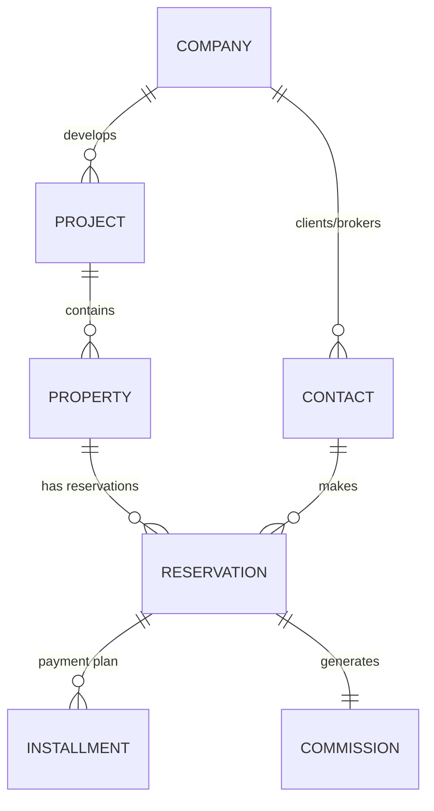

# Twenty Real Estate for Egypt - Implementation Plan

## Executive Summary

**Project**: Custom CRM/ERP built on Twenty for Egyptian Real Estate Developers & Brokers  
**Timeline**: 17 weeks (4 months)  
**Budget**: ~$19,000 USD  
**Target Market**: Egypt (expandable to UAE, Saudi Arabia, Sudan)

---

## Business Case

### Market Opportunity

**Egypt Real Estate Market (2026):**
- Market size: ~$80 billion USD
- 500+ registered developers (100+ mid-to-large size)
- 10,000+ licensed real estate brokers
- Digital transformation accelerating (post-pandemic + government initiatives)

### Pain Points Addressed

| Stakeholder | Current Pain Point | Twenty Solution |
|-------------|-------------------|-----------------|
| **Developers** | Manual Excel tracking of 1000s of units | Centralized database with unit-level tracking |
| **Developers** | Complex installment payment tracking | Automated payment schedules with reminders |
| **Brokers** | Lost leads from property portals | Integrated lead capture from all sources |
| **Brokers** | Commission disputes with developers | Transparent reservation-to-commission workflow |
| **Accountants** | Manual VAT calculations | Automated 14% VAT computation and reporting |
| **Management** | No real-time sales dashboard | Live dashboards with KPIs (occupancy %, collections) |

### Competitive Advantage

1. **First Egyptian-Focused Real Estate CRM**
   - Localized for Egyptian market (Arabic, VAT, E-invoicing)
   - Competitors: Generic CRMs (Salesforce, Odoo) or expensive ERPs (SAP)

2. **Open Source + Customizable**
   - Developers can customize without vendor lock-in
   - Brokers can add features as they grow

3. **Affordable Pricing**
   - Target: $50-150/user/month (vs. $300+ for Salesforce)
   - Self-hosted option for data sovereignty

---

## Technical Architecture

### Core Modules

```
twenty-real-estate/
├── Project Module (Phase 1)
│   └── Projects, phases, budgets, timelines
├── Property Module (Phase 1)
│   └── Units, floors, buildings, amenities
├── Reservation Module (Phase 2)
│   └── Reservations, contracts, installments
├── Commission Module (Phase 3)
│   └── Broker commissions, splits, payouts
├── Financial Module (Phase 3)
│   └── Invoices, receipts, VAT, payment gateway
└── Compliance Module (Phase 4)
    └── E-invoicing, tax reports, Central Bank reports
```

### Data Model (Simplified)



### Tech Stack

| Layer | Technology | Rationale |
|-------|------------|-----------|
| **Core Platform** | Twenty CRM (Open Source) | Modern, extensible, TypeScript |
| **Frontend** | React + TypeScript | Twenty's native stack |
| **Backend** | NestJS + TypeORM | Enterprise-grade, well-documented |
| **Database** | PostgreSQL 16 | Robust, supports multi-tenant |
| **Cache** | Redis | Session management, job queues |
| **Deployment** | Docker Compose | Easy deployment for Egyptian hosting |
| **Cloud** | Railway/Render (optional) | For clients who prefer cloud |

---

## Implementation Phases

### Phase 1: Foundation (Weeks 1-2) ✅

**Status**: In Progress

**Deliverables:**
- [x] Forked Twenty repo
- [x] Set up directory structure
- [x] Created Project entity definition
- [ ] Install dependencies (`yarn install`)
- [ ] Configure local development environment
- [ ] Run Twenty locally (frontend + backend)
- [ ] Create Property entity
- [ ] Test basic CRUD operations

**Success Criteria:**
- Can create/view projects in Twenty UI
- Can create/view properties linked to projects
- Multi-company isolation working

---

### Phase 2: Core Features (Weeks 3-6)

**Deliverables:**
- [ ] Reservation entity (with payment schedules)
- [ ] Installment entity (recurring payments)
- [ ] Reservation workflow:
  - Property → Reserved → Contract Signed → Cancelled
  - Automatic unit status updates
- [ ] Company isolation (company_id enforcement)
- [ ] Arabic localization (RTL, Arabic labels)
- [ ] Basic dashboards (projects, units, reservations)

**Sample Workflow:**
```
1. Broker creates reservation for Client
2. System marks property as "Reserved"
3. System generates installment plan (e.g., 60 months)
4. System sends SMS/Email confirmation to client
5. Dashboard shows "Units Reserved This Month"
```

---

### Phase 3: Financial Integration (Weeks 7-9)

**Deliverables:**
- [ ] VAT calculation service (14% Egyptian VAT)
- [ ] Invoice generation from reservations
- [ ] Receipt generation (PDF)
- [ ] Payment gateway integration:
  - Phase 3a: EgyCash (simpler API)
  - Phase 3b: Fawry, Paymob
- [ ] Bank reconciliation module
- [ ] Commission calculation (broker splits)

**Egyptian VAT Rules:**
- Standard rate: 14%
- Applied to: Property sales, brokerage commissions
- Exempt: First-time buyers under certain conditions (verify with tax advisor)

---

### Phase 4: Broker Portal (Weeks 10-12)

**Deliverables:**
- [ ] Broker dashboard (listings, reservations, commissions)
- [ ] Property listing management
- [ ] Client follow-up workflows (email/SMS campaigns)
- [ ] Commission tracking and payout reports
- [ ] Integration with developer ERPs (optional, via API)

**Broker Features:**
- View available units from multiple developers
- Reserve units for clients (with approval workflow)
- Track commission status (pending/paid)
- Receive automated notifications for new launches

---

### Phase 5: Compliance & Reporting (Weeks 13-14)

**Deliverables:**
- [ ] E-invoicing export (Egyptian Tax Authority JSON format)
- [ ] VAT return reports (monthly/quarterly)
- [ ] Central Bank reporting templates (for developers)
- [ ] Audit logs (who changed what, when)
- [ ] Data export (backup, migration)

**Egyptian Compliance:**
- **ETA E-Invoicing**: Mandatory for companies > X revenue
- **Format**: JSON with specific schema
- **Integration**: Direct API or manual upload

---

### Phase 6: Testing & UAT (Weeks 15-16)

**Activities:**
- Unit tests for all custom modules
- Integration tests for workflows
- Performance testing (1000+ concurrent users)
- Security audit (penetration testing)
- UAT with pilot clients:
  - 1 developer (e.g., El Nemery Group)
  - 1 broker (small-to-medium brokerage)

**Test Scenarios:**
1. Create project → Add 100 units → Reserve 10 units → Generate invoices
2. Change property status → Verify cascade updates
3. Calculate VAT on mixed-use property (residential + commercial)
4. Generate monthly sales report for management

---

### Phase 7: Deployment (Week 17)

**Activities:**
- [ ] Production environment setup
- [ ] Data migration (if replacing existing system)
- [ ] User training (video tutorials + live sessions)
- [ ] Go-live support (2 weeks hypercare)
- [ ] Feedback collection and iteration planning

**Deployment Options:**
1. **Self-Hosted**: Client's own servers (data sovereignty)
2. **Cloud**: Railway, AWS Middle East (Bahrain)
3. **Hybrid**: App in cloud, DB on-premise

---

## Budget Breakdown

| Item | Cost (USD) | Notes |
|------|------------|-------|
| **Development** | $12,000 | 4 months @ $3,000/month (Ahmed Hassan) |
| **UI/UX Design** | $2,000 | Custom Arabic dashboards, mobile optimization |
| **Tax Advisor** | $1,500 | Egyptian VAT/e-invoicing compliance |
| **Third-Party Services** | $1,000 | Hosting, EgyCash API fees, SMS gateway |
| **Contingency (15%)** | $2,500 | Buffer for scope changes |
| **Total** | **$19,000** | |

**Pricing Model (Post-Development):**
- **SaaS**: $50-150/user/month (tiered by features)
- **Self-Hosted**: $5,000 one-time license + 20% annual support
- **Custom Development**: $150/hour (feature requests)

---

## Risk Assessment

| Risk | Probability | Impact | Mitigation |
|------|-------------|--------|------------|
| **Twenty core changes break extensions** | Medium | High | Maintain fork; minimize reliance on unstable APIs |
| **Egyptian tax regulation changes** | Medium | Medium | Modular compliance design; work with tax advisor |
| **Slow user adoption (brokers)** | Medium | High | Mobile-first UX; training videos; gamification |
| **Payment gateway API issues** | Low | Medium | Support multiple gateways; manual receipt fallback |
| **Performance at scale (10k+ units)** | Low | Medium | PostgreSQL indexing; Redis caching; load testing |

---

## Success Metrics

### Technical KPIs
- < 200ms API response time (95th percentile)
- 99.9% uptime (SLA for paid customers)
- Zero data loss (daily backups + point-in-time recovery)

### Business KPIs
- **Developer Adoption**: 5+ developers in Year 1
- **Broker Adoption**: 50+ brokerages in Year 1
- **Revenue Target**: $100k ARR by end of Year 1
- **Customer Satisfaction**: NPS > 50

---

## Go-to-Market Strategy

### Phase 1: Early Adopters (Months 1-6)
- Target: 3-5 friendly developers/brokers (existing network)
- Offer: Free pilot in exchange for testimonials
- Goal: Prove product-market fit

### Phase 2: Growth (Months 7-12)
- Marketing: LinkedIn ads, real estate conferences (Cityscape Egypt)
- Partnerships: Real estate associations (REDA, BROKERS)
- Content: Case studies, webinars on digital transformation

### Phase 3: Scale (Year 2+)
- Expand to: UAE (Dubai, Abu Dhabi), Saudi Arabia (Riyadh)
- Add features: AI-powered property valuations, mortgage calculator
- Raise funding: Seed round for regional expansion

---

## Next Steps (Immediate)

### Week 1 Tasks
1. ✅ Fork and clone Twenty repo
2. ✅ Create directory structure
3. ✅ Define Project entity schema
4. ⏳ **Install dependencies**: `cd twenty-real-estate && yarn install`
5. ⏳ **Run locally**: `yarn start`
6. ⏳ **Create Property entity** (similar to Project)
7. ⏳ **Test multi-company** isolation

### Week 2 Tasks
1. Create Reservation entity
2. Create Installment entity
3. Build reservation workflow (status transitions)
4. Add Arabic labels (bilingual support)
5. Test end-to-end: Project → Property → Reservation

---

## Resources

### Documentation
- **Twenty Docs**: https://docs.twenty.com
- **Twenty GitHub**: https://github.com/twentyhq/twenty
- **This Project**: `twenty-real-estate/`

### Key Contacts
- **Project Lead**: Ahmed Hassan (ahmed@example.com)
- **Tax Advisor**: [To be hired - Egyptian VAT specialist]
- **UI/UX Designer**: [To be hired - Arabic UI经验]

### Internal References
- `README_REAL_ESTATE.md` - Project overview
- `SETUP_GUIDE.md` - Technical setup instructions
- `packages/twenty-server/src/modules/project/standard-objects/project.workspace-entity.ts` - First entity

---

**Last Updated**: May 29, 2026  
**Document Owner**: Ahmed Hassan  
**Version**: 1.0