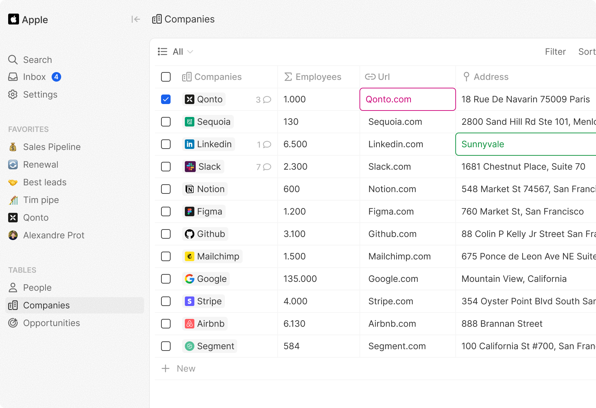

 

  
  

<h2 align="center" >A modern CRM Alternative</h3>

Engineer-Designed. Business-Ready.

<a href="https://twenty.com">Website</a> · <a href="https://docs.twenty.com">Documentation</a> · <a href="https://twenty.com/story">Story</a>

 

  

  

# About

Twenty is an Open Source CRM designed to solve the issues that are still prevalent among the existings solutions. 
It is meant to be:
- Easily extendable
- Perfectly in-sync with your data
- Crafted with care and enjoyable to use

# Progress
We are currently in the development phase of Twenty's alpha version:

**Released** 
✅  Create Companies & People 
✅  View, filter and sort Companies & People 

**In development** 
⚙️  Pipe views (Opportunities) 
⚙️  Comments 

**Planned** 
📅  Email logging 
📅  Custom Fields 
📅  Search / Cmd + K 
📅  Data connexion 
📅  +++

# Documentation
The doc is available on [docs.twenty.com](https://docs.twenty.com)

We don't have a Slack community yet but we will create one when we are ready to launch.
In the meantime, feel free to create a Github issue or open a discussion.