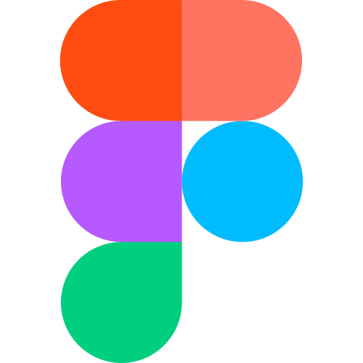
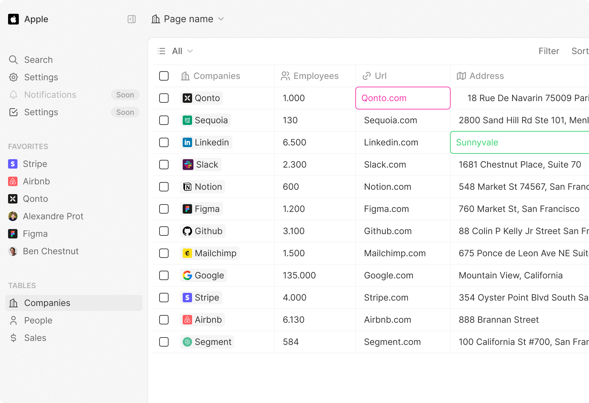
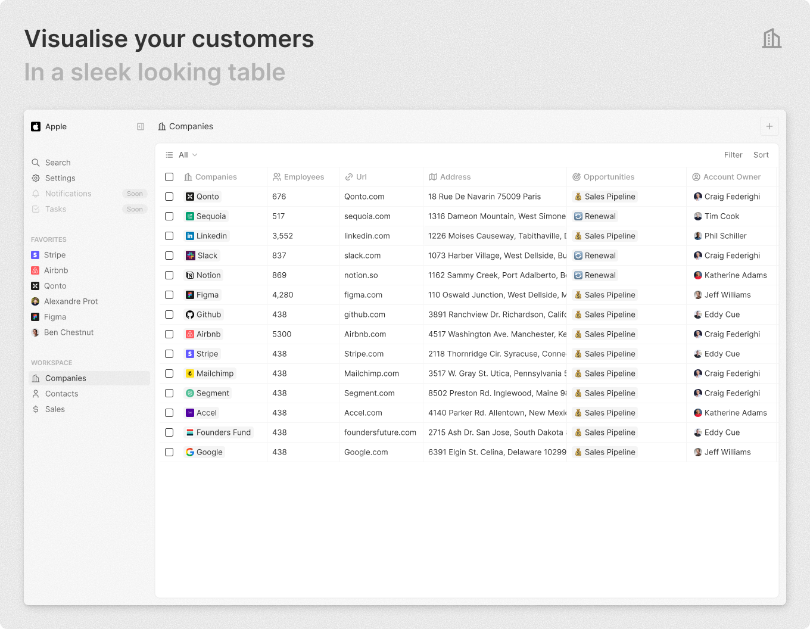
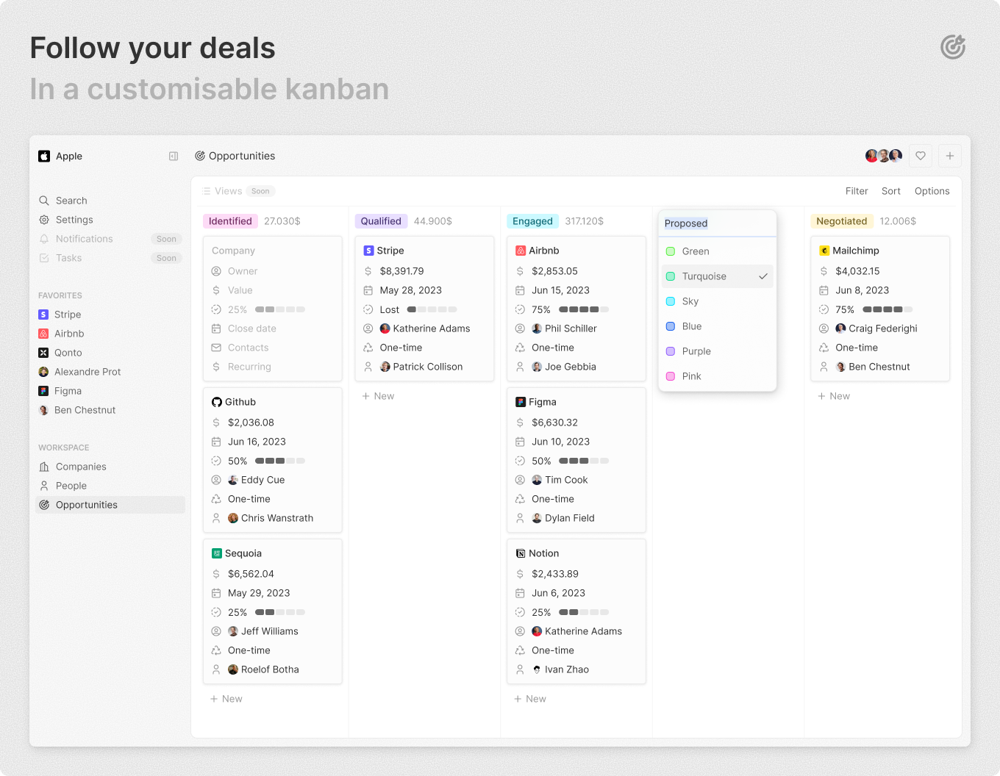
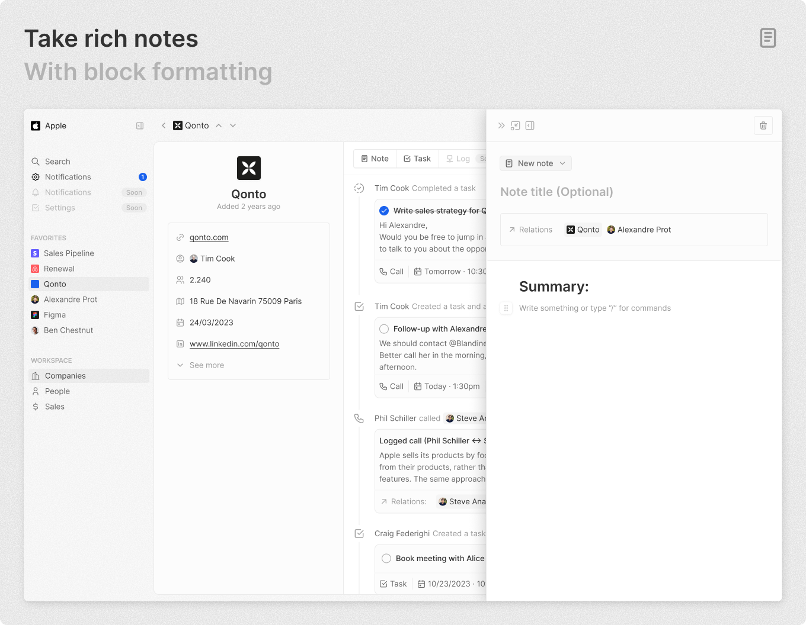
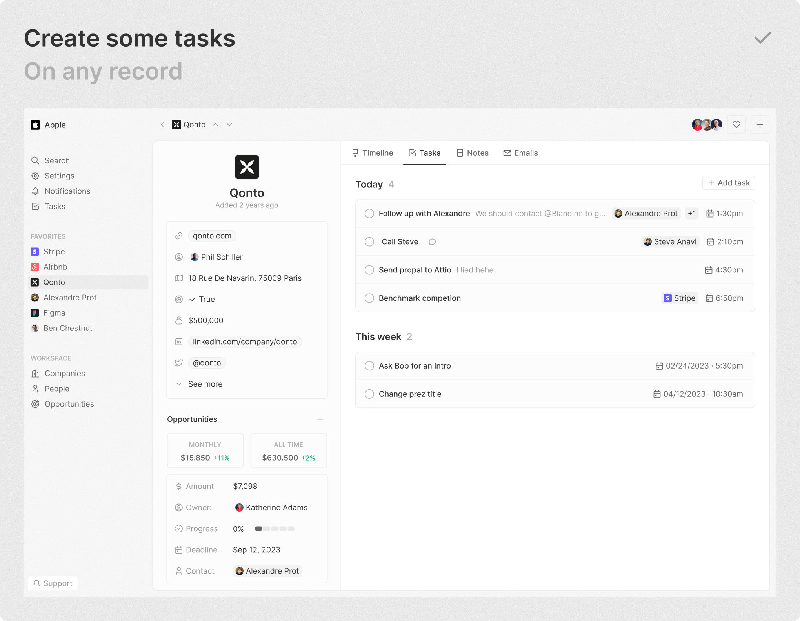
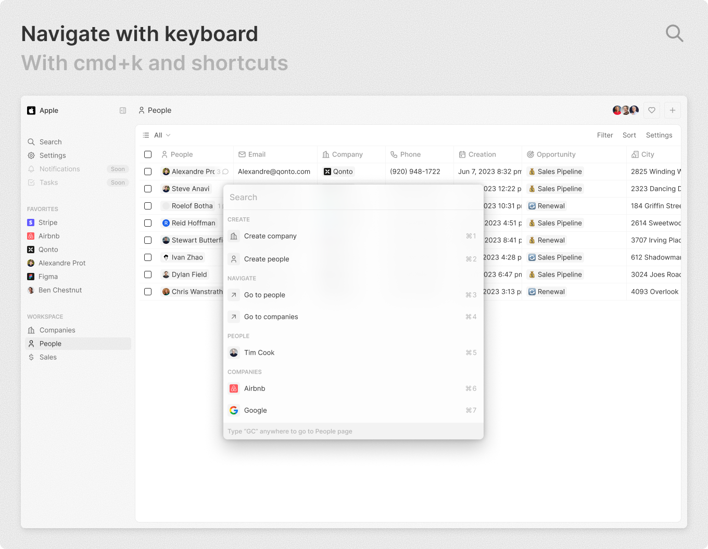

<br>
<p align="center">
  <a href="https://www.twenty.com">
    
  </a>
</p>

<h2 align="center" >The #1 Open-Source CRM </h3>
<p align="center">Tailored to your unique business needs</p>

<p align="center"><a href="https://twenty.com">🌐 Website</a> · <a href="https://docs.twenty.com">📚 Documentation</a> ·  <a href="https://discord.gg/cx5n4Jzs57"> Discord</a> · <a href="https://www.figma.com/file/xt8O9mFeLl46C5InWwoMrN/Twenty">  Figma</a><p>
<br />


<p align="center">
  <a href="https://www.twenty.com">
    <picture>
      <source media="(prefers-color-scheme: dark)" srcset="https://raw.githubusercontent.com/twentyhq/twenty/main/packages/twenty-docs/static/img/preview-dark.png">
      <source media="(prefers-color-scheme: light)" srcset="https://raw.githubusercontent.com/twentyhq/twenty/main/packages/twenty-docs/static/img/preview-light.png">
      
    </picture>
  </a>
</p>
<br>

We’ve spent thousands of hours grappling with traditional CRMs like Pipedrive and Salesforce to align them with our business needs, only to end up frustrated — customizations are complex and the closed ecosystems of these platforms can feel restrictive.

We felt the need for a CRM platform that empowers rather than constrains. We believe the next great CRM will come from the open source community. And we’ve packed Twenty with powerful features to give you full control and help you win more deals. 

<br>

# Demo 
Go to <a href="https://app.twenty.com/">app.twenty.com</a> and login with the following credentials:
```
email: noah@demo.dev
password: Applecar2025
```

See also:  
🚀 [Self-hosting](https://docs.twenty.com/start/self-hosting/)  
🖥️ [Local Setup](https://docs.twenty.com/contributor/local-setup)  

# Why Choose Twenty?
We understand that the CRM landscape is vast. So why should you choose us?

⛓️ **Full control, Full Freedom:** Contribute, self-host, fork. Break free from vendor lock-in and join us in shaping the open future of CRM.

📊 **Data, Your Way:** The days when the role of CRM platforms was to shift manual data entries to a database are over. Now, the data is already there. CRM 2.0 should be built around your data, allowing you to access and visualize any existing sources, not forcing you to retrofit your data into predefined objects on a remote cloud.

🎨 **Effortlessly Intuitive:** We set out to create something that we ourselves would always enjoy using. The main application draws inspiration from Notion, a tool known for its user-friendly interface and customization capabilities.
<br>


<br>

# What You Can Do With Twenty
We're currently in the development phase of Twenty's alpha version.  

Please feel free to flag any specific need you have need by creating an issue.   

Below are some features we have implemented to date:

+ [Add, filter, sort, edit and track customers](#add-filter-sort-edit-and-track-customers)
+ [Create one or several opportunities for each company](#create-one-or-several-opportunities-for-each-company)
+ [See rich notes tasks displayed in a timeline](#see-rich-notes-tasks-displayed-in-a-timeline)
+ [Create tasks on records](#create-tasks-on-records)
+ [Navigate quickly through the app using keyboard shortcuts and search](#navigate-quickly-through-the-app-using-keyboard-shortcuts-and-search)

## Add, filter, sort, edit and track customers:

<p align="center">
    <picture>
      <source media="(prefers-color-scheme: dark)" srcset="https://raw.githubusercontent.com/twentyhq/twenty/main/packages/twenty-docs/static/img/visualise-customer-dark.png">
      <source media="(prefers-color-scheme: light)" srcset="https://raw.githubusercontent.com/twentyhq/twenty/main/packages/twenty-docs/static/img/visualise-customer-light.png">
      
    </picture>
</p>

## Create one or several opportunities for each company:

<p align="center">
    <picture>
      <source media="(prefers-color-scheme: dark)" srcset="https://raw.githubusercontent.com/twentyhq/twenty/main/packages/twenty-docs/static/img/follow-your-deals-dark.png">
      <source media="(prefers-color-scheme: light)" srcset="https://raw.githubusercontent.com/twentyhq/twenty/main/packages/twenty-docs/static/img/follow-your-deals-light.png">
      
    </picture>
</p>

## See rich notes tasks displayed in a timeline:

<p align="center">
    <picture>
      <source media="(prefers-color-scheme: dark)" srcset="https://raw.githubusercontent.com/twentyhq/twenty/main/packages/twenty-docs/static/img/rich-notes-dark.png">
      <source media="(prefers-color-scheme: light)" srcset="https://raw.githubusercontent.com/twentyhq/twenty/main/packages/twenty-docs/static/img/rich-notes-light.png">
      
    </picture>
</p>

## Create tasks on records

<p align="center">
    <picture>
      <source media="(prefers-color-scheme: dark)" srcset="https://raw.githubusercontent.com/twentyhq/twenty/main/packages/twenty-docs/static/img/create-tasks-dark.png">
      <source media="(prefers-color-scheme: light)" srcset="https://raw.githubusercontent.com/twentyhq/twenty/main/packages/twenty-docs/static/img/create-tasks-light.png">
      
    </picture>
</p>


## Navigate quickly through the app using keyboard shortcuts and search:

<p align="center">
    <picture>
      <source media="(prefers-color-scheme: dark)" srcset="https://raw.githubusercontent.com/twentyhq/twenty/main/packages/twenty-docs/static/img/shortcut-navigation-dark.png">
      <source media="(prefers-color-scheme: light)" srcset="https://raw.githubusercontent.com/twentyhq/twenty/main/packages/twenty-docs/static/img/shortcut-navigation-light.png">
      
    </picture>
</p>

<br>

# What's In Store

Here’s what you can look forward to:

⏳ **Frequent updates:** We’re shipping fast! Expect regular updates and new features that enhance your experience.

🔗 **Extensibility:** We’re putting the power in your hands. Soon, you’ll have the tools to extend and customize Twenty with plugins and more.

<br>

# Join the Community

- Star the repo
- Join [discussions](https://github.com/twentyhq/twenty/discussions) and track [issues](https://github.com/twentyhq/twenty/issues) 
- Follow us on [Twitter](https://twitter.com/twentycrm) or [LinkedIn](https://www.linkedin.com/company/twenty/) 
- Join our [Discord](https://discord.gg/cx5n4Jzs57)
- [Contributions](https://github.com/twentyhq/twenty/contribute) are, of course, most welcome! 


