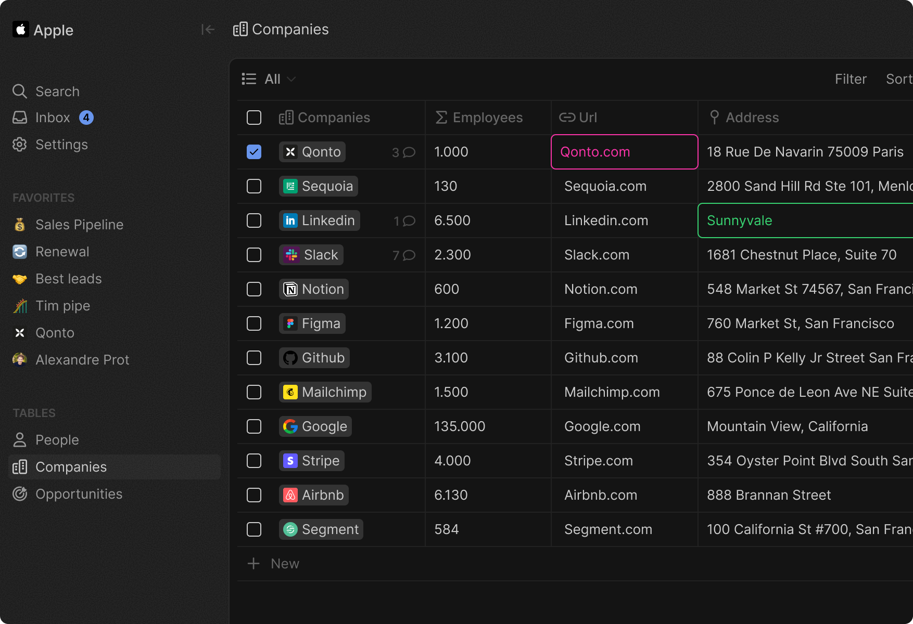
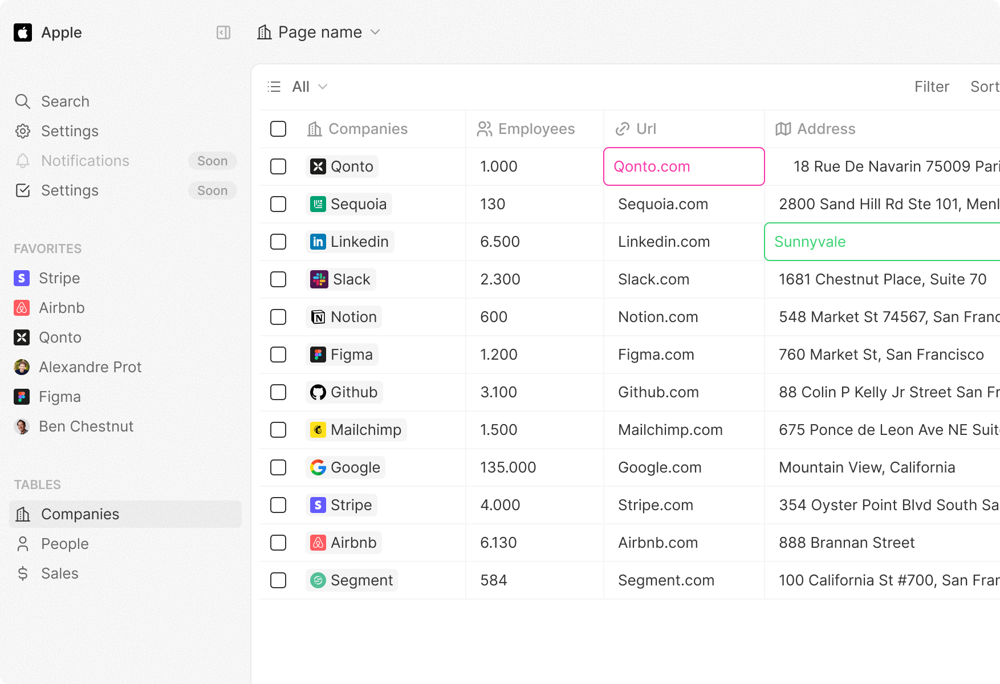

 

  
  

<h2 align="center" >A modern CRM Alternative</h3>

Engineer-Designed. Business-Ready.

<a href="https://twenty.com">Website</a> · <a href="https://docs.twenty.com">Documentation</a> · <a href="https://twenty.com/story">Story</a>

 

  

  

# About
Twenty is an Open Source CRM designed to be:
- Easily extendable
- Perfectly in-sync with your data
- Crafted with care and enjoyable to use

# Helping us
- The easiest way to help us is to star the repo and helping us getting visibility
- Contributions are, of course, most welcome! It doesn't have to be code, you could also create an issue to report a bug you've spotted, join discussions or write documentation.

# Quickstart
By the first week of July, you should be able to try a demo directly on [app.twenty.com], our cloud offering with a generous free tier. We'll also release click-to-deploy buttons for Render and Railway.

In the meantime, you can check [the documentation](/start/local-setup). It shouldn't take more than a few minutes to install locally.

# Progress
We are currently in the development phase of Twenty's alpha version:

**Released**  
✅  Create Companies & People  
✅  View, filter and sort Companies & People  
✅  Comments  

**In development**  
⚙️  Pipelines  
⚙️  Custom Fields  

**Planned** 
📅  Activity log  
📅  Auto-logging emails  
📅  Search / Cmd + K  
📅  Data connectors  
📅  +++

# Documentation
The doc is available on [docs.twenty.com](https://docs.twenty.com)

We don't have a Slack community yet but we will create one when we are ready to launch.
In the meantime, feel free to create a Github issue or open a discussion.