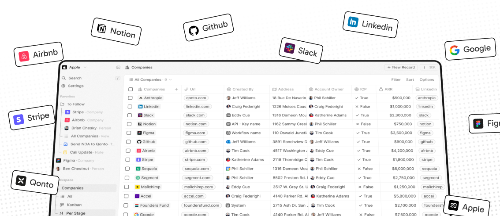
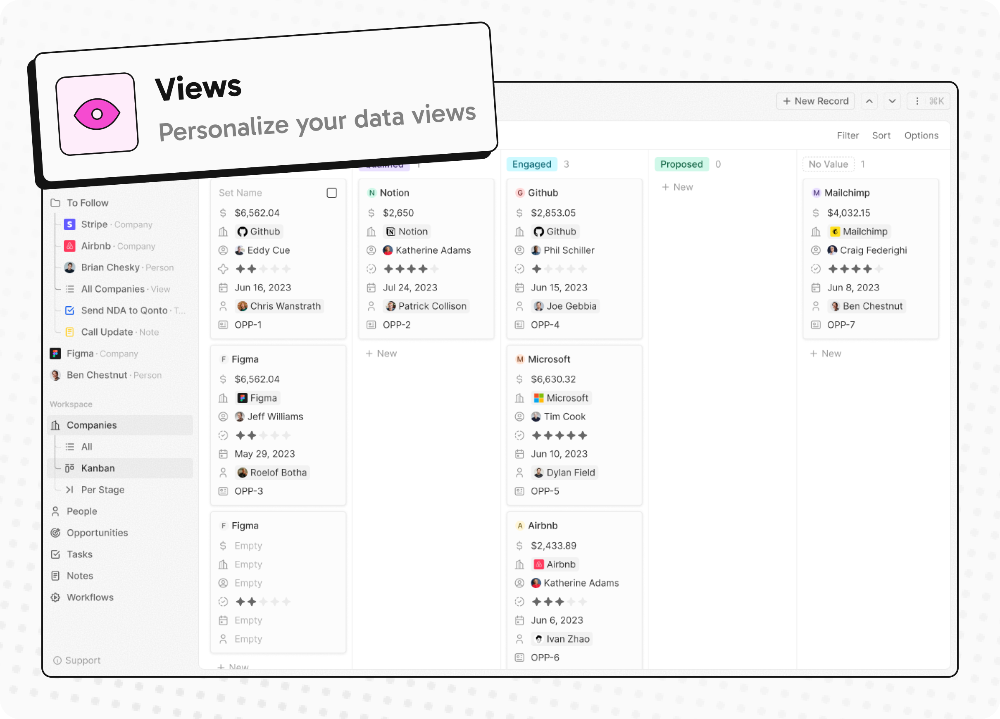

  

<h2 align="center" >
The #1 Open-Source CRM 
</h2>

<a href="https://twenty.com">🌐 Website</a> · <a href="https://twenty.com/developers">📚 Documentation</a> · <a href="https://github.com/orgs/twentyhq/projects/1"> Roadmap </a> · <a href="https://discord.gg/cx5n4Jzs57"> Discord</a> · <a href="https://www.figma.com/file/xt8O9mFeLl46C5InWwoMrN/Twenty">  Figma</a>

 

  <a href="https://www.twenty.com">
    <picture>
      <source media="(prefers-color-scheme: dark)" srcset="https://raw.githubusercontent.com/twentyhq/twenty/refs/heads/main/packages/twenty-website/public/images/readme/github-cover-dark.png" />
      <source media="(prefers-color-scheme: light)" srcset="https://raw.githubusercontent.com/twentyhq/twenty/refs/heads/main/packages/twenty-website/public/images/readme/github-cover-light.png" />
      
    </picture>
  </a>

 

# Installation 
See:
  🚀 [Self-hosting](https://twenty.com/developers/section/self-hosting)
  🖥️ [Local Setup](https://twenty.com/developers/local-setup)
  
# Does the world need another CRM?

We built Twenty for three reasons:

**CRMs are too expensive, and users are trapped.** Companies use locked-in customer data to hike prices. It shouldn't be that way.

**A fresh start is required to build a better experience.** We can learn from past mistakes and craft a cohesive experience inspired by new UX patterns from tools like Notion, Airtable or Linear.

**We believe in Open-source and community.** Hundreds of developers are already building Twenty together. Once we have plugin capabilities, a whole ecosystem will grow around it.

 

# What You Can Do With Twenty

Please feel free to flag any specific needs you have by creating an issue.   

Below are a few features we have implemented to date:

+ [Personalize layouts with filters, sort, group by, kanban and table views](#personalize-layouts-with-filters-sort-group-by-kanban-and-table-views)
+ [Customize your objects and fields](#customize-your-objects-and-fields)
+ [Create and manage permissions with custom roles](#create-and-manage-permissions-with-custom-roles)
+ [Automate workflow with triggers and actions](#automate-workflow-with-triggers-and-actions)
+ [Emails, calendar events, files, and more](#emails-calendar-events-files-and-more)

## Personalize layouts with filters, sort, group by, kanban and table views

    <picture>
      <source media="(prefers-color-scheme: dark)" srcset="https://raw.githubusercontent.com/twentyhq/twenty/refs/heads/main/packages/twenty-website/public/images/readme/views-dark.png" />
      <source media="(prefers-color-scheme: light)" srcset="https://raw.githubusercontent.com/twentyhq/twenty/refs/heads/main/packages/twenty-website/public/images/readme/views-light.png" />
      
    </picture>

