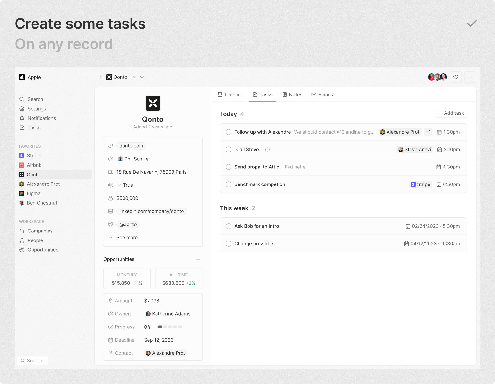

 

  

<h2 align="center" >A Modern Open Source CRM </h3>

CRM flexibility, tailored to your unique business needs

    
    
    
    
    

 

  <a href="https://www.twenty.com">
    <picture>
      <source media="(prefers-color-scheme: dark)" srcset="https://raw.githubusercontent.com/twentyhq/twenty/main/docs/static/img/preview-dark.png">
      <source media="(prefers-color-scheme: light)" srcset="https://raw.githubusercontent.com/twentyhq/twenty/main/docs/static/img/preview-light.png">
      
    </picture>
  </a>

 

We’ve spent thousands of hours grappling with traditional CRMs/platforms like Pipedrive and Salesforce to align them with our business needs, only to end up frustrated—customizations are complex and the closed ecosystems of these platforms can feel restrictive.

We felt the need for a CRM solution that empowers rather than constrains, which inspired us to create Twenty. We’re building the next-generation open-source CRM that offers you the flexibility to shape it according to your business objectives and meet your team’s unique needs. We’ve packed Twenty with powerful features to give you full control and help you win more deals. 

Explore [Twenty CRM](https://app.twenty.com/).

 

# Why Choose Twenty?
We understand that the CRM landscape is vast. So why should you choose us?

⛓️ **Full control, Full Freedom:** With Twenty, you aren’t just a CRM user; you’re also a co-creator. Join us in shaping the future of CRM through open source collaboration. Break free from vendor lock-in and limitations. 

📊 **Data, Your Way:** Your data should serve your business, not hinder it. Twenty allows you to harness the full potential of your data, securely and on your own terms.

🎨 **Effortlessly Intuitive:** We’ve made sure that Twenty’s design isn’t just beautiful, but also functional.
 It’s a CRM that your team will love to use.  
 

# Our Commitment 

Twenty is incorporated as a Public Benefits Company, which means we’re legally bound to consider the broader impact of our decisions on all stakeholders. We strive to build software that creates value for a wider ecosystem, not just our company. Our success is intertwined with the success of our users, contributors, and the open source community at large. 

 

# What You Can Do With Twenty
We're currently in the development phase of Twenty's alpha version.  

Don't hesitate to flag a specific need by creating an issue.   

Below are the features we have implemented to date:

+ [Add, filter, sort, edit and track customers](#add-filter-sort-edit-and-track-customers)
+ [Create one or several opportunities for each company](#create-one-or-several-opportunities-for-each-company)
+ [See rich notes tasks displayed in a timeline](#see-rich-notes-tasks-displayed-in-a-timeline)
+ [Create tasks on records](#create-tasks-on-records)
+ [Navigate quickly through the app using keyboard shortcuts and search](#navigate-quickly-through-the-app-using-keyboard-shortcuts-and-search)

## Add, filter, sort, edit and track customers:

    <picture>
      <source media="(prefers-color-scheme: dark)" srcset="https://raw.githubusercontent.com/twentyhq/twenty/main/docs/static/img/visualise-customer-dark.png">
      <source media="(prefers-color-scheme: light)" srcset="https://raw.githubusercontent.com/twentyhq/twenty/main/docs/static/img/visualise-customer-light.png">
      
    </picture>

## Create one or several opportunities for each company:

    <picture>
      <source media="(prefers-color-scheme: dark)" srcset="https://raw.githubusercontent.com/twentyhq/twenty/main/docs/static/img/follow-your-deals-dark.png">
      <source media="(prefers-color-scheme: light)" srcset="https://raw.githubusercontent.com/twentyhq/twenty/main/docs/static/img/follow-your-deals-light.png">
      
    </picture>

## See rich notes tasks displayed in a timeline:

    <picture>
      <source media="(prefers-color-scheme: dark)" srcset="https://raw.githubusercontent.com/twentyhq/twenty/main/docs/static/img/rich-notes-dark.png">
      <source media="(prefers-color-scheme: light)" srcset="https://raw.githubusercontent.com/twentyhq/twenty/main/docs/static/img/rich-notes-light.png">
      
    </picture>

## Create tasks on records

    <picture>
      <source media="(prefers-color-scheme: dark)" srcset="https://raw.githubusercontent.com/twentyhq/twenty/main/docs/static/img/create-tasks-dark.png">
      <source media="(prefers-color-scheme: light)" srcset="https://raw.githubusercontent.com/twentyhq/twenty/main/docs/static/img/create-tasks-light.png">
      
    </picture>

## Navigate quickly through the app using keyboard shortcuts and search:

    <picture>
      <source media="(prefers-color-scheme: dark)" srcset="https://raw.githubusercontent.com/twentyhq/twenty/main/docs/static/img/shortcut-navigation-dark.png">
      <source media="(prefers-color-scheme: light)" srcset="https://raw.githubusercontent.com/twentyhq/twenty/main/docs/static/img/shortcut-navigation-light.png">
      
    </picture>

 

# What's In Store

Here’s what you can look forward to:

⏳ **Frequent updates:** We’re shipping fast! Expect regular updates and new features that enhance your CRM experience.

🔗 **Extensibility:** We’re putting the power in your hands. Soon, you’ll have the tools to extend and customize your CRM to precisely fit your business needs. No more reliance on external consultants; you’re in control.

 

# Join the Movement

- Star the repo
- Join [discussions](https://github.com/twentyhq/twenty/discussions) and track [issues](https://github.com/twentyhq/twenty/issues) 
- Follow us on [Twitter](https://twitter.com/twentycrm) or [LinkedIn](https://www.linkedin.com/company/twenty/) 
- Join our [Discord](https://twenty.com/discord)
- [Contributions](https://github.com/twentyhq/twenty/contribute) are, of course, most welcome! 

 

# Get Started

Dive into Twenty today and experience the power of open-source CRM on your own terms.

🚀 [Get Started with Twenty](https://docs.twenty.com/contributor/local-setup). 

