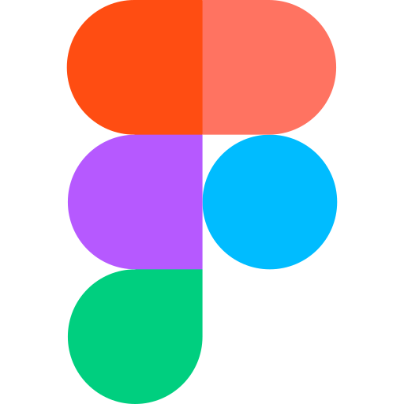
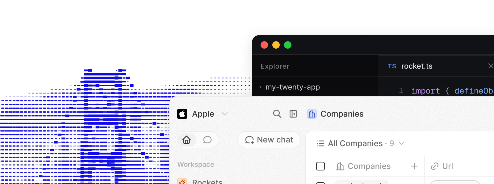
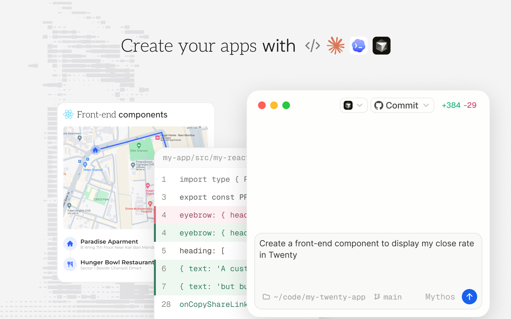
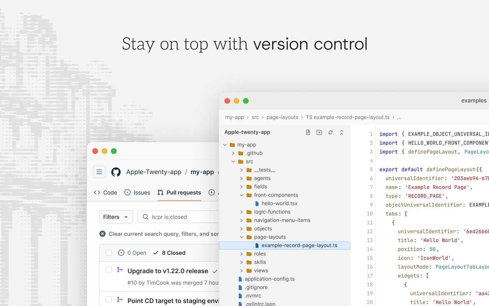
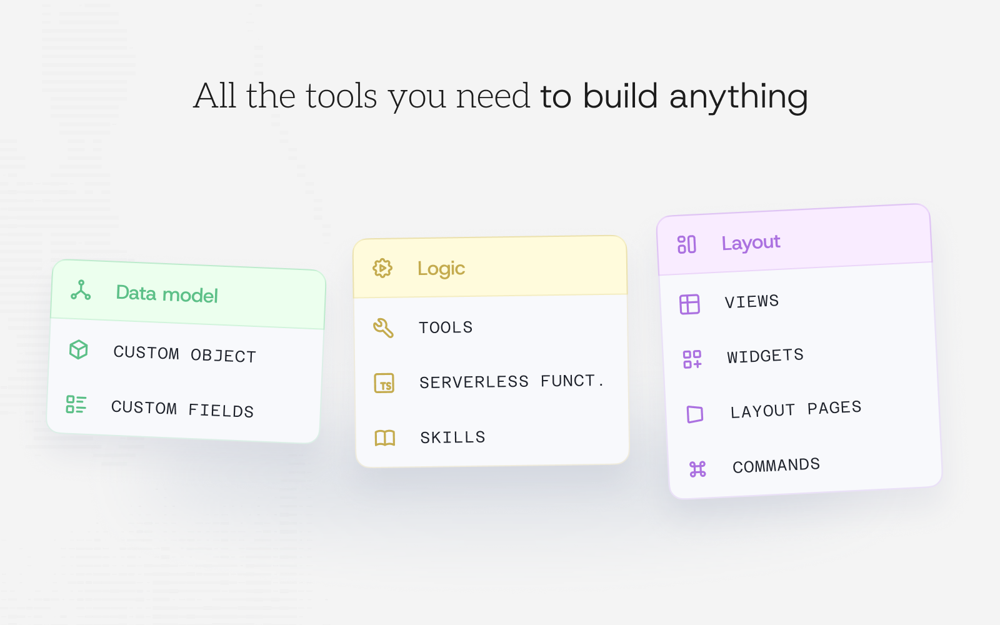
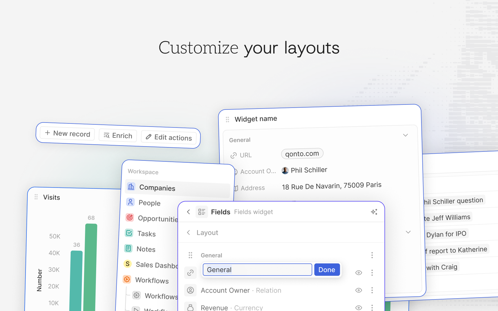
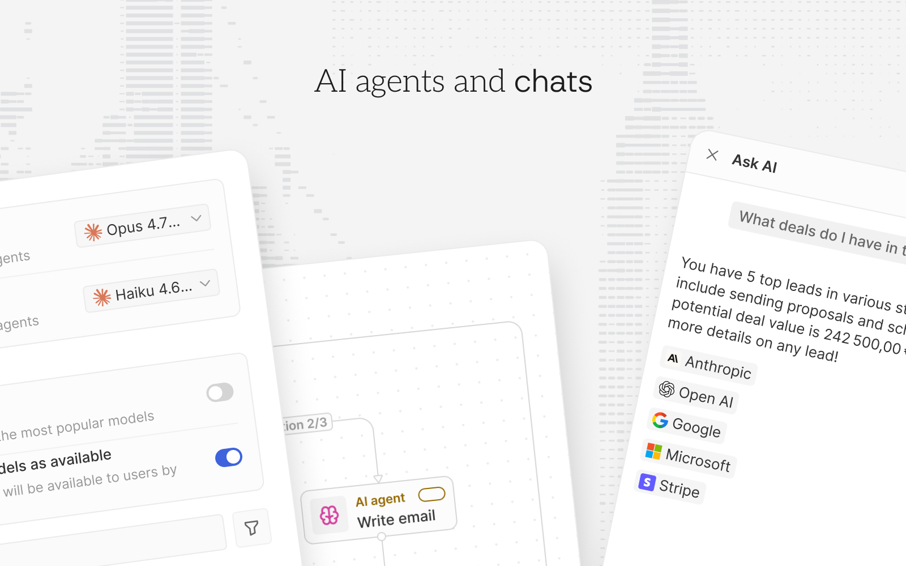
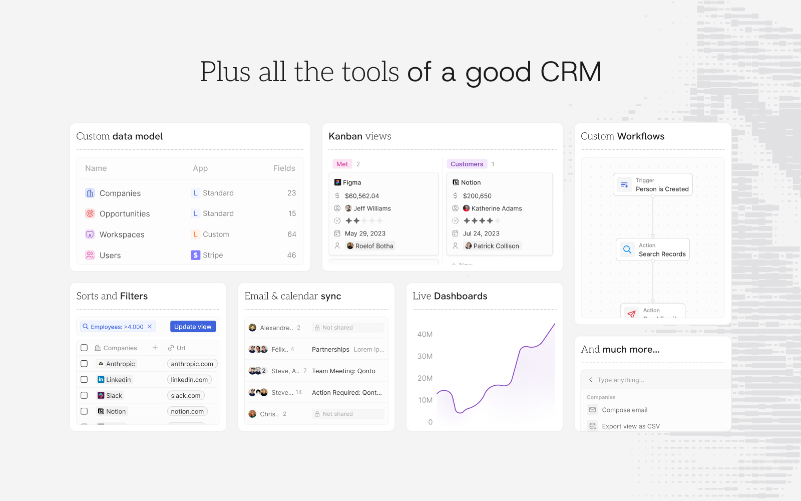
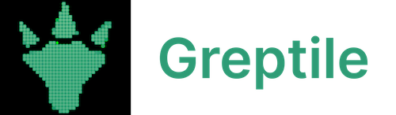

<p align="center">
  <a href="https://www.twenty.com">
    
  </a>
</p>

<h2 align="center" >The #1 Open-Source CRM</h2>

<p align="center"><a href="https://twenty.com"> Website</a> · <a href="https://docs.twenty.com"> Documentation</a> · <a href="https://github.com/orgs/twentyhq/projects/1"> Roadmap </a> · <a href="https://discord.gg/cx5n4Jzs57"> Discord</a> · <a href="https://www.figma.com/file/xt8O9mFeLl46C5InWwoMrN/Twenty">  Figma</a></p>

<p align="center">
  <a href="https://www.twenty.com">
    <picture>
      <source media="(prefers-color-scheme: dark)" srcset="./packages/twenty-website/public/images/readme/github-cover-dark.png" />
      <source media="(prefers-color-scheme: light)" srcset="./packages/twenty-website/public/images/readme/github-cover-light.png" />
      
    </picture>
  </a>
</p>

<br />

# Why Twenty

Twenty gives technical teams the building blocks for a custom CRM that meets complex business needs and quickly adapts as the business evolves. Twenty is the CRM you build, ship, and version like the rest of your stack.

<a href="https://twenty.com/why-twenty"> Learn more about why we built Twenty</a>

<br />

# Installation

###  Cloud

The fastest way to get started. Sign up at [twenty.com](https://twenty.com) and spin up a workspace in under a minute, with no infrastructure to manage and always up to date.

###  Build an app

Scaffold a new app with the Twenty CLI:

```bash
npx create-twenty-app my-app
```

Define objects, fields, and views as code:

```ts
import { defineObject, FieldType } from 'twenty-sdk/define';

export default defineObject({
  nameSingular: 'deal',
  namePlural: 'deals',
  labelSingular: 'Deal',
  labelPlural: 'Deals',
  fields: [
    { name: 'name', label: 'Name', type: FieldType.TEXT },
    { name: 'amount', label: 'Amount', type: FieldType.CURRENCY },
    { name: 'closeDate', label: 'Close Date', type: FieldType.DATE_TIME },
  ],
});
```

Then ship it to your workspace:

```bash
npx twenty deploy
```

See the [app development guide](https://docs.twenty.com/developers/extend/apps/getting-started) for objects, views, agents, and logic functions.

###  Self-hosting

Run Twenty on your own infrastructure with [Docker Compose](https://docs.twenty.com/developers/self-host/capabilities/docker-compose), or contribute locally via the [local setup guide](https://docs.twenty.com/developers/contribute/capabilities/local-setup).

<br />
<br />

# Everything you need

Twenty gives you the building blocks of a modern CRM (objects, views, workflows, and agents) and lets you extend them as code. Here's a tour of what's in the box.

Want to go deeper? Read the <a href="https://docs.twenty.com/user-guide/introduction"> User Guide</a> for product walkthroughs, or the <a href="https://docs.twenty.com"> Documentation</a> for developer reference.

<table align="center">
  <tr>
    <td width="50%">
      <picture>
        <source media="(prefers-color-scheme: dark)" srcset="./packages/twenty-website/public/images/readme/v2-build-apps-dark.png" />
        <source media="(prefers-color-scheme: light)" srcset="./packages/twenty-website/public/images/readme/v2-build-apps-light.png" />
        
      </picture>
      <p align="center"><a href="https://docs.twenty.com/developers/extend/apps/getting-started"> Learn more about apps in doc</a></p>
    </td>
    <td width="50%">
      <picture>
        <source media="(prefers-color-scheme: dark)" srcset="./packages/twenty-website/public/images/readme/v2-version-control-dark.png" />
        <source media="(prefers-color-scheme: light)" srcset="./packages/twenty-website/public/images/readme/v2-version-control-light.png" />
        
      </picture>
      <p align="center"><a href="https://docs.twenty.com/developers/extend/apps/publishing"> Learn more about version control in doc</a></p>
    </td>
  </tr>
  <tr>
    <td width="50%">
      <picture>
        <source media="(prefers-color-scheme: dark)" srcset="./packages/twenty-website/public/images/readme/v2-all-tools-dark.png" />
        <source media="(prefers-color-scheme: light)" srcset="./packages/twenty-website/public/images/readme/v2-all-tools-light.png" />
        
      </picture>
      <p align="center"><a href="https://docs.twenty.com/developers/extend/apps/building"> Learn more about primitives in doc</a></p>
    </td>
    <td width="50%">
      <picture>
        <source media="(prefers-color-scheme: dark)" srcset="./packages/twenty-website/public/images/readme/v2-tools-dark.png" />
        <source media="(prefers-color-scheme: light)" srcset="./packages/twenty-website/public/images/readme/v2-tools-light.png" />
        
      </picture>
      <p align="center"><a href="https://docs.twenty.com/user-guide/layout/overview"> Learn more about layouts in doc</a></p>
    </td>
  </tr>
  <tr>
    <td width="50%">
      <picture>
        <source media="(prefers-color-scheme: dark)" srcset="./packages/twenty-website/public/images/readme/v2-ai-agents-dark.png" />
        <source media="(prefers-color-scheme: light)" srcset="./packages/twenty-website/public/images/readme/v2-ai-agents-light.png" />
        
      </picture>
      <p align="center"><a href="https://docs.twenty.com/user-guide/ai/overview"> Learn more about AI in doc</a></p>
    </td>
    <td width="50%">
      <picture>
        <source media="(prefers-color-scheme: dark)" srcset="./packages/twenty-website/public/images/readme/v2-crm-tools-dark.png" />
        <source media="(prefers-color-scheme: light)" srcset="./packages/twenty-website/public/images/readme/v2-crm-tools-light.png" />
        
      </picture>
      <p align="center"><a href="https://docs.twenty.com/user-guide/introduction"> Learn more about CRM features in doc</a></p>
    </td>
  </tr>
</table>

<br />

# Stack

- <a href="https://www.typescriptlang.org/"> TypeScript</a>
- <a href="https://nx.dev/"> Nx</a>
- <a href="https://nestjs.com/"> NestJS</a>, with <a href="https://bullmq.io/">BullMQ</a>, <a href="https://www.postgresql.org/"> PostgreSQL</a>, <a href="https://redis.io/"> Redis</a>
- <a href="https://reactjs.org/"> React</a>, with <a href="https://jotai.org/">Jotai</a>, <a href="https://linaria.dev/">Linaria</a> and <a href="https://lingui.dev/">Lingui</a>


# Thanks

<p align="center">
  <a href="https://www.chromatic.com/"></a>
  &nbsp;&nbsp;&nbsp;&nbsp;
  <a href="https://greptile.com"></a>
  &nbsp;&nbsp;&nbsp;&nbsp;
  <a href="https://sentry.io/"></a>
  &nbsp;&nbsp;&nbsp;&nbsp;
  <a href="https://crowdin.com/"></a>
</p>

  Thanks to these amazing services that we use and recommend for UI testing (Chromatic), code review (Greptile), catching bugs (Sentry) and translating (Crowdin).


# Join the Community

<p><a href="https://github.com/twentyhq/twenty"> Star the repo</a> · <a href="https://discord.gg/cx5n4Jzs57"> Discord</a> · <a href="https://github.com/twentyhq/twenty/discussions"> Feature requests</a> · <a href="https://github.com/orgs/twentyhq/projects/1/views/35"> Releases</a> · <a href="https://twitter.com/twentycrm"> X</a> · <a href="https://www.linkedin.com/company/twenty/"> LinkedIn</a> · <a href="https://twenty.crowdin.com/twenty"> Crowdin</a> · <a href="https://github.com/twentyhq/twenty/contribute"> Contribute</a></p>
