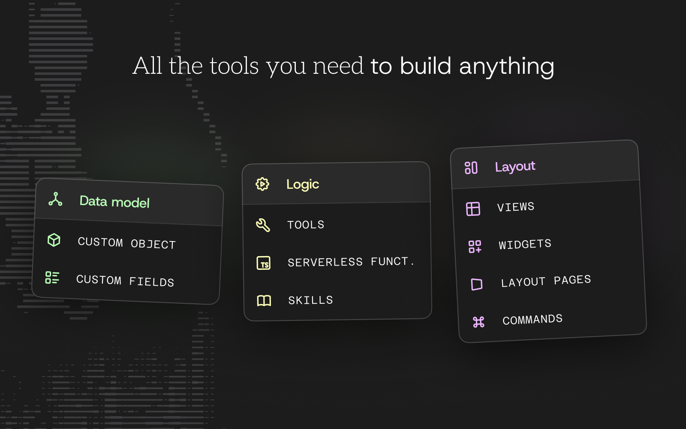
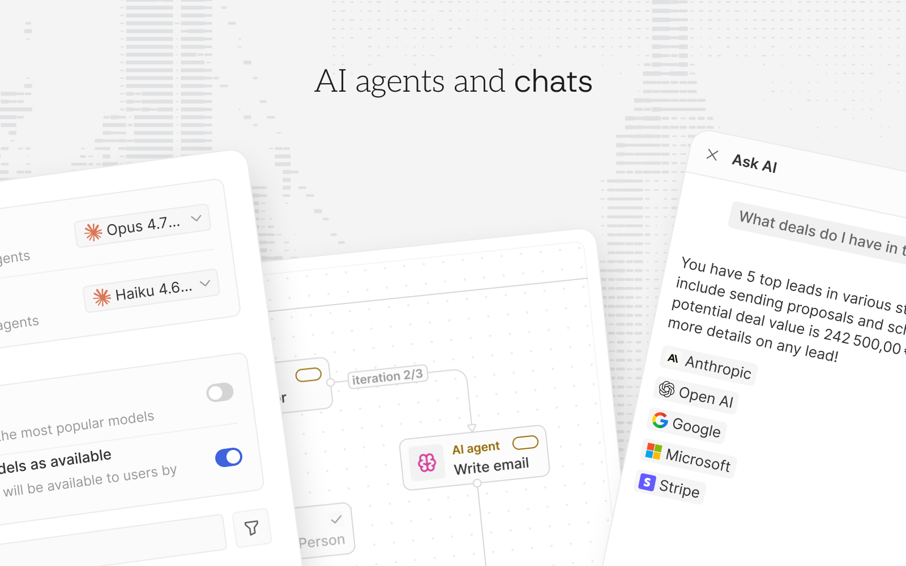
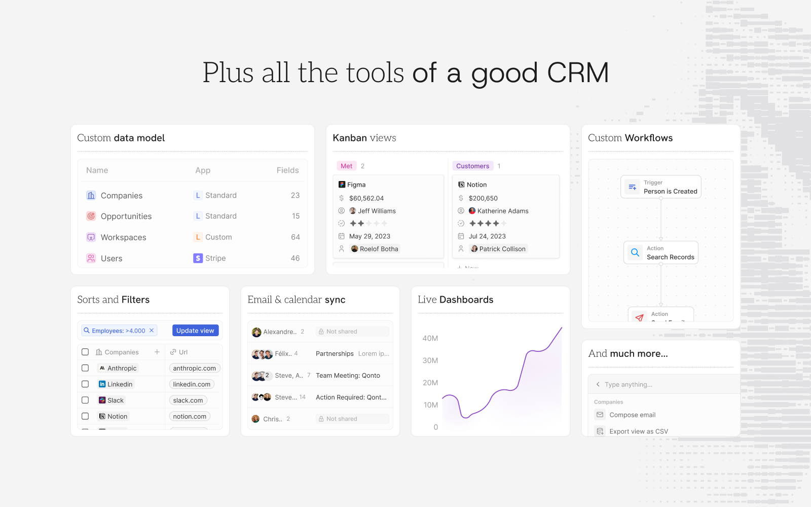

  

<h2 align="center" >The Open-Source CRM You Build With Code and AI </h2>

<a href="https://twenty.com">🌐 Website</a> · <a href="https://docs.twenty.com">📚 Documentation</a> · <a href="https://github.com/orgs/twentyhq/projects/1"> Roadmap </a> · <a href="https://discord.gg/cx5n4Jzs57"> Discord</a> · <a href="https://www.figma.com/file/xt8O9mFeLl46C5InWwoMrN/Twenty">  Figma</a>

 

  <a href="https://www.twenty.com">
    <picture>
      <source media="(prefers-color-scheme: dark)" srcset="https://raw.githubusercontent.com/twentyhq/twenty/refs/heads/main/packages/twenty-website/public/images/readme/github-cover-dark.png" />
      <source media="(prefers-color-scheme: light)" srcset="https://raw.githubusercontent.com/twentyhq/twenty/refs/heads/main/packages/twenty-website/public/images/readme/github-cover-light.png" />
      
    </picture>
  </a>

 

# Installation

See:
🚀 [Self-hosting](https://docs.twenty.com/developers/self-host/capabilities/docker-compose)
🖥️ [Local Setup](https://docs.twenty.com/developers/contribute/capabilities/local-setup)

# Why Twenty

We built Twenty for three reasons:

**CRMs are too expensive, and users are trapped.** Companies use locked-in customer data to hike prices. It shouldn't be that way.

**A fresh start is required to build a better experience.** We can learn from past mistakes and craft a cohesive experience inspired by new UX patterns from tools like Notion, Airtable or Linear.

**We believe in open-source and community.** Hundreds of developers are already building Twenty together. Once we have plugin capabilities, a whole ecosystem will grow around it.

 

# What You Can Do With Twenty

Twenty v2 is a code-first, AI-native CRM platform. Build, ship, and version your own CRM apps — with the full CRM toolkit out of the box and AI agents on top.

+ [Create your apps with code + AI](#create-your-apps-with-code--ai)
+ [All the tools you need to build anything](#all-the-tools-you-need-to-build-anything)
+ [Stay on top with version control](#stay-on-top-with-version-control)
+ [AI agents and chats](#ai-agents-and-chats)
+ [Plus all the tools of a good CRM](#plus-all-the-tools-of-a-good-crm)

## Create your apps with code + AI

    <picture>
      <source media="(prefers-color-scheme: dark)" srcset="https://raw.githubusercontent.com/twentyhq/twenty/refs/heads/main/packages/twenty-website/public/images/readme/v2-build-apps.png" />
      <source media="(prefers-color-scheme: light)" srcset="https://raw.githubusercontent.com/twentyhq/twenty/refs/heads/main/packages/twenty-website/public/images/readme/v2-build-apps.png" />
      
    </picture>

## All the tools you need to build anything

    <picture>
      <source media="(prefers-color-scheme: dark)" srcset="https://raw.githubusercontent.com/twentyhq/twenty/refs/heads/main/packages/twenty-website/public/images/readme/v2-tools.png" />
      <source media="(prefers-color-scheme: light)" srcset="https://raw.githubusercontent.com/twentyhq/twenty/refs/heads/main/packages/twenty-website/public/images/readme/v2-tools.png" />
      
    </picture>

## Stay on top with version control

    <picture>
      <source media="(prefers-color-scheme: dark)" srcset="https://raw.githubusercontent.com/twentyhq/twenty/refs/heads/main/packages/twenty-website/public/images/readme/v2-version-control.png" />
      <source media="(prefers-color-scheme: light)" srcset="https://raw.githubusercontent.com/twentyhq/twenty/refs/heads/main/packages/twenty-website/public/images/readme/v2-version-control.png" />
      
    </picture>

## AI agents and chats

    <picture>
      <source media="(prefers-color-scheme: dark)" srcset="https://raw.githubusercontent.com/twentyhq/twenty/refs/heads/main/packages/twenty-website/public/images/readme/v2-ai-agents.png" />
      <source media="(prefers-color-scheme: light)" srcset="https://raw.githubusercontent.com/twentyhq/twenty/refs/heads/main/packages/twenty-website/public/images/readme/v2-ai-agents.png" />
      
    </picture>

## Plus all the tools of a good CRM

    <picture>
      <source media="(prefers-color-scheme: dark)" srcset="https://raw.githubusercontent.com/twentyhq/twenty/refs/heads/main/packages/twenty-website/public/images/readme/v2-crm-tools.png" />
      <source media="(prefers-color-scheme: light)" srcset="https://raw.githubusercontent.com/twentyhq/twenty/refs/heads/main/packages/twenty-website/public/images/readme/v2-crm-tools.png" />
      
    </picture>

 

# Stack
- [TypeScript](https://www.typescriptlang.org/)
- [Nx](https://nx.dev/)
- [NestJS](https://nestjs.com/), with [BullMQ](https://bullmq.io/), [PostgreSQL](https://www.postgresql.org/), [Redis](https://redis.io/)
- [React](https://reactjs.org/), with [Jotai](https://jotai.org/), [Linaria](https://linaria.dev/) and [Lingui](https://lingui.dev/)

# Thanks

  
  
  
  
  

  Thanks to these amazing services that we use and recommend for UI testing (Chromatic), code review (Greptile), catching bugs (Sentry) and translating (Crowdin).

# Join the Community

- Star the repo
- Subscribe to releases (watch -> custom -> releases)
- Follow us on [Twitter](https://twitter.com/twentycrm) or [LinkedIn](https://www.linkedin.com/company/twenty/)
- Join our [Discord](https://discord.gg/cx5n4Jzs57)
- Improve translations on [Crowdin](https://twenty.crowdin.com/twenty)
- [Contributions](https://github.com/twentyhq/twenty/contribute) are, of course, most welcome!
