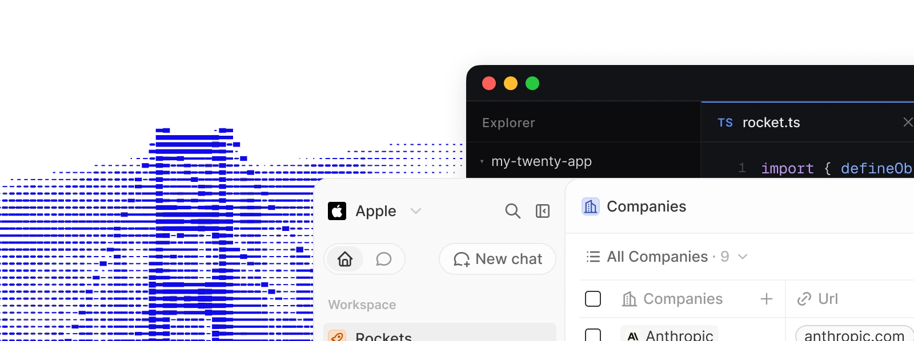
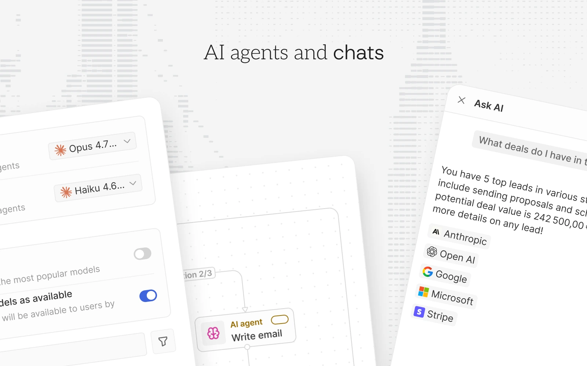

<p align="center">
  <a href="https://www.twenty.com">
    
  </a>
</p>

<h2 align="center">The #1 Open-Source CRM</h2>

<p align="center"><a href="https://twenty.com"> Website</a> · <a href="https://docs.twenty.com"> Documentation</a> · <a href="https://github.com/orgs/twentyhq/projects/1"> Roadmap </a> · <a href="https://discord.gg/cx5n4Jzs57"> Discord</a> · <a href="https://www.figma.com/file/xt8O9mFeLl46C5InWwoMrN/Twenty">  Figma</a></p>

<p align="center">
  <a href="https://www.twenty.com">
    <picture>
      <source media="(prefers-color-scheme: dark)" srcset="./packages/twenty-website/public/images/readme/github-cover-dark.webp" />
      <source media="(prefers-color-scheme: light)" srcset="./packages/twenty-website/public/images/readme/github-cover-light.webp" />
      
    </picture>
  </a>
</p>

<br />

# Why Twenty

Twenty gives technical teams the building blocks for a custom CRM that meets complex business needs and quickly adapts as the business evolves. Twenty is the CRM you build, ship, and version like the rest of your stack.

<a href="https://twenty.com/resources/why-twenty"> Learn more about why we built Twenty</a>

<br />

# Installation

###  Cloud

The fastest way to get started. Sign up at [twenty.com](https://twenty.com) and spin up a workspace in under a minute, with no infrastructure to manage and always up to date.

###  Build an app

Scaffold a new app with the Twenty CLI:

```bash
npx create-twenty-app my-app
```

Define objects, fields, and views as code:

```ts
import { defineObject, FieldType } from 'twenty-sdk/define';

export default defineObject({
  nameSingular: 'deal',
  namePlural: 'deals',
  labelSingular: 'Deal',
  labelPlural: 'Deals',
  fields: [
    { name: 'name', label: 'Name', type: FieldType.TEXT },
    { name: 'amount', label: 'Amount', type: FieldType.CURRENCY },
    { name: 'closeDate', label: 'Close Date', type: FieldType.DATE_TIME },
  ],
});
```

Then ship it to your workspace:

```bash
npx twenty app:publish --private
```

See the [app development guide](https://docs.twenty.com/developers/extend/apps/getting-started) for objects, views, agents, and logic functions.

###  Self-hosting

Run Twenty on your own infrastructure with [Docker Compose](https://docs.twenty.com/developers/self-host/capabilities/docker-compose), or contribute locally via the [local setup guide](https://docs.twenty.com/developers/contribute/capabilities/local-setup).

<br />
<br />

# Everything you need

Twenty gives you the building blocks of a modern CRM (objects, views, workflows, and agents) and lets you extend them as code. Here's a tour of what's in the box.

Want to go deeper? Read the <a href="https://docs.twenty.com/user-guide/introduction"> User Guide</a> for product walkthroughs, or the <a href="https://docs.twenty.com"> Documentation</a> for developer reference.

<table align="center">
  <tr>
    <td width="50%">
      <picture>
        <source media="(prefers-color-scheme: dark)" srcset="./packages/twenty-website/public/images/readme/v2-build-apps-dark.webp" />
        <source media="(prefers-color-scheme: light)" srcset="./packages/twenty-website/public/images/readme/v2-build-apps-light.webp" />
        
      </picture>
      <p align="center"><a href="https://docs.twenty.com/developers/extend/apps/getting-started"> Learn more about apps in doc</a></p>
    </td>
    <td width="50%">
      <picture>
        <source media="(prefers-color-scheme: dark)" srcset="./packages/twenty-website/public/images/readme/v2-version-control-dark.webp" />
        <source media="(prefers-color-scheme: light)" srcset="./packages/twenty-website/public/images/readme/v2-version-control-light.webp" />
        
      </picture>
      <p align="center"><a href="https://docs.twenty.com/developers/extend/apps/publishing"> Learn more about version control in doc</a></p>
    </td>
  </tr>
  <tr>
    <td width="50%">
      <picture>
        <source media="(prefers-color-scheme: dark)" srcset="./packages/twenty-website/public/images/readme/v2-all-tools-dark.webp" />
        <source media="(prefers-color-scheme: light)" srcset="./packages/twenty-website/public/images/readme/v2-all-tools-light.webp" />
        
      </picture>
      <p align="center"><a href="https://docs.twenty.com/developers/extend/apps/building"> Learn more about primitives in doc</a></p>
    </td>
    <td width="50%">
      <picture>
        <source media="(prefers-color-scheme: dark)" srcset="./packages/twenty-website/public/images/readme/v2-tools-dark.webp" />
        <source media="(prefers-color-scheme: light)" srcset="./packages/twenty-website/public/images/readme/v2-tools-light.webp" />
        
      </picture>
      <p align="center"><a href="https://docs.twenty.com/user-guide/layout/overview"> Learn more about layouts in doc</a></p>
    </td>
  </tr>
  <tr>
    <td width="50%">
      <picture>
        <source media="(prefers-color-scheme: dark)" srcset="./packages/twenty-website/public/images/readme/v2-ai-agents-dark.webp" />
        <source media="(prefers-color-scheme: light)" srcset="./packages/twenty-website/public/images/readme/v2-ai-agents-light.webp" />
        
      </picture>
      <p align="center"><a href="https://docs.twenty.com/user-guide/ai/overview"> Learn more about AI in doc</a></p>
    </td>
    <td width="50%">
      <picture>
        <source media="(prefers-color-scheme: dark)" srcset="./packages/twenty-website/public/images/readme/v2-crm-tools-dark.webp" />
        <source media="(prefers-color-scheme: light)" srcset="./packages/twenty-website/public/images/readme/v2-crm-tools-light.webp" />
        
      </picture>
      <p align="center"><a href="https://docs.twenty.com/user-guide/introduction"> Learn more about CRM features in doc</a></p>
    </td>
  </tr>
</table>

<br />

# Stack

- <a href="https://www.typescriptlang.org/"> TypeScript</a>
- <a href="https://nx.dev/"> Nx</a>
- <a href="https://nestjs.com/"> NestJS</a>, with <a href="https://bullmq.io/">BullMQ</a>, <a href="https://www.postgresql.org/"> PostgreSQL</a>, <a href="https://redis.io/"> Redis</a>
- <a href="https://reactjs.org/"> React</a>, with <a href="https://jotai.org/">Jotai</a>, <a href="https://linaria.dev/">Linaria</a> and <a href="https://lingui.dev/">Lingui</a>

# Thanks

<p align="center">
  <a href="https://greptile.com"></a>
  &nbsp;&nbsp;&nbsp;&nbsp;
  <a href="https://sentry.io/"></a>
  &nbsp;&nbsp;&nbsp;&nbsp;
  <a href="https://crowdin.com/"></a>
</p>

Thanks to these amazing services that we use and recommend for code review (Greptile), catching bugs (Sentry) and translating (Crowdin).

# Join the Community

<p><a href="https://github.com/twentyhq/twenty"> Star the repo</a> · <a href="https://discord.gg/cx5n4Jzs57"> Discord</a> · <a href="https://github.com/twentyhq/twenty/discussions"> Feature requests</a> · <a href="https://github.com/orgs/twentyhq/projects/1/views/35"> Releases</a> · <a href="https://twitter.com/twentycrm"> X</a> · <a href="https://www.linkedin.com/company/twenty/"> LinkedIn</a> · <a href="https://twenty.crowdin.com/twenty"> Crowdin</a> · <a href="https://github.com/twentyhq/twenty/contribute"> Contribute</a></p>


## 🌐 Web Resources & Interactive Index
- [OBBY GYM SIMULATOR ESCAPE](https://quizverses.pages.dev/obby-gym-simulator-escape.html)
- [ONLINE PORTAL](https://thcskq.github.io/)
- [INDEX13](https://studyquests.pages.dev/index13.html)
- [GRANNY GTA VEGAS](https://learnquester.github.io/granny-gta-vegas.html)
- [DEVIL DASH](https://quizverses.github.io/devil-dash.html)
- [3D KID SLIDING PUZZLE](https://quizverses-9d2f2.web.app/3d-kid-sliding-puzzle.html)
- [MEGA RAMP CAR](https://studyplayings.pages.dev/mega-ramp-car.html)
- [CONTACT](https://quizverses.pages.dev/contact.html)
- [CATEGORY DRESS UP 3](https://studyplaying.github.io/category-dress-up-3.html)
- [ARROW ESCAPE MASTER](https://studyplayings.pages.dev/arrow-escape-master.html)
- [BLOCK UP](https://quizverses.github.io/block-up.html)
- [TILE HEX WORLD RED VS BLUE](https://quizverses.github.io/tile-hex-world-red-vs-blue.html)
- [TIKTOK TRENDS COLORED DENIM](https://quizverses.github.io/tiktok-trends-colored-denim.html)
- [COMBINE PICKAXES](https://studyplayings.pages.dev/combine-pickaxes.html)
- [WIPE INSIGHT MASTER](https://studyquests.pages.dev/wipe-insight-master.html)
- [MEMOJI](https://studyplayings.web.app/memoji.html)
- [IDLE SUPERMARKET TYCOON](https://quizverses.github.io/idle-supermarket-tycoon.html)
- [AIRWAYS MAZE](https://quizverses-9d2f2.web.app/airways-maze.html)
- [THE SORTING MART](https://studyplayings.pages.dev/the-sorting-mart.html)
- [ZOMBIE ARENA 2 FURY ROAD](https://studyplaying.github.io/zombie-arena-2-fury-road.html)
- [FISH KINGDOM](https://studyplayings.pages.dev/fish-kingdom.html)
- [BLOONS SURVIVALIO](https://quizverses-9d2f2.web.app/bloons-survivalio.html)
- [MAGECLASH IO](https://studyquests.pages.dev/mageclash-io.html)
- [MUSTANG CITY DRIVER](https://studyquests.pages.dev/mustang-city-driver.html)
- [HUMAN EVOLUTION RUN](https://quizverses.github.io/human-evolution-run.html)
- [CATEGORY PROXIES](https://learnquester.github.io/category-proxies.html)
- [RESIDENT EVIL PURGE OPERATION](https://quizverses.github.io/resident-evil-purge-operation.html)
- [AXE THROW](https://studyplayings.web.app/axe-throw.html)
- [HOMO EVOLUTION](https://studyquests.github.io/homo-evolution.html)
- [CATEGORY PREMIUM PERKS74](https://studyquests.pages.dev/category-premium-perks74.html)
- [BELOTE 3IN1](https://studyplayings.web.app/belote-3in1.html)
- [CATEGORY TITANIUM NETWORK](https://quizverses.pages.dev/category-titanium-network.html)
- [BBQ STACK RUN](https://learnquester.github.io/bbq-stack-run.html)
- [MAKEUP TRENDS THEN AND NOW](https://studyquests.github.io/makeup-trends-then-and-now.html)
- [MERGE RACER STUNTS CAR](https://studyplaying.github.io/merge-racer-stunts-car.html)
- [CATEGORY BLOCK94](https://studyplaying.github.io/category-block94.html)
- [ORGANIZER MASTER](https://quizverses.github.io/organizer-master.html)
- [RED ESCAPE](https://studyplayings.web.app/red-escape.html)
- [GIRLFRIEND FROM HELL](https://quizverses-9d2f2.web.app/girlfriend-from-hell.html)
- [GOOBER DASH](https://studyquests.github.io/goober-dash.html)
- [GO CHICKEN GO](https://studyquesthub.web.app/go-chicken-go.html)
- [PIXEL DESTROYER](https://quizverses.github.io/pixel-destroyer.html)
- [PULL THE PIN FISH RESCUE](https://quizverses.github.io/pull-the-pin-fish-rescue.html)
- [MAHJONG CONNECT MAJONG CLASS](https://quizverses-9d2f2.web.app/mahjong-connect-majong-class.html)
- [CATEGORY TURN BASED30](https://studyquesthub.web.app/category-turn-based30.html)
- [BLOCK MATCH 8X8](https://studyplaying.github.io/block-match-8x8.html)
- [STACK FALL](https://quizverses-9d2f2.web.app/stack-fall.html)
- [ESCAPE AGAIN](https://studyplayings.web.app/escape-again.html)
- [ANIMAL MERGE BUBBLE SHOOTER](https://quizverses.github.io/animal-merge-bubble-shooter.html)
- [BOLT CLIMB TAP TO THE TOP](https://studyplaying.github.io/bolt-climb-tap-to-the-top.html)
- [CATEGORY CAR 2](https://studyplayings.web.app/category-car-2.html)
- [STRAWBERRY SHORTCAKE](https://studyplayings.pages.dev/strawberry-shortcake.html)
- [CATEGORY MINING75](https://studyquests.github.io/category-mining75.html)
- [LEAP OF LIFE](https://studyplaying.github.io/leap-of-life.html)
- [CATEGORY ARENA255](https://studyquests.github.io/category-arena255.html)
- [CATEGORY BOARDGAMES](https://studyplayings.pages.dev/category-boardgames.html)
- [STEAL BRAINROT MONSTERS](https://studyplaying.github.io/steal-brainrot-monsters.html)
- [ROPE SORTING](https://quizverses.github.io/rope-sorting.html)
- [MOTO STUNT BIKER](https://studyquesthub.web.app/moto-stunt-biker.html)
- [KAWAII REALM ADVENTURE](https://quizverses.pages.dev/kawaii-realm-adventure.html)
- [CATEGORY DEEP IMMERSIVE24](https://learnquester.github.io/category-deep-immersive24.html)
- [CATEGORY GUN238](https://learnquester.github.io/category-gun238.html)
- [STUNT CAR EXTREME 2](https://studyplayings.web.app/stunt-car-extreme-2.html)
- [CATEGORY RAGDOLL57](https://studyquests.github.io/category-ragdoll57.html)
- [CATEGORY MAHJONG GAMES](https://studyquests.github.io/category-mahjong-games.html)
- [CATEGORY MOBILE2 112](https://studyquesthub.web.app/category-mobile2-112.html)
- [CAR RACING 3D DRIVE MAD](https://studyquests.pages.dev/car-racing-3d-drive-mad.html)
- [CATEGORY EDUCATIONAL](https://studyplaying.github.io/category-educational.html)
- [TYPE SPRINT](https://studyquests.github.io/type-sprint.html)
- [CATEGORY SANDBOX](https://learnquester.github.io/category-sandbox.html)
- [ARROW WAVE](https://studyplaying.github.io/arrow-wave.html)
- [INDEX6](https://quizverses.pages.dev/index6.html)
- [CATEGORY ESCAPE 2](https://studyplaying.github.io/category-escape-2.html)
- [CATEGORY BATTLE ROYALE25](https://studyplayings.web.app/category-battle-royale25.html)
- [PRSINO](https://quizverses.github.io/prsino.html)
- [CATEGORY MAHJONG 2](https://studyplayings.web.app/category-mahjong-2.html)
- [DESTINATION BRAIN TEST](https://studyquesthub.web.app/destination-brain-test.html)
- [ANGRY FLAPPY](https://quizverses.github.io/angry-flappy.html)
- [MAD TRUCK](https://studyplaying.github.io/mad-truck.html)
- [ZOMBIE CHASE](https://quizverses.pages.dev/zombie-chase.html)
- [HOLE BATTLEIO](https://studyplayings.pages.dev/hole-battleio.html)
- [UNCLE HIT PUNCH THE DUMMY](https://studyplayings.web.app/uncle-hit-punch-the-dummy.html)
- [CATEGORY STICKMAN 2](https://studyquests.github.io/category-stickman-2.html)
- [JUMP MAN](https://studyplaying.github.io/jump-man.html)
- [SUPER TANK WRESTLE](https://quizverses.pages.dev/super-tank-wrestle.html)
- [FUSION 2048](https://quizverses.pages.dev/fusion-2048.html)
- [CATEGORY MINECRAFT81](https://studyquesthub.web.app/category-minecraft81.html)
- [SPRUNKI CHARACTER MAKER OC](https://studyplayings.web.app/sprunki-character-maker-oc.html)
- [ANOMALY CONTENT RECORD](https://studyplayings.pages.dev/anomaly-content-record.html)
- [FRUIT MERGE JUICY DROP GAME](https://quizverses-9d2f2.web.app/fruit-merge-juicy-drop-game.html)
- [CATEGORY FREE](https://quizverses.pages.dev/category-free.html)
- [CATEGORY MAKEUP51](https://quizverses.pages.dev/category-makeup51.html)
- [MAHJONG ZEN GARDEN](https://quizverses.github.io/mahjong-zen-garden.html)
- [PIRATE NOOB APOCALYPSE](https://studyquests.github.io/pirate-noob-apocalypse.html)
- [PIECE OF CAKE MERGE AND BAKE](https://studyquesthub.web.app/piece-of-cake-merge-and-bake.html)
- [CATEGORY WAR137](https://quizverses.pages.dev/category-war137.html)
- [BLOCK PUZZLE TROPICAL STORY](https://quizverses.pages.dev/block-puzzle-tropical-story.html)
- [STEAL BRAINROT EGGS](https://quizverses.github.io/steal-brainrot-eggs.html)
- [MR DUDE KING OF THE HILL](https://quizverses.github.io/mr-dude-king-of-the-hill.html)
- [HOTFOOT BASEBALL](https://quizverses.github.io/hotfoot-baseball.html)
- [INFINITE CRAFT](https://studyquests.pages.dev/infinite-craft.html)
- [PERFECT SHOT](https://studyquests.pages.dev/perfect-shot.html)
- [CATEGORY MATCH 3](https://studyquesthub.web.app/category-match-3.html)
- [FRUIT MERGE ARENA](https://learnquester.github.io/fruit-merge-arena.html)
- [FOOT HOSPITAL](https://quizverses-9d2f2.web.app/foot-hospital.html)
- [CATEGORY MOUSE1 697](https://studyquesthub.web.app/category-mouse1-697.html)
- [SKATING PARK](https://quizverses-9d2f2.web.app/skating-park.html)
- [CATEGORY CARDS](https://studyplayings.web.app/category-cards.html)
- [CATEGORY PUZZLE 6](https://studyquesthub.web.app/category-puzzle-6.html)
- [CATEGORY PUZZLE](https://quizverses.pages.dev/category-puzzle.html)
- [BADLANDS HERO](https://studyplaying.github.io/badlands-hero.html)
- [2048 BLOCK FUSION](https://studyquests.github.io/2048-block-fusion.html)
- [CATEGORY CARE](https://studyplayings.web.app/category-care.html)
- [BANANA FARM](https://studyquests.github.io/banana-farm.html)
- [DREAM PET HOTEL](https://quizverses.github.io/dream-pet-hotel.html)
- [SNOW RACE 3D FUN RACING](https://studyplayings.web.app/snow-race-3d-fun-racing.html)
- [CHARGER CITY DRIVER](https://quizverses.github.io/charger-city-driver.html)
- [CATEGORY CAN T STOP PLAYING215](https://studyquesthub.web.app/category-can-t-stop-playing215.html)
- [RICH CHOICE RUN](https://studyquests.github.io/rich-choice-run.html)
- [HAWAII MATCH 5](https://studyplayings.pages.dev/hawaii-match-5.html)
- [CATEGORY MMO25](https://quizverses.github.io/category-mmo25.html)
- [MONEY MAN 3D](https://studyplaying.github.io/money-man-3d.html)
- [CATEGORY OBBY56](https://studyplaying.github.io/category-obby56.html)
- [ONLINE PORTAL](https://cryptotify.netlify.app/)
- [CARD MASTER](https://quizverses-9d2f2.web.app/card-master.html)
- [LEXY](https://studyquesthub.web.app/lexy.html)
- [PHYSICS BOX 2](https://studyplayings.pages.dev/physics-box-2.html)
- [ISLAND PUZZLE BUILD SOLVE](https://quizverses-9d2f2.web.app/island-puzzle-build-solve.html)
- [JIGSAW CARDS DAILY PUZZLES](https://studyplayings.web.app/jigsaw-cards-daily-puzzles.html)
- [MAZE ESCAPE CHALLENGE](https://quizverses.pages.dev/maze-escape-challenge.html)
