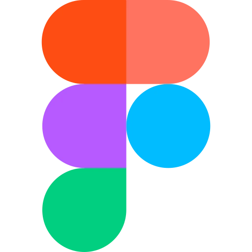
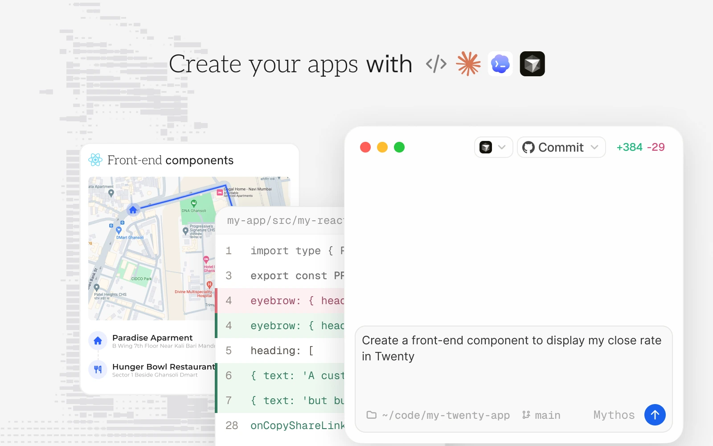
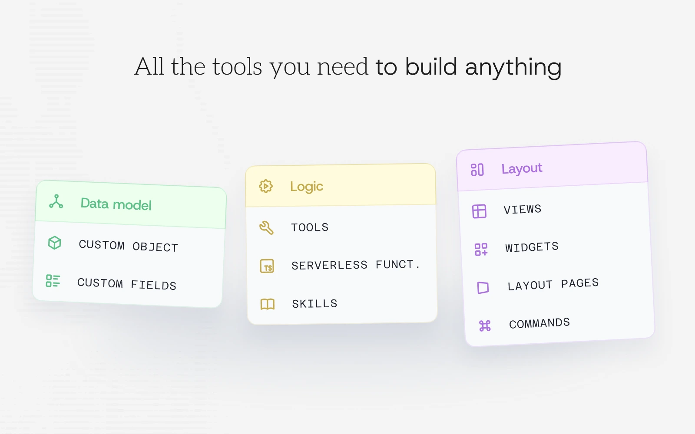
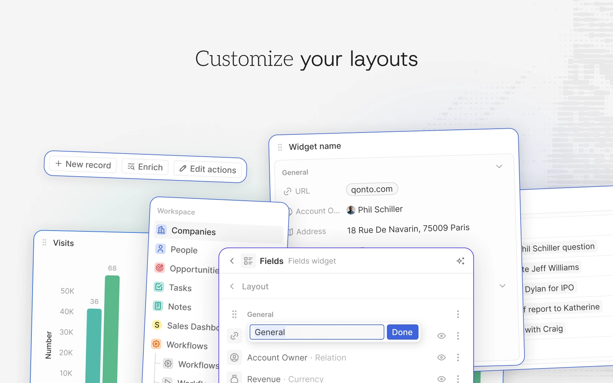
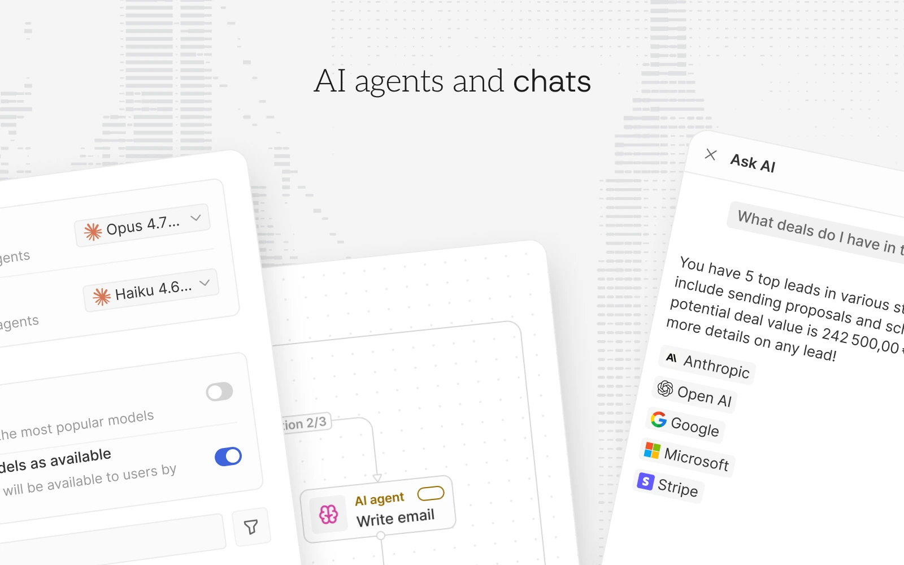
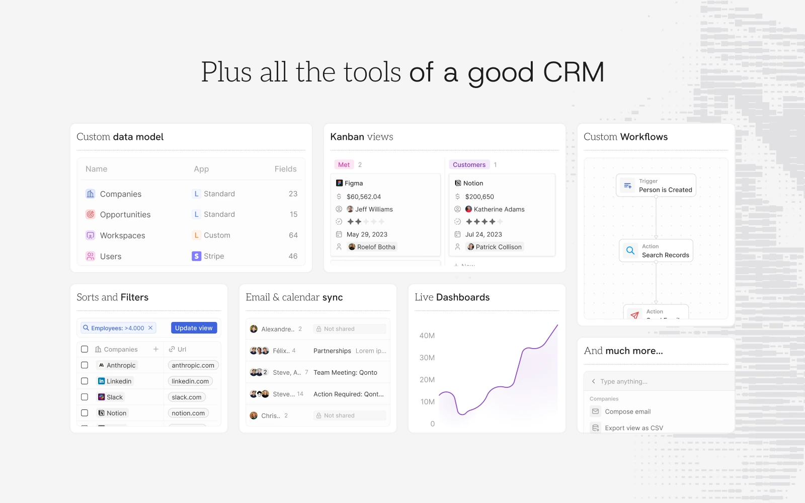

<p align="center">
  <a href="https://www.twenty.com">
    
  </a>
</p>

<h2 align="center" >排名第一的开源 CRM</h2>

<p align="center"><a href="https://twenty.com"> Website</a> · <a href="https://docs.twenty.com">文档</a> · <a href="https://github.com/orgs/twentyhq/projects/1">路线图 </a> · <a href="https://discord.gg/cx5n4Jzs57"> Discord</a> · <a href="https://www.figma.com/file/xt8O9mFeLl46C5InWwoMrN/Twenty">  Figma</a></p>

<p align="center">
  <a href="https://www.twenty.com">
    <picture>
      <source media="(prefers-color-scheme: dark)" srcset="./packages/twenty-website-new/public/images/readme/github-cover-dark.webp" />
      <source media="(prefers-color-scheme: light)" srcset="./packages/twenty-website-new/public/images/readme/github-cover-light.webp" />
      
    </picture>
  </a>
</p>

<br />

# 为什么选择 Twenty

Twenty 为技术团队提供了构建自定义 CRM 的基础模块，能够满足复杂的业务需求，并随业务发展快速迭代。Twenty 是一款你可以像管理技术栈中其他组件一样进行构建、发布和版本控制的 CRM。

<a href="https://twenty.com/resources/why-twenty"> 了解更多关于我们为何构建 Twenty</a>

<br />

# 安装

### 云服务

最快的上手方式。在 [twenty.com](https://twenty.com) 注册，一分钟内即可创建工作区——无需管理基础设施，始终保持最新版本。

### 构建应用

使用 Twenty CLI 快速创建新应用：

```bash
npx create-twenty-app my-app
```

以代码方式定义对象、字段和视图：

```ts
import { defineObject, FieldType } from 'twenty-sdk/define';

export default defineObject({
  nameSingular: 'deal',
  namePlural: 'deals',
  labelSingular: 'Deal',
  labelPlural: 'Deals',
  fields: [
    { name: 'name', label: 'Name', type: FieldType.TEXT },
    { name: 'amount', label: 'Amount', type: FieldType.CURRENCY },
    { name: 'closeDate', label: 'Close Date', type: FieldType.DATE_TIME },
  ],
});
```

然后将其部署到你的工作区：

```bash
npx twenty deploy
```

查看[应用开发指南](https://docs.twenty.com/developers/extend/apps/getting-started)了解对象、视图、智能体和逻辑函数。

### 自托管

使用 [Docker Compose](https://docs.twenty.com/developers/self-host/capabilities/docker-compose) 在你自己的基础设施上运行 Twenty，或通过[本地开发指南](https://docs.twenty.com/developers/contribute/capabilities/local-setup)参与本地开发。

<br />
<br />

# 你需要的一切

Twenty 提供了现代 CRM 的核心构建模块（对象、视图、工作流和智能体），并允许你通过代码进行扩展。以下是功能概览。

想深入了解？阅读 <a href="https://docs.twenty.com/user-guide/introduction"> 用户指南</a> 了解产品使用方法，或查阅 <a href="https://docs.twenty.com">文档</a> 获取开发者参考。

<table align="center">
  <tr>
    <td width="50%">
      <picture>
        <source media="(prefers-color-scheme: dark)" srcset="./packages/twenty-website-new/public/images/readme/v2-build-apps-dark.webp" />
        <source media="(prefers-color-scheme: light)" srcset="./packages/twenty-website-new/public/images/readme/v2-build-apps-light.webp" />
        
      </picture>
      <p align="center"><a href="https://docs.twenty.com/developers/extend/apps/getting-started"> 在文档中了解应用相关内容</a></p>
    </td>
    <td width="50%">
      <picture>
        <source media="(prefers-color-scheme: dark)" srcset="./packages/twenty-website-new/public/images/readme/v2-version-control-dark.webp" />
        <source media="(prefers-color-scheme: light)" srcset="./packages/twenty-website-new/public/images/readme/v2-version-control-light.webp" />
        
      </picture>
      <p align="center"><a href="https://docs.twenty.com/developers/extend/apps/publishing"> 在文档中了解版本控制相关内容</a></p>
    </td>
  </tr>
  <tr>
    <td width="50%">
      <picture>
        <source media="(prefers-color-scheme: dark)" srcset="./packages/twenty-website-new/public/images/readme/v2-all-tools-dark.webp" />
        <source media="(prefers-color-scheme: light)" srcset="./packages/twenty-website-new/public/images/readme/v2-all-tools-light.webp" />
        
      </picture>
      <p align="center"><a href="https://docs.twenty.com/developers/extend/apps/building"> 在文档中了解基础原语相关内容</a></p>
    </td>
    <td width="50%">
      <picture>
        <source media="(prefers-color-scheme: dark)" srcset="./packages/twenty-website-new/public/images/readme/v2-tools-dark.webp" />
        <source media="(prefers-color-scheme: light)" srcset="./packages/twenty-website-new/public/images/readme/v2-tools-light.webp" />
        
      </picture>
      <p align="center"><a href="https://docs.twenty.com/user-guide/layout/overview"> 在文档中了解布局相关内容</a></p>
    </td>
  </tr>
  <tr>
    <td width="50%">
      <picture>
        <source media="(prefers-color-scheme: dark)" srcset="./packages/twenty-website-new/public/images/readme/v2-ai-agents-dark.webp" />
        <source media="(prefers-color-scheme: light)" srcset="./packages/twenty-website-new/public/images/readme/v2-ai-agents-light.webp" />
        
      </picture>
      <p align="center"><a href="https://docs.twenty.com/user-guide/ai/overview"> 在文档中了解 AI 相关内容</a></p>
    </td>
    <td width="50%">
      <picture>
        <source media="(prefers-color-scheme: dark)" srcset="./packages/twenty-website-new/public/images/readme/v2-crm-tools-dark.webp" />
        <source media="(prefers-color-scheme: light)" srcset="./packages/twenty-website-new/public/images/readme/v2-crm-tools-light.webp" />
        
      </picture>
      <p align="center"><a href="https://docs.twenty.com/user-guide/introduction"> 在文档中了解 CRM 功能相关内容</a></p>
    </td>
  </tr>
</table>

<br />

# 技术栈

- <a href="https://www.typescriptlang.org/"> TypeScript</a>
- <a href="https://nx.dev/"> Nx</a>
- <a href="https://nestjs.com/"> NestJS</a>，配合 <a href="https://bullmq.io/">BullMQ</a>, <a href="https://www.postgresql.org/"> PostgreSQL</a>, <a href="https://redis.io/"> Redis</a>
- <a href="https://reactjs.org/"> React</a>，配合 <a href="https://jotai.org/">Jotai</a>, <a href="https://linaria.dev/">Linaria</a> and <a href="https://lingui.dev/">Lingui</a>


# 致谢

<p align="center">
  <a href="https://www.chromatic.com/"></a>
  &nbsp;&nbsp;&nbsp;&nbsp;
  <a href="https://greptile.com"></a>
  &nbsp;&nbsp;&nbsp;&nbsp;
  <a href="https://sentry.io/"></a>
  &nbsp;&nbsp;&nbsp;&nbsp;
  <a href="https://crowdin.com/"></a>
</p>

  感谢这些我们使用并推荐的优秀服务：UI 测试（Chromatic）、代码审查（Greptile）、错误追踪（Sentry）和翻译（Crowdin）。


# 加入社区

<p><a href="https://github.com/twentyhq/twenty">给仓库点 Star</a> · <a href="https://discord.gg/cx5n4Jzs57"> Discord</a> · <a href="https://github.com/twentyhq/twenty/discussions">功能建议</a> · <a href="https://github.com/orgs/twentyhq/projects/1/views/35">版本发布</a> · <a href="https://twitter.com/twentycrm"> X</a> · <a href="https://www.linkedin.com/company/twenty/"> LinkedIn</a> · <a href="https://twenty.crowdin.com/twenty"> Crowdin</a> · <a href="https://github.com/twentyhq/twenty/contribute">参与贡献</a></p>

