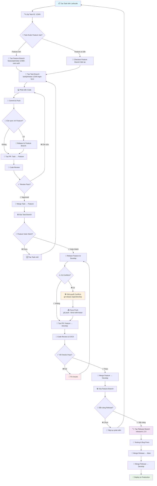
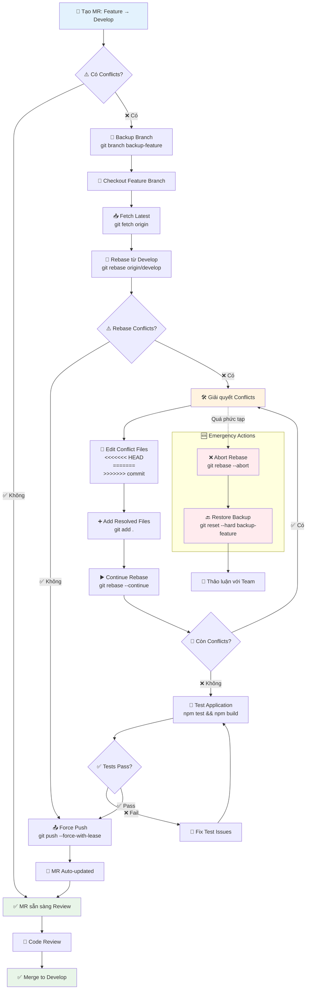
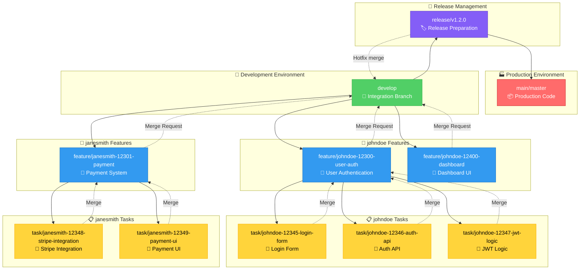
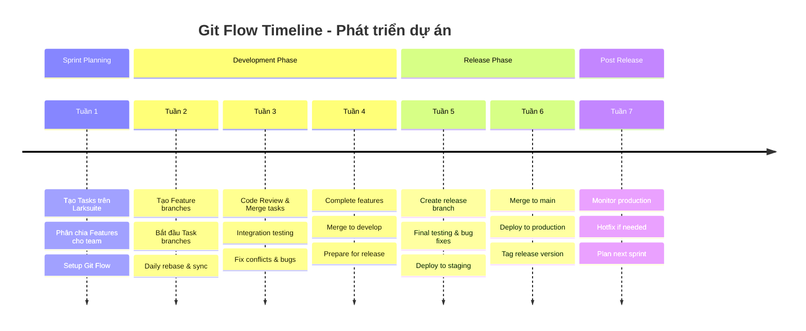
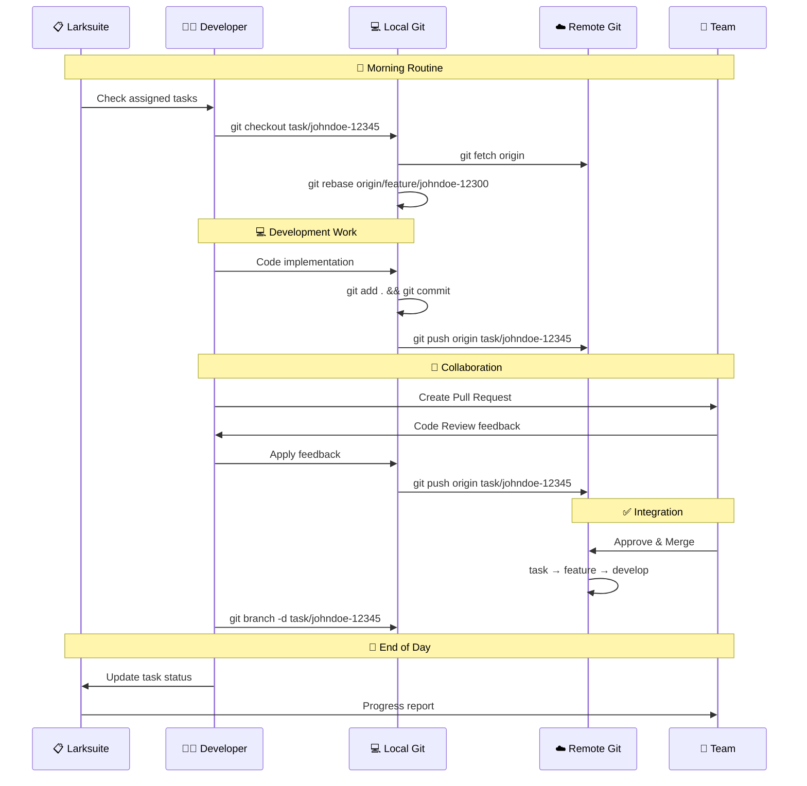

# Tài liệu Git Flow - Quy trình phát triển dự án

## Tổng quan về Git Flow

Git Flow là một mô hình phân nhánh Git được thiết kế để quản lý quy trình phát triển phần mềm một cách có tổ chức và hiệu quả. Trong dự án của chúng ta, chúng ta sử dụng một phiên bản Git Flow tùy chỉnh với các nhánh chính và quy trình làm việc cụ thể.

## Cấu trúc nhánh

### Nhánh chính (Main Branches)

#### 1. `main` (hoặc `master`)
- **Mục đích**: Chứa code production, luôn ở trạng thái stable và có thể deploy
- **Đặc điểm**:
  - Chỉ merge từ nhánh `release`
  - Mỗi commit trên nhánh này tương ứng với một phiên bản release
  - Được bảo vệ, không được commit trực tiếp

#### 2. `release`
- **Mục đích**: Chuẩn bị cho việc release, tích hợp và kiểm thử cuối cùng
- **Đặc điểm**:
  - Được tạo từ nhánh `develop` khi sẵn sàng release
  - Chỉ nhận bug fixes, không nhận feature mới
  - Merge vào cả `main` và `develop` sau khi hoàn thành

#### 3. `develop`
- **Mục đích**: Nhánh phát triển chính, tích hợp tất cả features
- **Đặc điểm**:
  - Nhận merge từ các nhánh `feature`
  - Luôn chứa code mới nhất cho lần release tiếp theo
  - Được sử dụng làm base cho các nhánh `feature` mới

### Nhánh hỗ trợ (Supporting Branches)

#### 4. `feature/*`
- **Mục đích**: Phát triển các tính năng cụ thể
- **Quy tắc đặt tên**: `feature/[github-username]-[larkid]-[mô-tả-ngắn]`
- **Chu trình**: Tạo từ `develop` → Merge về `develop`

#### 5. `task/*`
- **Mục đích**: Thực hiện các task cụ thể trong feature
- **Quy tắc đặt tên**: `task/[github-username]-[larkid]-[mô-tả-ngắn]`
- **Chu trình**: Tạo từ nhánh `feature` → Merge về nhánh `feature`

## Quy trình làm việc chi tiết

### Bước 1: Tạo và quản lý Task trên Larksuite

1. **Tạo task mới** trên Larksuite với mô tả chi tiết
2. **Ghi nhận Task ID** (ví dụ: `12345`)
3. **Phân loại task** thuộc feature nào

### Bước 2: Tạo nhánh Feature

```bash
# Đảm bảo đang ở nhánh develop và cập nhật
git checkout develop
git pull origin develop

# Tạo nhánh feature mới với tên GitHub và Lark ID
git checkout -b feature/johndoe-12300-user-authentication
git push -u origin feature/johndoe-12300-user-authentication
```

**Quy tắc đặt tên nhánh Feature:**
- `feature/johndoe-12300-user-management` - Quản lý người dùng
- `feature/janesmith-12301-api-integration` - Tích hợp API
- `feature/mikewilson-12302-dashboard-ui` - Giao diện dashboard
- `feature/alicebrown-12303-payment-system` - Hệ thống thanh toán
- `feature/davidlee-12304-notification-service` - Dịch vụ thông báo

### Bước 3: Tạo nhánh Task từ Feature

```bash
# Đảm bảo đang ở nhánh feature
git checkout feature/johndoe-12300-user-authentication
git pull origin feature/johndoe-12300-user-authentication

# Tạo nhánh task với GitHub username và ID từ Larksuite
git checkout -b task/johndoe-12345-login-validation
git push -u origin task/johndoe-12345-login-validation
```

**Quy tắc đặt tên nhánh Task:**
- `task/johndoe-12345-login-form` - Form đăng nhập
- `task/janesmith-12346-password-reset` - Reset mật khẩu
- `task/mikewilson-12347-oauth-integration` - Tích hợp OAuth
- `task/alicebrown-12348-user-profile-api` - API thông tin người dùng

### Bước 4: Phát triển và Commit Code

```bash
# Thực hiện thay đổi code
# ...

# Commit với message rõ ràng
git add .
git commit -m "feat(auth): implement login validation logic

- Add email format validation
- Add password strength checker  
- Handle authentication errors
- Update tests for login component

Task: 12345"

# Đẩy code lên remote
git push origin task/johndoe-12345-login-validation
```

**Quy tắc Commit Message:**
```
<type>(<scope>): <subject>

<body>

Task: <larksuite-id>
```

**Các loại commit:**
- `feat`: Tính năng mới
- `fix`: Sửa lỗi
- `docs`: Cập nhật tài liệu
- `style`: Thay đổi format, không ảnh hưởng logic
- `refactor`: Tái cấu trúc code
- `test`: Thêm hoặc sửa tests
- `chore`: Cập nhật build tools, dependencies

### Bước 5: Tạo Pull Request và Merge

#### 5.1: Merge Task → Feature

```bash
# Tạo Pull Request từ task về feature
# Review code và merge

# Sau khi merge, xóa nhánh task
git checkout feature/johndoe-12300-user-authentication
git pull origin feature/johndoe-12300-user-authentication
git branch -d task/johndoe-12345-login-validation
git push origin --delete task/johndoe-12345-login-validation
```

#### 5.2: Merge Feature → Develop

```bash
# Đảm bảo feature hoàn thành và đã test
git checkout feature/johndoe-12300-user-authentication
git pull origin feature/johndoe-12300-user-authentication

# Tạo Pull Request từ feature về develop
# Review code, chạy CI/CD và merge

# Sau khi merge, xóa nhánh feature
git checkout develop
git pull origin develop
git branch -d feature/johndoe-12300-user-authentication
git push origin --delete feature/johndoe-12300-user-authentication
```

#### 5.3: Merge Develop → Release

```bash
# Khi sẵn sàng release
git checkout develop
git pull origin develop

# Tạo nhánh release
git checkout -b release/v1.2.0
git push -u origin release/v1.2.0

# Chỉ sửa bugs trên nhánh release
# Tạo PR merge release → main và release → develop
```

## Quy tắc đặt tên nhánh

### Format chung
```
feature/[github-username]-[larkid]-[mô-tả-ngắn]
task/[github-username]-[larkid]-[mô-tả-ngắn]
```

### Quy tắc chi tiết
- **GitHub username**: Tên username chính xác trên GitHub (giữ nguyên format)
- **Lark ID**: Mã ID từ Larksuite (ví dụ: 12345) - chỉ số, không prefix
- **Mô tả ngắn**: Tóm tắt nội dung bằng tiếng Anh, dùng dấu gạch nối `-`
- **Chữ thường**: Mô tả viết thường, không dấu cách
- **Dấu phân cách**: Sử dụng dấu gạch nối `-` giữa các phần

### Ví dụ GitHub username
- `johndoe` (GitHub: @johndoe)
- `janesmith` (GitHub: @janesmith)
- `mikewilson` (GitHub: @mikewilson)
- `alice-brown` (GitHub: @alice-brown)
- `davidlee91` (GitHub: @davidlee91)
- `nguyenvanan` (GitHub: @nguyenvanan)
- `tran-mai` (GitHub: @tran-mai)

### Ví dụ tên nhánh hoàn chỉnh
**Feature branches:**
- `feature/johndoe-12300-user-authentication`
- `feature/janesmith-12301-payment-integration`
- `feature/mikewilson-12302-dashboard-redesign`

**Task branches:**
- `task/johndoe-12345-login-form-validation`
- `task/alice-brown-12346-password-reset-api`
- `task/davidlee91-12347-oauth-google-integration`

### Quy tắc đặt tên và Lưu ý

### Quy tắc bắt buộc

1. **Không commit trực tiếp** vào `main`, `release`, `develop`
2. **Luôn tạo Pull Request** cho mọi merge
3. **Code review bắt buộc** trước khi merge
4. **Chạy tests** trước khi merge
5. **Xóa nhánh** sau khi merge thành công
6. **Sync thường xuyên** với nhánh base

#### **Khi nào dùng từng phương pháp:**

**🔄 Rebase - Dùng cho:**
- Cập nhật nhánh cá nhân từ base branch
- Đồng bộ với thay đổi mới từ team
- Làm sạch commit history trước khi merge
- Tránh merge commits không cần thiết
- Khi làm việc một mình trên nhánh

**🔀 Merge - Dùng cho:**
- Tích hợp chính thức giữa các nhánh
- Merge thông qua Pull Request
- Giữ lại context và history của feature
- Khi nhiều người cùng làm việc trên nhánh
- Merge vào develop/main

#### **Lưu ý quan trọng:**

**⚠️ Không bao giờ rebase:**
- Nhánh đã được push và có người khác sử dụng
- Nhánh shared như develop, main
- Khi không chắc chắn về tác động

**✅ An toàn khi rebase:**
- Nhánh cá nhân chưa ai khác sử dụng
- Dùng `--force-with-lease` thay vì `--force`
- Backup nhánh trước khi rebase quan trọng

**💡 Best Practice:**
- Rebase thường xuyên để tránh conflicts lớn
- Squash commits liên quan trước khi merge
- Viết commit message rõ ràng sau rebase
- Test kỹ sau mỗi lần rebase

### Xử lý Conflicts trong Merge Request

#### **Tình huống: MR có conflicts với develop**

Khi tạo Merge Request từ feature → develop mà gặp conflicts, **luôn sử dụng REBASE** để giải quyết:

```bash
# Bước 1: Checkout về nhánh feature
git checkout feature/johndoe-LS-12300-user-authentication
git fetch origin

# Bước 2: Rebase từ develop để cập nhật
git rebase origin/develop

# Bước 3: Giải quyết conflicts (nếu có)
# Git sẽ dừng tại commit có conflict
# Sửa files có conflict, sau đó:
git add .
git rebase --continue

# Lặp lại bước 3 cho đến khi hoàn thành
# Nếu muốn hủy rebase:
# git rebase --abort

# Bước 4: Force push (sau khi giải quyết hết conflicts)
git push --force-with-lease origin feature/johndoe-12300-user-authentication

# Bước 5: MR sẽ tự động cập nhật và không còn conflicts
```

#### **Tại sao chọn Rebase thay vì Merge:**

**✅ Ưu điểm của Rebase:**
- History tuyến tính, dễ đọc
- Không tạo merge commit thừa
- Conflicts được giải quyết từng commit
- Feature branch được "updated" với latest develop
- Standard practice trong industry

**❌ Nhược điểm của Merge:**
- Tạo merge commit phức tạp
- History bị rối với nhiều nhánh
- Khó debug khi có vấn đề
- Không phù hợp với workflow hiện đại

#### **Chi tiết xử lý Conflicts:**

```bash
# Khi rebase gặp conflict
git status
# Sẽ hiển thị files bị conflict

# Mở file conflict và sửa
# Tìm các đoạn:
# <<<<<<< HEAD
# (code từ develop)
# =======
# (code từ feature branch)
# >>>>>>> commit-hash

# Sau khi sửa xong tất cả conflicts:
git add .
git rebase --continue

# Nếu có nhiều commits bị conflict, lặp lại quá trình
```

#### **Xử lý trường hợp phức tạp:**

```bash
# Nếu quá nhiều conflicts và muốn hủy
git rebase --abort

# Hoặc rebase interactive để squash commits trước
git rebase -i origin/develop
# Chọn "squash" cho các commits liên quan để giảm conflicts

# Backup branch trước khi rebase (an toàn)
git branch backup-feature-johndoe-LS-12300
git rebase origin/develop
```

#### **Sau khi giải quyết conflicts:**

```bash
# Kiểm tra log để đảm bảo history đúng
git log --oneline -10

# Test lại application
npm test
npm run build

# Push và kiểm tra MR
git push --force-with-lease origin feature/johndoe-LS-12300-user-authentication
```

### Cập nhật nhánh từ base

```bash
# Cập nhật task từ feature
git checkout task/johndoe-12345-login-validation
git fetch origin
git rebase origin/feature/johndoe-12300-user-authentication

# Nếu có conflicts, giải quyết và tiếp tục
git rebase --continue
git push --force-with-lease origin task/johndoe-12345-login-validation
```

## Sơ đồ Git Flow

### Workflow chi tiết từ Larksuite đến Deploy



### Quy trình xử lý Conflicts trong MR



## Workflow Example

### Cấu trúc nhánh và mối quan hệ



### Timeline phát triển dự án



### Quy trình Daily Workflow



## Kết luận

Git Flow này giúp đảm bảo:
- **Tổ chức code rõ ràng** theo từng tính năng và task
- **Truy vết được nguồn gốc** của mỗi thay đổi
- **Kiểm soát chất lượng** thông qua code review
- **Phát triển song song** nhiều tính năng
- **Release ổn định** và có thể rollback

Tuân thủ quy trình này sẽ giúp team làm việc hiệu quả và giảm thiểu conflicts trong quá trình phát triển.