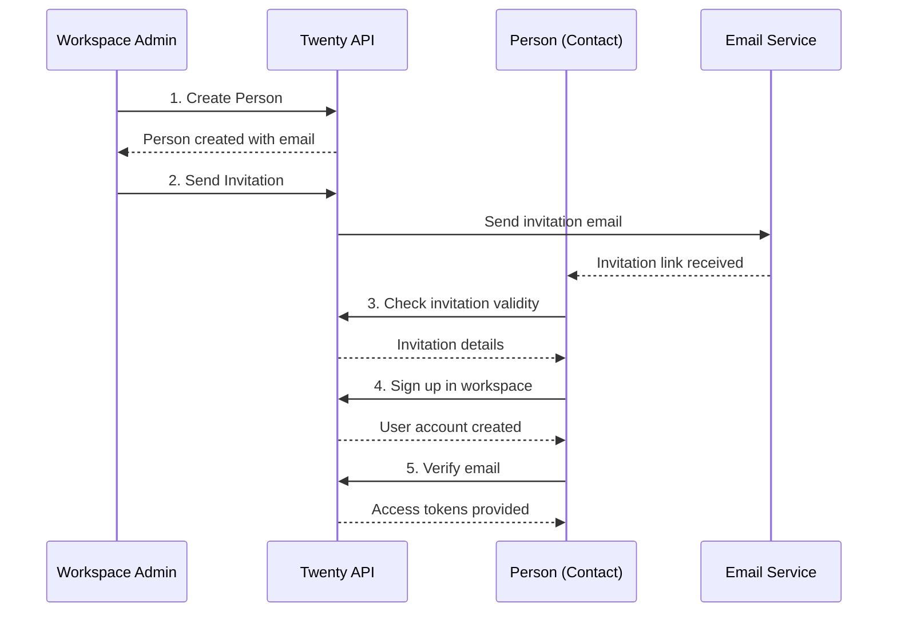

# Person to User Registration API

## Overview

Tài liệu này mô tả quy trình hoàn chỉnh để chuyển đổi một person (contact) thành user của workspace thông qua invitation system.

## Process Flow



---

## Step 1: Check Invitation Validity

Trước khi đăng ký, person cần check xem invitation link có hợp lệ không.

**Endpoint:** `checkWorkspaceInviteHashIsValid`  
**Type:** Query  
**Authentication:** Public (không cần token)

### Input

```graphql
query CheckWorkspaceInviteHashIsValid($inviteHash: String!) {
  checkWorkspaceInviteHashIsValid(inviteHash: $inviteHash) {
    isValid
  }
}
```

### Request Example

```json
{
  "query": "query CheckWorkspaceInviteHashIsValid($inviteHash: String!) { checkWorkspaceInviteHashIsValid(inviteHash: $inviteHash) { isValid } }",
  "variables": {
    "inviteHash": "workspace-invite-hash-from-email"
  }
}
```

### Response Example

```json
{
  "data": {
    "checkWorkspaceInviteHashIsValid": {
      "isValid": true
    }
  }
}
```

---

## Step 2: Get Workspace Information

Lấy thông tin workspace từ invitation hash.

**Endpoint:** `findWorkspaceFromInviteHash`  
**Type:** Query  
**Authentication:** Public (không cần token)

### Input

```graphql
query FindWorkspaceFromInviteHash($inviteHash: String!) {
  findWorkspaceFromInviteHash(inviteHash: $inviteHash) {
    id
    displayName
    logo
    subdomain
    domainName
  }
}
```

### Request Example

```json
{
  "query": "query FindWorkspaceFromInviteHash($inviteHash: String!) { findWorkspaceFromInviteHash(inviteHash: $inviteHash) { id displayName logo subdomain domainName } }",
  "variables": {
    "inviteHash": "workspace-invite-hash-from-email"
  }
}
```

### Response Example

```json
{
  "data": {
    "findWorkspaceFromInviteHash": {
      "id": "workspace-uuid",
      "displayName": "Acme Corp Workspace",
      "logo": "https://example.com/logo.png",
      "subdomain": "acmecorp",
      "domainName": "acmecorp.twenty.com"
    }
  }
}
```

---

## Step 3: Sign Up in Workspace

Đăng ký account user mới trong workspace thông qua invitation.

**Endpoint:** `signUpInWorkspace`  
**Type:** Mutation  
**Authentication:** Public + CaptchaGuard

### Input

```graphql
mutation SignUpInWorkspace(
  $email: String!
  $password: String!
  $workspaceInviteHash: String
  $workspacePersonalInviteToken: String
  $locale: String
  $verifyEmailNextPath: String
) {
  signUpInWorkspace(
    email: $email
    password: $password
    workspaceInviteHash: $workspaceInviteHash
    workspacePersonalInviteToken: $workspacePersonalInviteToken
    locale: $locale
    verifyEmailNextPath: $verifyEmailNextPath
  ) {
    loginToken {
      token
    }
    workspace {
      id
      workspaceUrls {
        front
        api
      }
    }
  }
}
```

### SignUpInput Schema

```typescript
type SignUpInput = {
  email: string;                              // Required: Person's email
  password: string;                           // Required: New password
  workspaceId?: string;                       // Optional: Workspace ID
  workspaceInviteHash?: string;               // Optional: From invitation link
  workspacePersonalInviteToken?: string;      // Optional: Personal invitation token
  captchaToken?: string;                      // Optional: Captcha verification
  locale?: string;                            // Optional: User's locale (en, vi, etc.)
  verifyEmailNextPath?: string;               // Optional: Redirect path after email verification
}
```

### Request Example (Generic Invitation)

```json
{
  "query": "mutation SignUpInWorkspace($email: String!, $password: String!, $workspaceInviteHash: String, $locale: String) { signUpInWorkspace(email: $email, password: $password, workspaceInviteHash: $workspaceInviteHash, locale: $locale) { loginToken { token } workspace { id workspaceUrls { front api } } } }",
  "variables": {
    "email": "john.doe@example.com",
    "password": "securepassword123",
    "workspaceInviteHash": "workspace-invite-hash-from-email",
    "locale": "en"
  }
}
```

### Request Example (Personal Invitation)

```json
{
  "query": "mutation SignUpInWorkspace($email: String!, $password: String!, $workspaceInviteHash: String, $workspacePersonalInviteToken: String, $locale: String) { signUpInWorkspace(email: $email, password: $password, workspaceInviteHash: $workspaceInviteHash, workspacePersonalInviteToken: $workspacePersonalInviteToken, locale: $locale) { loginToken { token } workspace { id workspaceUrls { front api } } } }",
  "variables": {
    "email": "john.doe@example.com",
    "password": "securepassword123", 
    "workspaceInviteHash": "workspace-invite-hash-from-email",
    "workspacePersonalInviteToken": "personal-invite-token-from-email",
    "locale": "en"
  }
}
```

### Response Example

```json
{
  "data": {
    "signUpInWorkspace": {
      "loginToken": {
        "token": "login-token-for-email-verification"
      },
      "workspace": {
        "id": "workspace-uuid",
        "workspaceUrls": {
          "front": "https://acmecorp.twenty.com",
          "api": "https://api.twenty.com"
        }
      }
    }
  }
}
```

---

## Step 4: Email Verification

Sau khi đăng ký, user sẽ nhận email verification. Khi click link verification, họ sẽ được redirect với email verification token.

**Endpoint:** `getLoginTokenFromEmailVerificationToken`  
**Type:** Mutation  
**Authentication:** Public

### Input

```graphql
mutation GetLoginTokenFromEmailVerificationToken(
  $emailVerificationToken: String!
  $origin: String!
) {
  getLoginTokenFromEmailVerificationToken(
    emailVerificationToken: $emailVerificationToken
    origin: $origin
  ) {
    loginToken {
      token
    }
    workspaceUrls {
      front
      api
    }
  }
}
```

### Request Example

```json
{
  "query": "mutation GetLoginTokenFromEmailVerificationToken($emailVerificationToken: String!, $origin: String!) { getLoginTokenFromEmailVerificationToken(emailVerificationToken: $emailVerificationToken, origin: $origin) { loginToken { token } workspaceUrls { front api } } }",
  "variables": {
    "emailVerificationToken": "email-verification-token-from-link",
    "origin": "https://acmecorp.twenty.com"
  }
}
```

### Response Example

```json
{
  "data": {
    "getLoginTokenFromEmailVerificationToken": {
      "loginToken": {
        "token": "verified-login-token"
      },
      "workspaceUrls": {
        "front": "https://acmecorp.twenty.com",
        "api": "https://api.twenty.com"
      }
    }
  }
}
```

---

## Step 5: Get Access Tokens

Chuyển đổi login token thành access tokens để truy cập workspace.

**Endpoint:** `getAuthTokensFromLoginToken`  
**Type:** Mutation  
**Authentication:** Public

### Input

```graphql
mutation GetAuthTokensFromLoginToken($loginToken: String!, $origin: String!) {
  getAuthTokensFromLoginToken(loginToken: $loginToken, origin: $origin) {
    tokens {
      accessToken
      refreshToken
    }
  }
}
```

### Request Example

```json
{
  "query": "mutation GetAuthTokensFromLoginToken($loginToken: String!, $origin: String!) { getAuthTokensFromLoginToken(loginToken: $loginToken, origin: $origin) { tokens { accessToken refreshToken } } }",
  "variables": {
    "loginToken": "verified-login-token-from-step4",
    "origin": "https://acmecorp.twenty.com"
  }
}
```

### Response Example

```json
{
  "data": {
    "getAuthTokensFromLoginToken": {
      "tokens": {
        "accessToken": "workspace-access-token",
        "refreshToken": "workspace-refresh-token"
      }
    }
  }
}
```

---

## Complete JavaScript Example

```javascript
class PersonToUserRegistration {
  constructor(apiUrl) {
    this.apiUrl = apiUrl;
  }

  async checkInvitation(inviteHash) {
    const query = `
      query CheckWorkspaceInviteHashIsValid($inviteHash: String!) {
        checkWorkspaceInviteHashIsValid(inviteHash: $inviteHash) {
          isValid
        }
      }
    `;

    const response = await fetch(this.apiUrl, {
      method: 'POST',
      headers: { 'Content-Type': 'application/json' },
      body: JSON.stringify({
        query,
        variables: { inviteHash }
      })
    });

    const { data } = await response.json();
    return data.checkWorkspaceInviteHashIsValid.isValid;
  }

  async getWorkspaceInfo(inviteHash) {
    const query = `
      query FindWorkspaceFromInviteHash($inviteHash: String!) {
        findWorkspaceFromInviteHash(inviteHash: $inviteHash) {
          id
          displayName
          logo
          subdomain
          domainName
        }
      }
    `;

    const response = await fetch(this.apiUrl, {
      method: 'POST',
      headers: { 'Content-Type': 'application/json' },
      body: JSON.stringify({
        query,
        variables: { inviteHash }
      })
    });

    const { data } = await response.json();
    return data.findWorkspaceFromInviteHash;
  }

  async signUpInWorkspace({ 
    email, 
    password, 
    workspaceInviteHash, 
    workspacePersonalInviteToken,
    locale = 'en' 
  }) {
    const query = `
      mutation SignUpInWorkspace(
        $email: String!
        $password: String!
        $workspaceInviteHash: String
        $workspacePersonalInviteToken: String
        $locale: String
      ) {
        signUpInWorkspace(
          email: $email
          password: $password
          workspaceInviteHash: $workspaceInviteHash
          workspacePersonalInviteToken: $workspacePersonalInviteToken
          locale: $locale
        ) {
          loginToken { token }
          workspace { 
            id 
            workspaceUrls { front api } 
          }
        }
      }
    `;

    const response = await fetch(this.apiUrl, {
      method: 'POST',
      headers: { 'Content-Type': 'application/json' },
      body: JSON.stringify({
        query,
        variables: {
          email,
          password,
          workspaceInviteHash,
          workspacePersonalInviteToken,
          locale
        }
      })
    });

    const { data } = await response.json();
    return data.signUpInWorkspace;
  }

  async getTokensFromLoginToken(loginToken, origin) {
    const query = `
      mutation GetAuthTokensFromLoginToken($loginToken: String!, $origin: String!) {
        getAuthTokensFromLoginToken(loginToken: $loginToken, origin: $origin) {
          tokens {
            accessToken
            refreshToken
          }
        }
      }
    `;

    const response = await fetch(this.apiUrl, {
      method: 'POST',
      headers: { 'Content-Type': 'application/json' },
      body: JSON.stringify({
        query,
        variables: { loginToken, origin }
      })
    });

    const { data } = await response.json();
    return data.getAuthTokensFromLoginToken.tokens;
  }

  // Complete registration flow
  async completeRegistration(registrationData) {
    const { 
      email, 
      password, 
      inviteHash, 
      personalInviteToken,
      origin 
    } = registrationData;

    try {
      // Step 1: Check invitation validity
      console.log('Checking invitation validity...');
      const isValid = await this.checkInvitation(inviteHash);
      if (!isValid) {
        throw new Error('Invalid invitation link');
      }

      // Step 2: Get workspace info
      console.log('Getting workspace information...');
      const workspace = await this.getWorkspaceInfo(inviteHash);
      console.log('Workspace:', workspace.displayName);

      // Step 3: Sign up
      console.log('Signing up user...');
      const signUpResult = await this.signUpInWorkspace({
        email,
        password,
        workspaceInviteHash: inviteHash,
        workspacePersonalInviteToken: personalInviteToken
      });

      console.log('User signed up successfully!');
      console.log('Login token:', signUpResult.loginToken.token);
      console.log('Check your email for verification link');

      return {
        success: true,
        loginToken: signUpResult.loginToken.token,
        workspace: signUpResult.workspace,
        message: 'Please check your email and click verification link'
      };

    } catch (error) {
      console.error('Registration failed:', error);
      return {
        success: false,
        error: error.message
      };
    }
  }
}

// Usage example
const registrationService = new PersonToUserRegistration('https://api.twenty.com/graphql');

// From invitation URL: https://workspace.twenty.com/invite/{inviteHash}?inviteToken={personalToken}&email={email}
const registrationData = {
  email: 'john.doe@example.com',
  password: 'securepassword123',
  inviteHash: 'workspace-invite-hash',
  personalInviteToken: 'personal-invite-token', // Optional
  origin: 'https://workspace.twenty.com'
};

registrationService.completeRegistration(registrationData)
  .then(result => {
    if (result.success) {
      console.log('Registration completed:', result.message);
      // User should check email and click verification link
      // After verification, they can use the tokens to access the workspace
    } else {
      console.error('Registration failed:', result.error);
    }
  });
```

---

## Invitation URL Structure

### Generic Invitation (Public)
```
https://workspace.twenty.com/invite/{workspaceInviteHash}
```

### Personal Invitation (Recommended)
```
https://workspace.twenty.com/invite/{workspaceInviteHash}?inviteToken={personalToken}&email={email}
```

### URL Parameters:
- `workspaceInviteHash`: Workspace public invitation hash
- `personalToken`: Personal invitation token (more secure)
- `email`: Pre-filled email address

---

## Error Handling

### Invalid Invitation
```json
{
  "data": {
    "checkWorkspaceInviteHashIsValid": {
      "isValid": false
    }
  }
}
```

### User Already Exists
```json
{
  "errors": [
    {
      "message": "User already exists",
      "extensions": {
        "code": "USER_ALREADY_EXISTS"
      }
    }
  ]
}
```

### Expired Invitation
```json
{
  "errors": [
    {
      "message": "Invitation expired",
      "extensions": {
        "code": "INVITATION_EXPIRED"
      }
    }
  ]
}
```

---

## Security Notes

1. **Email Verification Required**: User phải verify email trước khi có thể truy cập workspace
2. **Invitation Expiry**: Personal invitation tokens có thời hạn (thường 7 ngày)
3. **Captcha Protection**: SignUp endpoints được bảo vệ bởi captcha
4. **Password Requirements**: Password phải đáp ứng các yêu cầu bảo mật
5. **One-time Use**: Personal invitation tokens chỉ sử dụng được 1 lần

---

## Data Types

### SignUpInput
```typescript
type SignUpInput = {
  email: string;
  password: string;
  workspaceId?: string;
  workspaceInviteHash?: string;
  workspacePersonalInviteToken?: string;
  captchaToken?: string;
  locale?: string;
  verifyEmailNextPath?: string;
}
```

### SignUpOutput
```typescript
type SignUpOutput = {
  loginToken: {
    token: string;
  };
  workspace: {
    id: string;
    workspaceUrls: {
      front: string;
      api: string;
    };
  };
}
```

### WorkspaceInviteHashValid
```typescript
type WorkspaceInviteHashValid = {
  isValid: boolean;
}
```