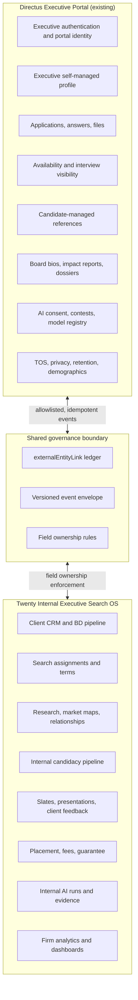
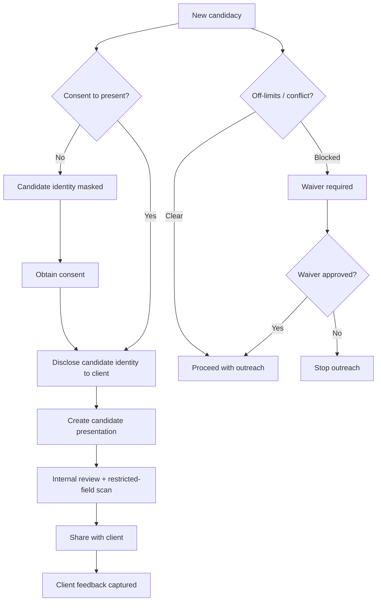

# 03 — System Boundaries and Data Ownership

## Purpose

Define exactly what Directus owns, what Twenty owns, what is shared, and what must never cross the boundary. Every synchronized field has exactly one authority.

## Operating principle

Directus remains the executive-facing source of truth. Twenty becomes the internal source of truth for client CRM, business development, retained-search assignments, research, relationship intelligence, off-limits/conflicts, internal candidacy, client collaboration, placement, and firm analytics. No field is updated bidirectionally without an explicit authority rule.

## Authority rules

For every synchronized field, exactly one authority applies:

| Authority                                  | Meaning                                                                                                     |
| ------------------------------------------ | ----------------------------------------------------------------------------------------------------------- |
| `DIRECTUS_AUTHORITATIVE`                   | Candidate/portal or external source owns the field; Twenty stores a projection or reference.                |
| `TWENTY_AUTHORITATIVE`                     | Internal search operation owns the field; Directus receives only a safe candidate-facing/public projection. |
| `APPEND_ONLY_BOTH_WITH_SHARED_IDEMPOTENCY` | Both systems may append events with shared IDs; neither rewrites history.                                   |
| `DERIVED_IN_TWENTY_FROM_DIRECTUS`          | Twenty computes a derived value from Directus-owned source data.                                            |
| `DERIVED_IN_DIRECTUS_FROM_TWENTY`          | Directus computes a derived value from Twenty-owned source data.                                            |
| `REFERENCE_ONLY_NO_REPLICATION`            | Twenty stores an external ID, hash, or secure link, not a second editable copy.                             |
| `NOT_ALLOWED_TO_SYNC`                      | Data remains in one system; ordinary replication is prohibited.                                             |

Uncontrolled bidirectional last-write-wins synchronization is **never** allowed.

## Data classifications

Every field is classified as one of:

- Public opportunity data
- Public company data
- Candidate self-authored professional data
- Search-firm internal relationship data
- Client-confidential assignment data
- Candidate-confidential candidacy data
- Client-reviewable candidate data
- Restricted compensation data
- Restricted references and diligence
- Restricted accommodations/medical data
- Restricted voluntary demographics
- Commercial/subscription data
- Authentication/security secret
- AI-derived data
- Audit/retention data

## Boundary enforcement

### Authentication secrets — absolute no-sync

Password hashes, tokens, TFA secrets, OTPs, auth payloads, Stripe IDs, and provider secrets are **never** replicated into Twenty objects. This is absolute.

### Commercial-selection firewall

See `07-commercial-selection-firewall.md` and `commercial-selection-firewall.csv`. Subscription tier, plan level, premium status, payment history, learning activity, marketing engagement, and candidate-service usage are excluded from search scoring, AI context, client reports, pipeline automation, and candidate ordering by default. Automated tests must prove non-use.

### Restricted data — purpose-limited exceptions

Protected medical, voluntary demographic, accommodation, and compliance data permits only:

- **No ordinary replication** into search, AI, or client-facing contexts.
- **Exact-field, purpose-limited restricted references** (e.g., compliance officer access to aggregate demographics, minimal accommodation status for scheduling).
- **Approved aggregate analytics** under separately approved privacy-preserving policy.
- Each exception is separately permissioned, documented, and non-selection.

### Confidentiality levels for assignments

- Fully public assignment
- Public role, confidential client
- Confidential role and client (codename only)
- Candidate identity masked until consent
- Client identity withheld until disclosure gate

## Client access boundary

A client must never:

- Browse the executive database
- See executives not deliberately shared
- See internal research sources or notes
- See off-limits details outside their scope
- See another client's assignments
- See unreviewed AI
- See candidate subscription/commercial data
- See voluntary demographics, accommodations, or medical information
- See internal compensation unless explicitly allowed
- See confidential references unless authorized

The client collaboration access model is documented in `adrs/0002-client-collaboration-access-model.md` (proposed; decision gate before PR21).

## Client identity and candidate identity disclosure

