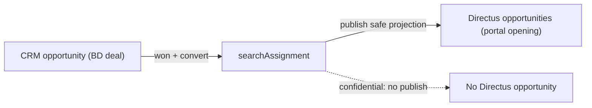
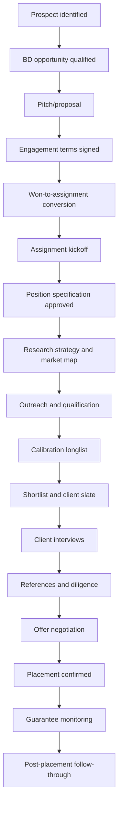
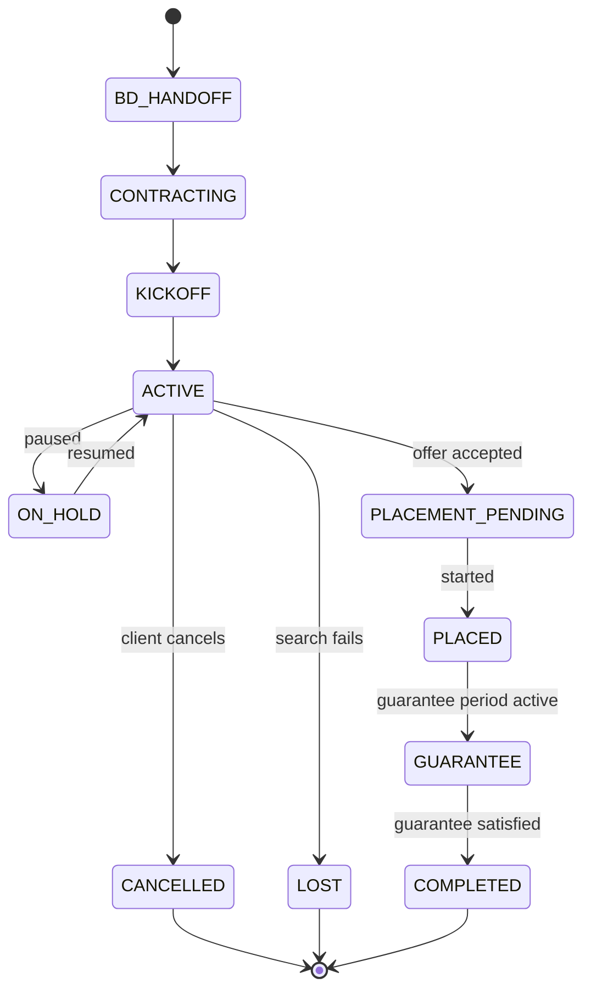
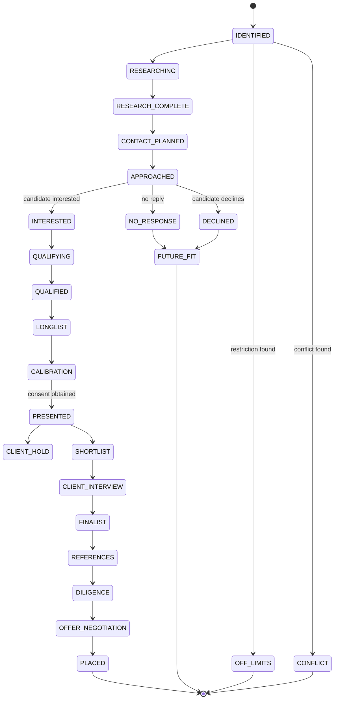

# 04 — Domain Model

## Purpose

This document defines the conceptual object model, business invariants, three-opportunity semantics, and state machines for the Executive Search Operating System. It is a conceptual design — physical schemas, workspace entities, and migrations are deferred to later implementation PRs.

## Evidence basis

- `OBSERVED_REPOSITORY`: Twenty's standard object pattern (`packages/twenty-shared/src/metadata/constants/standard-object.constant.ts`), hybrid core/app architecture (Call Recorder), and existing `company`, `person`, and `opportunity` objects.
- `SUPPLIED_MASTER_PROMPT`: Section 11 (core object model), Section 12 (domain invariants and command services).
- `DERIVED_POLICY`: Object families are classified as core-standard (durable business records) or app-technical (install/config/adapter/UI artifacts). See `core-app-object-ownership.csv`.

## Three-opportunity semantics

The most critical domain distinction is that three different concepts share the word "opportunity":

| Concept                  | Canonical system                                          | Rule                                                                                                                                                                          |
| ------------------------ | --------------------------------------------------------- | ----------------------------------------------------------------------------------------------------------------------------------------------------------------------------- |
| Twenty CRM `opportunity` | Twenty                                                    | A **business-development deal** for winning a retained-search engagement. Won BD deals convert to a `searchAssignment`.                                                       |
| `searchAssignment`       | Twenty                                                    | The central **retained-search delivery engagement**. One per won BD opportunity. Contains team, terms, specification, research, candidacy pipeline, and placement.            |
| Directus `opportunities` | Directus projection / Twenty publish source after cutover | A **candidate-facing Board/C-Suite opening** linked to an assignment. Some confidential assignments have no Directus opportunity. Never confused with the CRM BD opportunity. |

A candidacy (`searchCandidacy`) can exist with or without a Directus application. Passive candidates are approached without applying.

## Object families

### Firm CRM and relationship intelligence

| Family                    | Key objects                                                           | Source section      |
| ------------------------- | --------------------------------------------------------------------- | ------------------- |
| Company/client            | `company` (existing), `clientAccountProfile`, `clientStakeholderRole` | §11.1, §11.7, §11.8 |
| Business development      | CRM `opportunity` (existing, extended), `searchEngagementTerms`       | §11.9, §11.10       |
| Relationship intelligence | `relationshipEdge`                                                    | §11.6               |

### Executive identity and profile

| Family            | Key objects                                                                                                                                                                                                                                | Source section |
| ----------------- | ------------------------------------------------------------------------------------------------------------------------------------------------------------------------------------------------------------------------------------------ | -------------- |
| Executive profile | `executiveProfile`, `executiveCareerExperience`, `executiveEducation`, `executiveBoardService`, `executiveCapability`, `executiveLanguage`, `executiveArtifact`, `executiveAward`, `executiveExternalProfile`, `executiveSearchPreference` | §11.2–§11.5    |

### Search delivery

| Family               | Key objects                                                           | Source section         |
| -------------------- | --------------------------------------------------------------------- | ---------------------- |
| Assignment           | `searchAssignment`, `assignmentTeamMember`, `searchMilestone`         | §11.11, §11.12, §11.15 |
| Specification        | `positionSpecification`, `searchCriterion`                            | §11.13, §11.14         |
| Research             | `researchStrategy`, `marketMap`, `targetCompany`, `researchCandidate` | §11.16–§11.19          |
| Off-limits/conflicts | `offLimitsRestriction`, `conflictCheck`, `confidentialityRecord`      | §11.20–§11.22          |
| Candidacy            | `searchCandidacy`, `candidacyStageEvent`                              | §11.23, §11.24         |
| Assessment           | `executiveAssessment`, `criterionEvaluation`                          | §11.25, §11.26         |
| Slate/presentation   | `searchSlate`, `slateMembership`, `candidatePresentation`             | §11.27–§11.29          |
| Client feedback      | `clientFeedback`, `searchStatusReport`                                | §11.30, §11.31         |
| Interviews           | `searchInterview`                                                     | §11.32                 |
| References/diligence | `referenceCheck`, `diligenceCheck`                                    | §11.33, §11.34         |
| Compensation         | `compensationExpectation`, `offerNegotiation`                         | §11.35, §11.36         |
| Placement            | `placement`, `guaranteeCase`                                          | §11.37, §11.38         |

### Board-specific

| Family            | Key objects                                                                                                                                | Source section |
| ----------------- | ------------------------------------------------------------------------------------------------------------------------------------------ | -------------- |
| Board composition | `boardCompositionProfile`, `boardMatrixCriterion`, `candidateBoardMatrixEvaluation`, `directorIndependenceReview`, `boardCommitmentReview` | §11.39         |

### Integration infrastructure

| Family            | Key objects                                                                                                      | Source section |
| ----------------- | ---------------------------------------------------------------------------------------------------------------- | -------------- |
| External identity | `externalEntityLink`                                                                                             | §8.2           |
| Sync ledger       | inbound/outbound event ledgers, sync checkpoint, conflict record, dead-letter record, reconciliation run/finding | §8.4           |

## Core/app ownership

See `core-app-object-ownership.csv` for the complete registry. Summary:

- **CORE_STANDARD** (survive app disable/uninstall, managed via core upgrade commands): all firm CRM, executive profile, search delivery, board, and integration ledger objects. These are durable business records and system invariants.
- **APP_TECHNICAL** (follow app lifecycle, managed via app install hooks): app configuration, adapter settings, front components, command menu items, navigation entries, and optional presentation widgets.

## Business lifecycle

### Business development to placement

### Assignment state machine

### Candidacy state machine

Internal stages are **not** exposed to candidates directly. Candidate-visible stages are a separate, mapped, versioned projection published to Directus.

## Key domain invariants (high-risk commands)

The following operations must be implemented as validated command services, not ordinary record patches:

1. **ConvertBusinessDevelopmentOpportunityToAssignment**: confirm won status, resolve client/stakeholders, confirm approved engagement terms, run conflict/off-limits checks, create assignment + team + milestones, emit domain event, idempotent.
2. **CreateSearchCandidacy**: resolve/verify executive identity, deduplicate, record origin, run off-limits/conflict before outreach eligibility, set safe initial stage, append first stage event, never auto-client-visible.
3. **Candidacy stage transition**: validate graph + gates (off-limits, disclosure consent, presentation consent), atomic update + append event, enqueue projections, idempotent, override requires reason + elevated permission.
4. **PublishCandidatePresentation**: frozen source snapshot, consent check, restricted-field leakage scan, exclude unreviewed AI/commercial/demographic/internal notes, reviewer approval, never mutate shared version.
5. **OffLimitsGuard**: reusable guard returning CLEAR/REVIEW_REQUIRED/BLOCKED/WAIVER_REQUIRED/EXPIRED_REVIEW_REQUIRED, explaining without over-disclosing.
6. **Placement creation**: link accepted candidacy, update assignment, record fee/credits under restricted permissions, safe portal outcome, guarantee milestones, follow-up tasks.

## Candidate care principles

- Timely progress updates, confidentiality reminders, feedback and closure.
- Future-fit relationship plan for declined/no-response candidates.
- Consent renewal, do-not-contact, and privacy workflows.
- No silent abandonment; post-placement check-ins.
