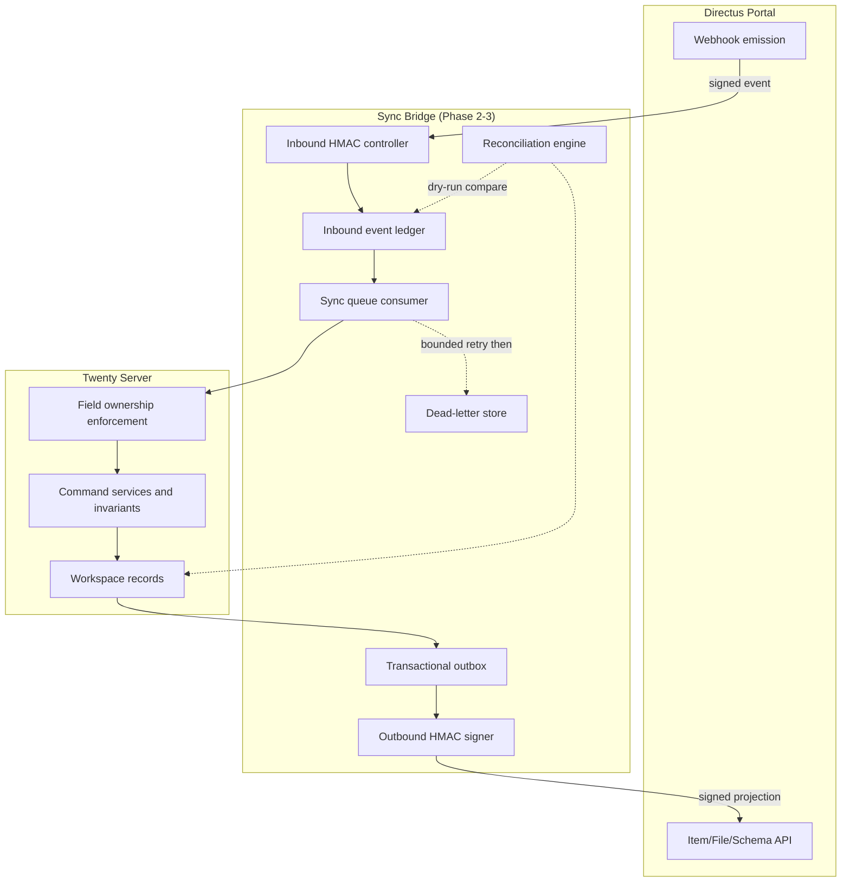

# 05 — Integration Architecture

## Current repository findings (OBSERVED_REPOSITORY)

### Queues (reuse)

Twenty has a mature BullMQ wrapper with custom decorators:

- Queue registry: `engine/core-modules/message-queue/message-queue.constants.ts` — 17 queues. New queues added via enum member.
- Decorators: `@Processor(MessageQueue.x)`, `@Process(JobName)`, `@InjectMessageQueue`.
- Service: `message-queue.service.ts` — `add()`, `addCron()`, `work()`.
- Drivers: BullMQ (prod), sync (tests).

### Inbound webhooks (reuse pattern)

- Generic server-route: `engine/core-modules/server-route-trigger/server-route-trigger.controller.ts` — `@Controller('webhooks/server')` with `PublicEndpointGuard` + `NoPermissionGuard`.
- HMAC-verified (Stripe template): `engine/core-modules/billing-webhook/` — reads signature header, verifies via `stripe.webhooks.constructEvent`.
- SNS/SES signature verification: `modules/messaging-webhooks/services/sns-signature-verifier.service.ts`.
- **Pattern for Directus inbound:** public route + guards + HMAC verification in service body.

### Domain events (reuse emission; build durability)

- Emitter: `engine/workspace-event-emitter/workspace-event-emitter.ts` — `emitDatabaseBatchEvent`, `emitCustomBatchEvent`. Wraps `EventEmitter2`.
- Events named `<objectSingular>.<action>` (created/updated/deleted/destroyed/restored/upserted).
- Central fan-out listener: `entity-events-to-db.listener.ts` — enqueues to webhook/trigger/event-logs queues + GraphQL subscriptions.

**Gap:** Events are **in-memory (EventEmitter2), not transactional**. No outbox table, no at-least-once guarantee, no replay. If the process crashes between DB commit and event handling, the event is lost. `entityEventsToDbQueue` persists event logs after the fact but is not a transactional outbox.

**Build:** A durable outbox + reconciliation layer must be built before any portal projections.

### Permissions (reuse and extend)

Twenty has mature object/field/row-level permissions enforced at the ORM layer:

- `permissions.utils.ts` — `validateQueryIsPermittedOrThrow()` called from every workspace query builder.
- Field-read restrictions enforced even on `SELECT *`.
- Row-level predicates via `apply-row-level-permission-predicates.util.ts`.

The commercial-selection firewall extends this with field-exclusions on search-delivery roles.

## Desired architecture

## Core/app ownership and lifecycle

See `core-app-object-ownership.csv` for the complete registry. Key rules:

- Durable business records (CRM, executive profile, search delivery, board, integration ledger) are **CORE_STANDARD** — they survive app disable/uninstall and are managed by core upgrade commands.
- App configuration, adapters, UI artifacts, and agent definitions are **APP_TECHNICAL** — they follow app lifecycle (disabled on app disable, removed on uninstall) and are managed by app install hooks.
- Moving an object from one owner to another requires an explicit migration with data preservation.

## Directus adapter design

The adapter is modeled as app logic functions with:

- `serverRouteTriggerSettings` for inbound webhook receipt.
- `cronTriggerSettings` for scheduled reconciliation.
- `databaseEventTriggerSettings` for outbound projection on Twenty record changes.
- `serverVariables` for secret Directus credentials (never exposed to front components).

The adapter name is generic (not hard-wired throughout domain code), enabling future system expansion beyond Directus.

## Gaps that must be built

1. **Transactional outbox** — current events are non-durable.
2. **Idempotency keys** — BullMQ job IDs intentionally append random UUIDs; not dedup keys.
3. **Dead-letter queue / re-drive** — only retention exists, no DLQ mechanism.
4. **Reconciliation engine** — no scheduled cross-system comparison exists.
5. **Directus adapter** — zero Directus code exists in the repository.
