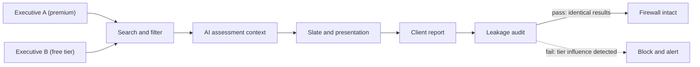

# 07 — Commercial-Selection Firewall

## Purpose

Ensure that candidate commercial, subscription, payment, learning, marketing, and candidate-service data can never influence search, assessment, AI, slate, presentation, or client reporting. This is a hard architectural firewall, not an advisory label.

## Prohibited data classes

The following are **not allowed in selection or candidate ordering by default**:

- `executives.subscription_tier`
- `executives.plan_level`
- `executives.is_premium`
- Candidate product limits and engagement limits
- `executive_settings.stripe_customer_id`
- Purchase/payment history
- Marketing opt-in
- Learning activity, course completion, quiz activity, content consumption (unless a specific credential is explicitly job-related and candidate-authorized)
- Profile views and marketing engagement
- Candidate-service usage frequency
- `executive_psychographic`
- Photo analysis and photo scores
- Birthdate, year of birth, gender, voluntary demographics
- Accommodation and medical information
- Unreviewed AI culture-fit or success-probability outputs

## Enforcement layers

### 1. Search-index exclusion

Prohibited fields are excluded from `searchVector` tsvector generation and from all search-filter configurations. The search index builder for executive objects must not include any commercial or protected field in its column expression.

**Automated test:** assert that no prohibited selector appears in any executive search-field configuration.

### 2. Field-level permission barriers

Search-delivery roles (partner, researcher, coordinator) have field-read restrictions on commercial/subscription/payment fields via Twenty's ORM-enforced field permissions (`field-permission.entity.ts`). A restricted field cannot be read even via `SELECT *`.

### 3. AI context allowlist

The AI context builder uses a positive allowlist: only explicitly approved fields enter AI context. Prohibited selectors are absent from the allowlist by construction.

**Automated test:** assert that the AI context allowlist for any candidate-affecting capability has empty intersection with `commercial-selection-firewall.csv`.

### 4. Client report and presentation exclusion

Candidate presentations and client reports run a restricted-field leakage scan before sharing. The scan fails if any prohibited selector appears in the presentation payload.

**Automated test:** `PublishCandidatePresentation` command must reject a payload containing any firewall-prohibited field.

### 5. Pipeline automation exclusion

Stage transitions, workflow triggers, and bulk operations cannot reference commercial or protected fields as decision inputs.

**Automated test:** assert that no workflow trigger or stage-transition rule references a prohibited selector.

## Leakage test contract

Two otherwise identical executives with different subscription tiers must produce identical search results, AI assessments, slates, and client reports. The audit confirms no commercial feature was used.

## Machine-checkable registries

- `commercial-selection-firewall.csv` — prohibited selectors × contexts with PROHIBITED status.
- `candidate-facing-nonreplication-denylist.csv` — boundary denylist for data that must not reach Twenty, candidates, clients, search, reports, exports, logs, or AI contexts.

Both registries are validated by `validate-directus-governance.mjs` and covered by contract tests in `tests/directus-governance.test.mjs`.

## Absolute no-sync vs restricted reference

| Category                | Rule                                                              | Example                                               |
| ----------------------- | ----------------------------------------------------------------- | ----------------------------------------------------- |
| Authentication secrets  | Absolute no-sync; never replicated                                | password hash, TFA secret, OTP                        |
| Commercial/subscription | No-sync into search delivery; ORM-excluded                        | subscription_tier, stripe_customer_id                 |
| Voluntary demographics  | No individual replication; aggregate-only by approved policy      | candidate_demographics_voluntary                      |
| Medical/accommodations  | No-sync into evaluators; minimal status projection for scheduling | accommodation_requests (status only, no medical docs) |
| Learning/marketing      | No-sync into search unless explicit job-related credential        | learning_path_progress                                |
| Legacy risky AI         | Quarantine; excluded from progression                             | culture_fit_score, success_probability                |
