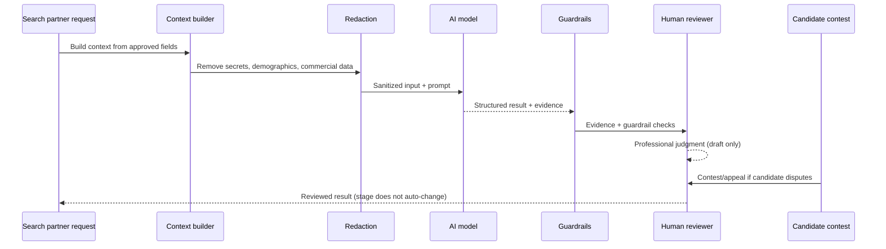

# 08 — AI Governance

## Purpose

Define how AI is governed across Directus and Twenty, ensuring evidence-based, human-reviewed AI that preserves professional judgment, with legacy risky AI quarantined.

## Current Twenty AI architecture (OBSERVED_REPOSITORY)

Twenty has rich AI infrastructure under `engine/metadata-modules/ai/`:

- **Agent entity** (`ai-agent/entities/agent.entity.ts`): name, prompt, modelId, responseFormat, modelConfiguration, evaluationInputs.
- **Execution records** (`ai-agent-execution/entities/`): agent turns, messages, message parts — full run audit trail.
- **Execution services**: `AgentRunService`, async executor, actor context.
- **Monitoring**: per-turn evaluation scoring (`agent-turn-evaluation.entity.ts`).
- **Model config**: `ai-model-registry.service.ts`, `ai-model-config.service.ts`, provider config, SDK provider factory.
- **Chat**: queue-backed, persists threads.
- **Roles**: agents assigned roles tied to the permission engine.

**Gap:** No Directus-compatible prompt/model/run/evidence/guardrail/contest registry exists. Directus has its own model registry (`ai_model_registry`), prompt templates (`prompt_templates`), assessment runs/evidence/guardrails, request logs, audit runs/metrics/findings, and candidate contests.

## Canonical registry decision (PROPOSED ADR)

See `adrs/0001-ai-governance-canonical-registry.md`. Three options:

1. **Directus-canonical**: Directus governance collections remain canonical; Twenty writes through a governed API.
2. **Shared-service-canonical**: A shared AI governance service becomes canonical; both systems reference it.
3. **Twenty-canonical-after-migration**: Twenty becomes canonical after explicit migration with backward-compatible Directus projections.

**Decision gate:** immediately before PR30. No contradictory "current" model/prompt versions may exist across systems in the meantime.

## AI governance requirements

### Evidence and provenance

Every candidate-affecting AI output must record:

- Capability, subject, assignment
- Model, prompt, policy version
- Input references and hashes
- Redaction manifest (what was removed)
- Structured result and evidence per criterion
- Guardrail checks and results
- Human reviewer, review decision, override
- Client/candidate visibility
- Contest/appeal linkage

### Human professional judgment

- AI may draft but cannot submit an assessor's professional judgment.
- Every candidate-affecting AI output requires human review before use.
- Stage changes, client presentations, and rejections are never automatic.
- AI drafts are labeled and do not count as human submission.

### Legacy AI quarantine

The following Directus legacy outputs are preserved but quarantined:

- `ai_application_analysis.matching_score`
- `ai_application_analysis.success_probability`
- `ai_application_analysis.overall_culture_fit_percentage`
- `ai_application_analysis.competitive_analysis`
- `executive_psychographic`
- Photo analysis/photo scores
- Candidate ranking artifacts

**Required behavior:** preserve history, mark provenance and legacy contract version, exclude from automated progression and default client reports, do not use as training labels without governance approval, record when a human viewed or relied upon a legacy result, support candidate contest linkage.

## Prohibited AI uses

The following are **never** implemented or enabled by default:

- Automatic hire, reject, shortlist, or client presentation
- Opaque executive ranking
- Subscription or payment-based ranking
- Culture-fit scoring
- Psychometric/psychographic selection
- Emotion recognition
- Facial analysis
- Voice personality or accent scoring
- "Executive presence" inference from appearance or vocal style
- Protected-class inference
- Age inference
- Social-media lifestyle surveillance
- Unverified reputation allegations treated as fact
- Automatic off-limits waiver or conflict resolution
- Automatic reference outreach without consent/policy
- Silent recording/transcription
- AI-generated professional judgment presented as human-authored
- Cross-client reuse of confidential candidate/client data

## Executive-search AI capabilities (future, risk-ordered)

| Capability                           | Risk   | Human approval    | Phase  |
| ------------------------------------ | ------ | ----------------- | ------ |
| Assignment intake assistant (drafts) | Low    | Required          | PR31   |
| Position specification draft         | Low    | Required          | PR31   |
| Research strategy draft              | Low    | Required          | PR31   |
| Status report draft                  | Low    | Partner review    | PR31   |
| Candidate presentation draft         | Medium | Consent + review  | PR31   |
| Natural-language search filters      | Low    | Transparent       | PR32   |
| Target-company suggestions           | Low    | Researcher review | PR32   |
| Relationship path suggestions        | Medium | No auto-send      | PR32   |
| Criterion assessment (shadow mode)   | High   | Human submits     | PR33   |
| Board matrix evaluation              | Medium | Human review      | PR34   |
| Search health advisory               | Low    | Advisory only     | PR14.5 |

## Kill switches

Each AI capability has an independent kill switch. When triggered, the capability returns no results, logs the deactivation, and does not affect any in-flight candidacy, stage, or client decision.
