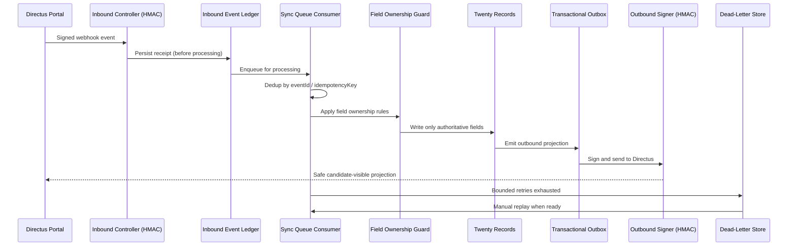

# Sync Runbook

**Status: NON-OPERATIONAL until Phase 2 code and Directus access exist.**

This runbook documents future operational procedures. It cannot be executed until the sync bridge (PR2–PR4) is implemented and live Directus access is configured.

## Inbound and outbound synchronization flow

## Enable/disable inbound sync

1. Verify Directus endpoint and credentials are configured (server variables).
2. Enable inbound webhook endpoint.
3. Monitor inbound event ledger for receipt.
4. To disable: pause the inbound queue consumer; events queue in the ledger without processing.

## Enable/disable outbound sync

1. Verify field ownership configuration is approved.
2. Enable outbound projection listeners.
3. Monitor outbound event ledger.
4. To disable: pause outbound queue consumer; events queue in the outbox without sending.

## Replay an event

1. Identify the event in the inbound/outbound ledger by eventId or idempotencyKey.
2. Replay through the queue consumer.
3. Idempotency dedup prevents duplicate records.
4. Verify before/after hashes recorded.

## Resolve identity conflict

1. Identify the conflicting `externalEntityLink` records.
2. Human review determines the correct mapping.
3. Deactivate the incorrect link (do not delete — preserve audit).
4. Create the correct link.
5. Reconcile affected records.

## Resolve field ownership conflict

1. Identify the conflicting field via conflict record.
2. Human review determines the authoritative value based on the ownership registry.
3. Apply the authoritative value.
4. Record the resolution in the conflict record.

## Rotate Directus secret

1. Generate new Directus API token/secret.
2. Update server variable.
3. Verify inbound signature verification still works.
4. Verify outbound authentication still works.
5. Revoke old token.

## Reconcile one record/assignment

1. Run reconciliation for the specific record or assignment.
2. Review findings (existence, authoritative field hashes, candidate-visible state, published state, interview schedule, reference state, consent flags, AI references, file references, retention state).
3. Dry-run any corrective action.
4. Apply only after dry-run approval.

## Pause public opportunity

1. Send `opportunity.paused` outbound event.
2. Verify Directus reflects paused state.
3. Monitor candidate-facing impact.

## Revoke client access

1. Deactivate client role/predicates.
2. Revoke any shared slates/presentations.
3. Audit client access log.

## Revoke candidate presentation

1. Mark presentation version as revoked/superseded.
2. Do not mutate the already-shared version (immutable).
3. Create a new version if needed.
4. Notify client of supersession.

## Apply off-limits emergency block

1. Create `offLimitsRestriction` with immediate effect.
2. Guard blocks all in-flight outreach/presentation for affected parties.
3. Audit all affected candidacies.

## Disable AI capability

1. Trigger kill switch for the capability.
2. Capability returns no results.
3. Log deactivation.
4. No effect on in-flight candidacy/stage/client decisions.

## Process candidate privacy request

1. Receive privacy deletion/anonymization request.
2. Propagate to Directus via retention action.
3. Reconcile across both systems.
4. Verify derived AI/search data is anonymized.
5. Record in retention audit.

## Recover queue backlog

1. Identify failed/dead-lettered jobs.
2. Inspect dead-letter records.
3. Fix root cause.
4. Replay from ledger with idempotency.
5. Monitor for echo loops.

## Restore from failed backfill

1. Check backfill checkpoint.
2. Resume from last checkpoint (idempotent).
3. Verify counts and referential integrity.
4. Run shadow sync to detect drift.
