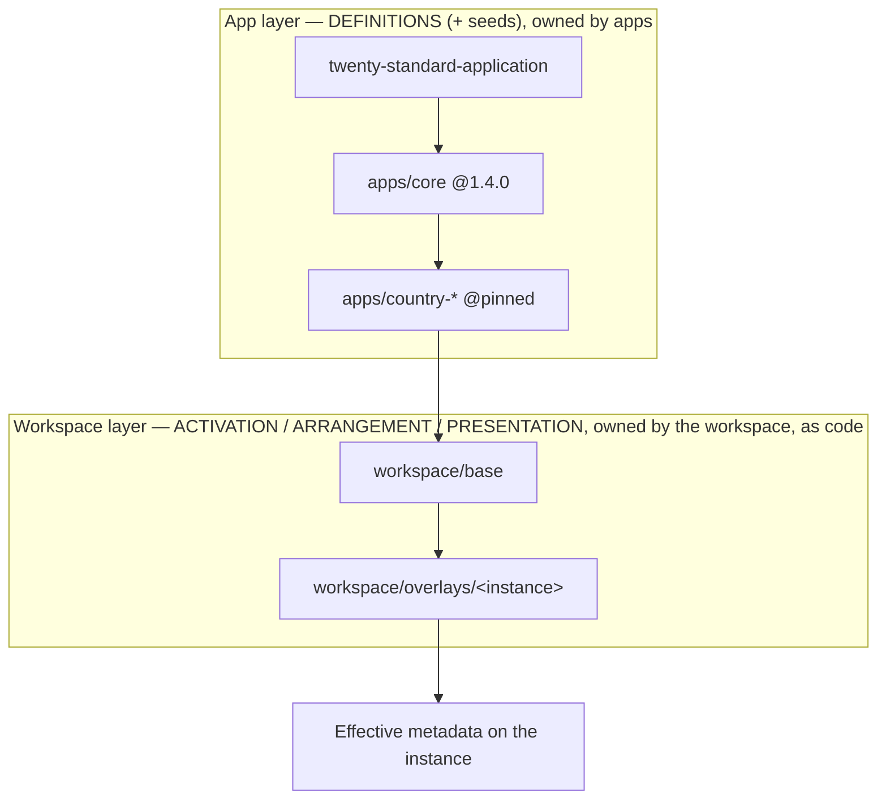
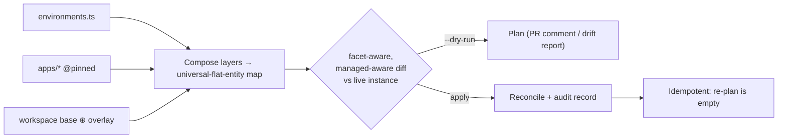

# Twenty Config-as-Code — Enterprise Plan (codename: "Bayer")

> **Status:** Planning branch (`claude/bayer-config-as-code-plan`). This branch is a
> design artifact and is **never intended to be merged**. It exists to hold the full,
> detailed plan that takes Twenty from its current state to a fully declarative,
> GitOps-managed, multi-instance configuration platform suitable for a large regulated
> enterprise.

## What this plan is

A large life-sciences enterprise ("Bayer" — used throughout as the archetype of a big,
regulated, multi-country customer) wants to manage **everything about their Twenty
deployment as code**: objects, fields, functions, page layouts, views, command menu,
navigation, labels/translations, which apps are installed where, and per-environment
values — across `dev` / `staging` / `prod` and across multiple regional instances, with
a **central app** plus **per-country apps** that are only installed on some instances.

Clicking into a workspace UI to arrange or relabel things is **not an option** for them.
Git must be the source of truth, changes must go through pull-request review and CI, and
promotion must flow `dev → staging → prod` with an auditable trail (a hard requirement in
a GxP / 21 CFR Part 11 regulated context).

This plan describes the **end-state experience**, the **ownership model** that makes it
coherent, the **architecture changes** in `twenty-server` and `twenty-sdk`, the **repo
structure** the customer authors against, and a **sequenced roadmap** to build it.

## The one-sentence framework

> **Apps deliver capabilities and suggested defaults; the workspace owns what is turned
> on, where it sits, and what it is called. Both are authored as code. Nothing edits
> another owner's definition in place.**

Ownership of every property is decided mechanically by its **facet**
(Definition / Activation / Arrangement / Presentation). See
[`01-ownership-model.md`](./01-ownership-model.md).

## How to read this plan

Read in order for the full narrative; jump directly if you know what you want.

| # | Document | Audience | What it answers |
|---|----------|----------|-----------------|
| — | [README.md](./README.md) | everyone | Index, framing, how to navigate |
| 00 | [00-vision-and-north-star.md](./00-vision-and-north-star.md) | leadership, product | What is the dream end-state? Personas, success criteria, regulatory drivers |
| 01 | [01-ownership-model.md](./01-ownership-model.md) | architects, app devs | The facet model, surfaces-as-commons, the mechanical decision rule |
| 02 | [02-current-state-analysis.md](./02-current-state-analysis.md) | engineers | What Twenty already has (grounded in code) vs. the gaps to close |
| 03 | [03-target-architecture.md](./03-target-architecture.md) | server engineers | Server-side target: facet registry, unified overrides, managed mode, drift, the workspace-config artifact |
| 04 | [04-sdk-config-authoring-layer.md](./04-sdk-config-authoring-layer.md) | SDK/DevEx engineers | The `twenty-sdk/config` API: `defineEnvironments`/`defineInstance`/`defineActivation`/… |
| 05 | [05-repo-structure-and-gitops.md](./05-repo-structure-and-gitops.md) | platform teams | The customer repo layout, overlays, promotion, secrets, CI plan/apply |
| 06 | [06-reference-example.md](./06-reference-example.md) | everyone | A concrete, end-to-end `bayer-twenty/` walkthrough |
| 07 | [07-implementation-roadmap.md](./07-implementation-roadmap.md) | eng leads | Phased PR sequence, milestones, dependencies, sizing |
| 08 | [08-testing-and-verification.md](./08-testing-and-verification.md) | QA, eng | Test strategy, drift tests, validation/CSV evidence |
| 09 | [09-risks-and-open-questions.md](./09-risks-and-open-questions.md) | everyone | Risks, trade-offs, decisions still needed |
| 10 | [10-glossary.md](./10-glossary.md) | everyone | Precise definitions of every term used |

## Architecture at a glance

How an instance's effective configuration is composed (lowest → highest precedence; higher layers may
set only workspace-owned facets on lower-layer entities):

The reconcile loop (`plan` shows it, `apply` executes it — one engine, driven by `universalIdentifier`):

## The three pillars

1. **A crisp ownership model** so nobody has to hold a product debate per metadata type.
   Every property has a *facet*; the facet decides who owns it and how upgrades treat it.
2. **A managed, declarative workspace layer.** "Workspace-owned" ≠ "clicked". The
   workspace layer is authored as code and reconciled; UI edits are locked on managed
   instances and surface as drift.
3. **A GitOps repo + CI** that composes central and per-country apps over multiple
   instances with base⊕overlay, version-pinned promotion, encrypted secrets, and
   `plan`/`apply` semantics identical in spirit to Terraform.

## Design invariants (non-negotiables that every later document must respect)

- **Identity is `universalIdentifier`, never a per-instance DB UUID.** Portability across
  `dev`/`staging`/`prod` depends on stable identifiers.
- **One reconciliation engine.** The workspace-config layer rides the *same*
  universal-flat-entity diff/apply engine that app manifests already use — no second
  engine.
- **Additive, never in-place foreign edits.** An app may add namespaced/attributed
  components onto another app's object; it may never mutate another owner's component.
  Cross-owner "changes" are overrides in a distinct, reversible layer.
- **Everything auditable and reproducible.** Any instance must be rebuildable from Git
  alone. Every change is a reviewed commit.

## Provenance

This plan is grounded in a reading of the current `twenty-server` and `twenty-sdk`
code (entity model, the flat-entity/universal-flat-entity migration system, the property
configuration registry, `OverridableEntity`, the application manifest + install/sync
services, and the SDK `define*` authoring API). Specific file anchors are cited inline in
[`02-current-state-analysis.md`](./02-current-state-analysis.md) and
[`03-target-architecture.md`](./03-target-architecture.md).
