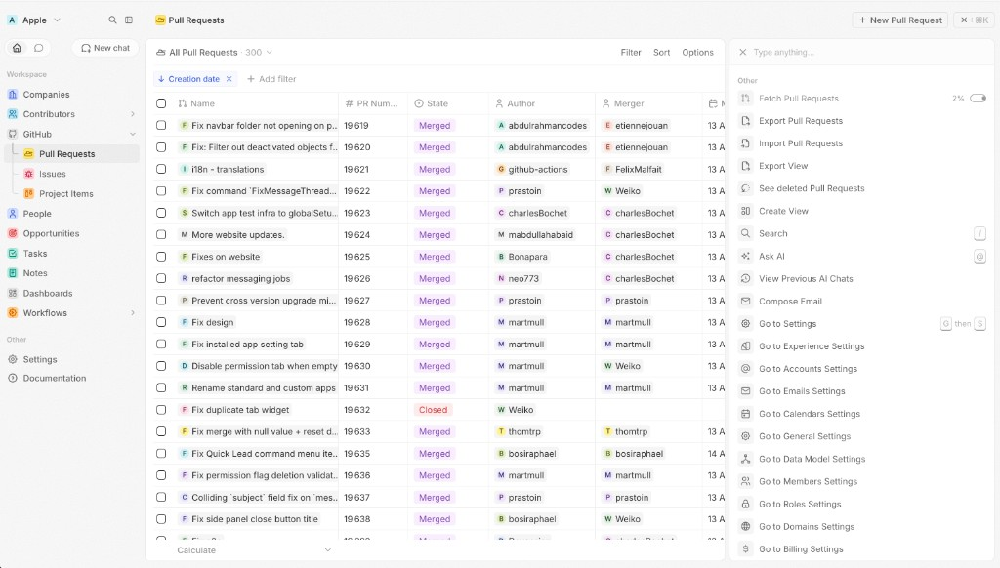

# GitHub Connector

Sync pull requests, issues, contributors and project items from GitHub into
Twenty, and react to GitHub webhook events in real time.

This app showcases how to build a non-trivial third-party connector with the
Twenty SDK: custom objects with rich relationships, navigation menu items,
table views, logic functions for periodic syncs, an HTTP webhook handler, and
authenticated GraphQL/REST calls against an external provider.



## What it adds to your workspace

Six custom objects, each with fields, relationships, table views, and a
navigation entry under a top-level "GitHub" section:

- `pullRequest`
- `pullRequestReview`
- `pullRequestReviewEvent`
- `issue`
- `projectItem`
- `contributor`

Logic functions wired up:

| Function                          | Trigger                                          |
| --------------------------------- | ------------------------------------------------ |
| `count-prs`                       | HTTP `POST /github/count-prs`                    |
| `fetch-prs`                       | HTTP `POST /github/fetch-prs`                    |
| `count-issues`                    | HTTP `POST /github/count-issues`                 |
| `fetch-issues`                    | HTTP `POST /github/fetch-issues`                 |
| `count-contributors`              | HTTP `POST /github/count-contributors`           |
| `fetch-contributors`              | HTTP `POST /github/fetch-contributors`           |
| `count-project-items`             | HTTP `POST /github/count-project-items`          |
| `fetch-project-items`             | HTTP `POST /github/fetch-project-items`          |
| `handle-github-webhook`           | HTTP `POST /github/webhook` (no auth, signed)    |
| `search-contributors`             | HTTP `POST /contributors/search`                 |
| `contributor-stats`               | HTTP `POST /contributors/stats`                  |
| `recompute-pull-request-reviews`  | HTTP `POST /pull-request-reviews/recompute`      |

Four headless front-components expose the manual sync flows as commands in
the Twenty UI:

- **Fetch Pull Requests** (visible on the Pull Request object)
- **Fetch Issues** (visible on the Issue object)
- **Fetch Contributors** (visible on the Contributor object)
- **Fetch Project Items** (visible on the Project Item object)

## Install

You have two options. Use **dev mode** for a tight edit/test loop while
iterating on the app, or **install** for a one-shot deploy.

### Option A — Live development (`yarn twenty dev`)

Use this when you want every code change to be re-synced into your local
Twenty server automatically.

```bash
cd packages/twenty-apps/community/github-connector
yarn install

# Register your local Twenty server as a remote (interactive prompt).
# When asked for the URL use http://localhost:2021 and paste an API key
# from Settings -> Developers in the Twenty UI.
yarn twenty remote add

# Build, install, and watch for changes.
yarn twenty dev
```

The first `yarn twenty dev` run installs the app on the remote and starts
watching `src/`. Edit any file and the change is re-synced within seconds.

### Option B — One-shot install

```bash
cd packages/twenty-apps/community/github-connector
yarn install
yarn twenty remote add        # same prompts as above
yarn twenty install           # builds and installs once
```

## Configure authentication

Once the app is installed, open the Twenty UI and go to
**Settings → Apps → GitHub Connector**. You only need one of the two auth
methods.

### Option 1 — Personal Access Token (recommended for trying it out)

| Variable        | Required | Notes                                                                |
| --------------- | -------- | -------------------------------------------------------------------- |
| `GITHUB_TOKEN`  | yes      | Fine-grained PAT (preferred) or classic PAT. See permissions below.  |

Create a fine-grained PAT at
<https://github.com/settings/personal-access-tokens>:

1. **Resource owner**: yourself or the org that owns the repos in
   `GITHUB_REPOS`.
2. **Repository access**: pick the specific repos (or "All repositories").
3. **Repository permissions** — set to **Read-only**:
   - `Contents`
   - `Issues`
   - `Pull requests`
   - `Metadata` (selected automatically)
4. **Organization permissions** — only if you want to sync GitHub Projects
   (v2): set `Projects` to **Read-only**.
5. Generate, then copy the `github_pat_…` value.

(Classic PATs at <https://github.com/settings/tokens> still work. They need
`repo` + `read:org` for PR/issue/contributor syncs, plus `read:project`
when you also sync GitHub Projects (v2). Fine-grained tokens are scoped
tighter and recommended.)

When `GITHUB_TOKEN` is set, it always wins regardless of any GitHub App
config below.

### Option 2 — GitHub App (recommended for production / org-wide installs)

| Variable                     | Required | Notes                                                                  |
| ---------------------------- | -------- | ---------------------------------------------------------------------- |
| `GITHUB_APP_ID`              | yes      | Numeric App ID from the GitHub App settings page.                      |
| `GITHUB_APP_PRIVATE_KEY`     | yes      | PEM private key (BEGIN/END PRIVATE KEY block). Newlines are tolerant.  |
| `GITHUB_APP_INSTALLATION_ID` | yes      | The installation id of the App on your org/user.                       |

To create one:

1. <https://github.com/settings/apps/new> (or
   `https://github.com/organizations/<org>/settings/apps/new`).
2. Grant the App these **repository permissions**: `Contents: Read`,
   `Issues: Read`, `Pull Requests: Read`, `Metadata: Read`. For Projects v2
   add `Organization → Projects: Read`.
3. Generate a private key (downloads a `.pem`).
4. Install the App on your org/user — the URL bar of the post-install page
   contains the installation id, e.g. `.../installations/12345678`.
5. Paste the App ID, the PEM contents, and the installation ID into the
   variables above.

The connector exchanges the App credentials for a short-lived installation
token (cached in-memory until shortly before expiry) and uses it for all
GitHub calls.

### Common variables

| Variable                  | Required | Notes                                                                                   |
| ------------------------- | -------- | --------------------------------------------------------------------------------------- |
| `GITHUB_REPOS`            | yes      | Comma-separated `owner/repo` list, e.g. `octocat/hello-world,octo-org/octo-repo`.       |
| `GITHUB_PROJECTS`         | no       | Comma-separated GitHub Projects (v2) as `owner/number` (e.g. `twentyhq/24,octo/3`). Owner can be an org or a user. Full URLs like `https://github.com/orgs/twentyhq/projects/24` also work. |
| `GITHUB_WEBHOOK_SECRET`   | no       | Shared secret to verify `X-Hub-Signature-256`. When unset, signatures are not verified. |

## Running a sync

In the Twenty UI, open any of the GitHub objects (e.g. **Pull Requests**) and
trigger the matching command from the command palette (`Cmd/Ctrl+K`):

- Pull Requests view → **Fetch Pull Requests**
- Issues view → **Fetch Issues**
- Contributors view → **Fetch Contributors**
- Project Items view → **Fetch Project Items**

Each command iterates over every entry in `GITHUB_REPOS` (or
`GITHUB_PROJECTS`) and shows a progress bar.

## Webhooks

Point a GitHub repo or App webhook at the public URL of your Twenty server,
path `POST /github/webhook`. Recommended event subscriptions:

- Pull requests
- Pull request reviews
- Issues
- Project (v2) items

Set the same value as `GITHUB_WEBHOOK_SECRET` on both sides to enable HMAC
verification. For local testing, expose your dev server with
[smee.io](https://smee.io/) or `ngrok` and use that URL as the webhook URL on
GitHub.

> Note: HMAC verification needs the original raw request body. The Twenty
> SDK currently parses JSON requests before handing them to logic functions,
> so when the runtime delivers an already-parsed body the connector will
> log a warning and reject the delivery rather than silently accept it.
> Until the SDK exposes the raw bytes for HTTP routes, leave
> `GITHUB_WEBHOOK_SECRET` unset (and rely on a hard-to-guess `/github/webhook`
> URL plus IP allow-listing) or terminate signature verification at a
> reverse proxy in front of Twenty.

## How auth resolution works

`src/modules/github/connector/auth.ts` returns a token using the following
order:

1. `GITHUB_TOKEN` (PAT) if present.
2. Cached installation token, if still valid.
3. Fresh installation token minted from the GitHub App credentials.

This makes the example easy to try in 30 seconds with a PAT, while still
demonstrating the production-grade GitHub App flow.

## Tests

The app ships with a small integration test suite that runs against a local
`twenty-app-dev-test` container.

```bash
docker run -d --name twenty-app-dev-test \
  -p 2021:2021 twentycrm/twenty-app-dev:v2.0.3

cd packages/twenty-apps/community/github-connector
yarn test
```

The suite installs the app into the container, then asserts that every
object/field/logic-function is wired up and that webhook signature
verification behaves correctly.
