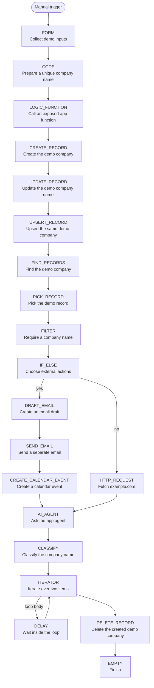

# All 20 step types

App-owned workflow example. Manual trigger; select a step in the SDK definition to inspect its inputs.

The branch rejoins at AI_AGENT. DELAY is the loop body; DELETE_RECORD runs after the iterator finishes. It targets only the company created earlier in this run.

The email/calendar branch needs configured accounts and inputs. The agent and classification steps need AI configuration. Installation does not execute the workflow.
