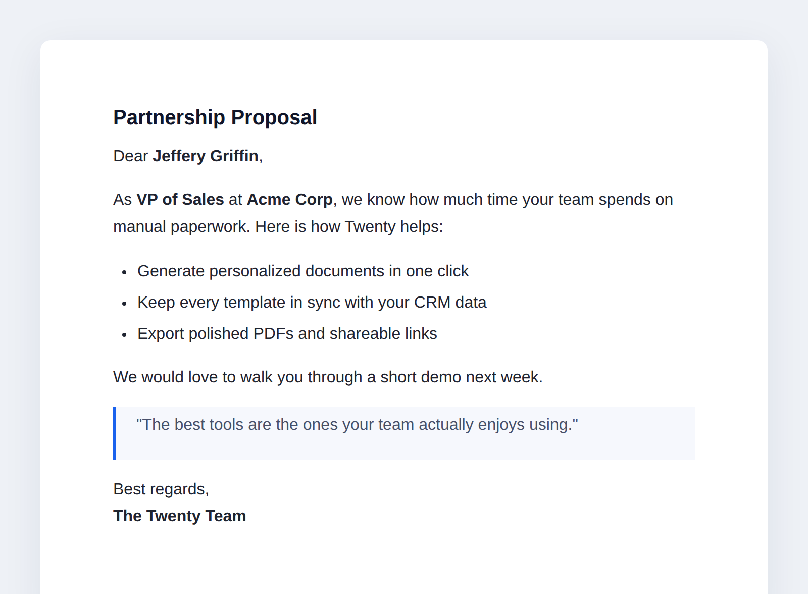
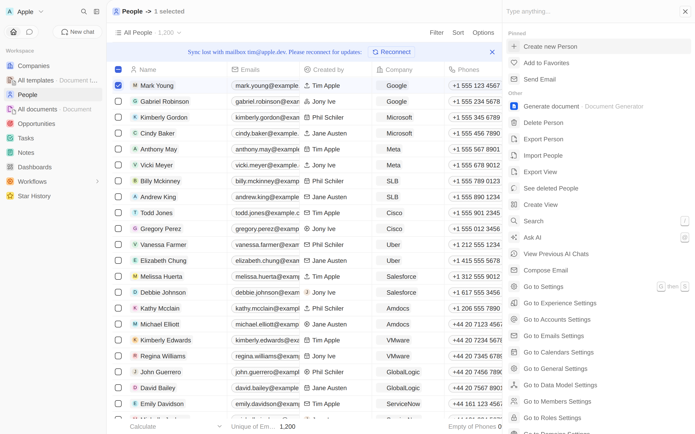
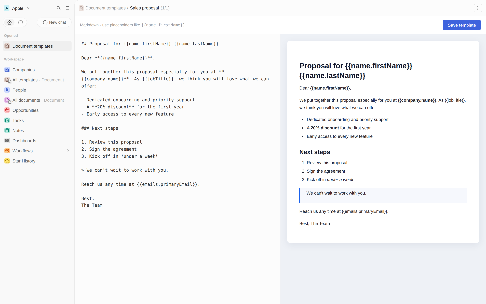
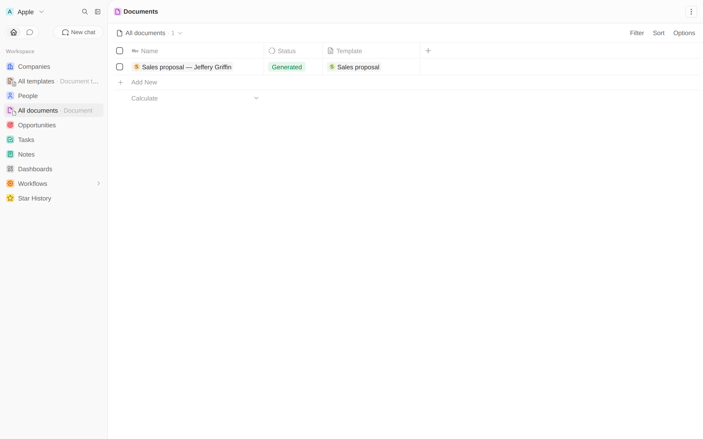

# Document Generator

**Turn your CRM data into finished documents — in one click.**

Document Generator is a [Twenty](https://twenty.com) app that fills reusable
templates with the data already in your CRM. Write a proposal, offer letter, or
follow-up once with `{{placeholders}}`, then generate a personalized document for
any Person or Company — from the command menu, an AI agent, or a workflow. Every
document is saved to your CRM with a downloadable **PDF** and a shareable **web
link**.

No copy-paste. No leaving Twenty.



## Why you'll love it

- **✍️ Write once, reuse forever** — templates with `{{name.firstName}}`,
  `{{jobTitle}}`, `{{company.name}}` and any field on your records.
- **⚡ Generate anywhere** — one click from a record's command menu, a step in a
  workflow, or a natural-language request to an AI agent.
- **📄 Real, polished PDFs** — every document carries a clean, printable PDF
  attached to the record.
- **🔗 Shareable links** — open any document as a standalone web page to send to
  a client.
- **🧩 Native rich-text editor** — author templates in the same editor Twenty
  uses for Notes and Tasks.

## See it in action

| | |
| --- | --- |
| **Generate from the command menu** |  |
| **Author templates in rich text** |  |
| **Every document, organized** |  |

## Install

```bash
yarn install
yarn twenty docker:start                 # start a local Twenty server
yarn twenty remote:add --url http://localhost:2020 --as local
yarn twenty dev                          # build, sync, and watch
```

Open your Twenty instance and look for **Templates** and **Documents** in the
sidebar. Create a template, then hit **⌘K → Generate document** on any Person or
Company.

## How it's built

This is the reference app from the
[Document Generator tutorial](https://docs.twenty.com/developers/extend/apps/tutorials/document-generator/overview) —
a tour through most of the Twenty SDK.

| Capability | Files |
| --- | --- |
| Objects, fields & relations | `src/objects/`, `src/fields/` |
| PDF generation + file upload | `src/logic-functions/utils/generate-document-pdf.ts`, `src/logic-functions/handlers/generate-document-handler.ts` |
| Logic function (AI tool + workflow action) | `src/logic-functions/generate-document.ts` |
| HTTP routes (JSON + shareable page) | `src/logic-functions/generate-document-route.ts`, `src/logic-functions/view-document.ts` |
| Front component + command menu | `src/front-components/`, `src/command-menu-items/` |
| Views & navigation | `src/views/`, `src/navigation-menu-items/` |
| Agent & skill | `src/agents/`, `src/skills/` |
| Role | `src/roles/` |

## Commands

- `yarn twenty dev` — build, sync, and watch for changes
- `yarn lint` — lint with oxlint
- `yarn typecheck` — type-check the project
- `yarn test:unit` — run unit tests
- `yarn test` — run integration tests (requires a running server)

## Learn more

- [Twenty Apps documentation](https://docs.twenty.com/developers/extend/apps/getting-started/quick-start)
- [twenty-sdk CLI reference](https://www.npmjs.com/package/twenty-sdk)
