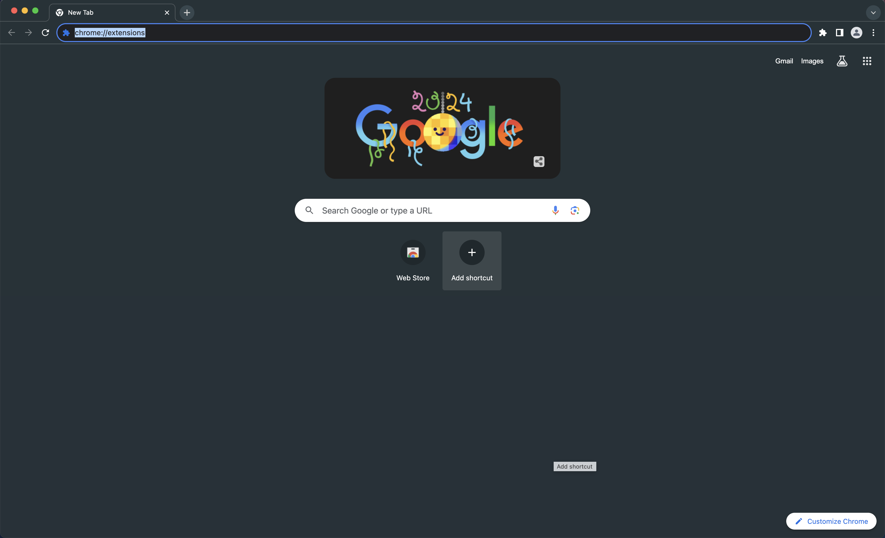
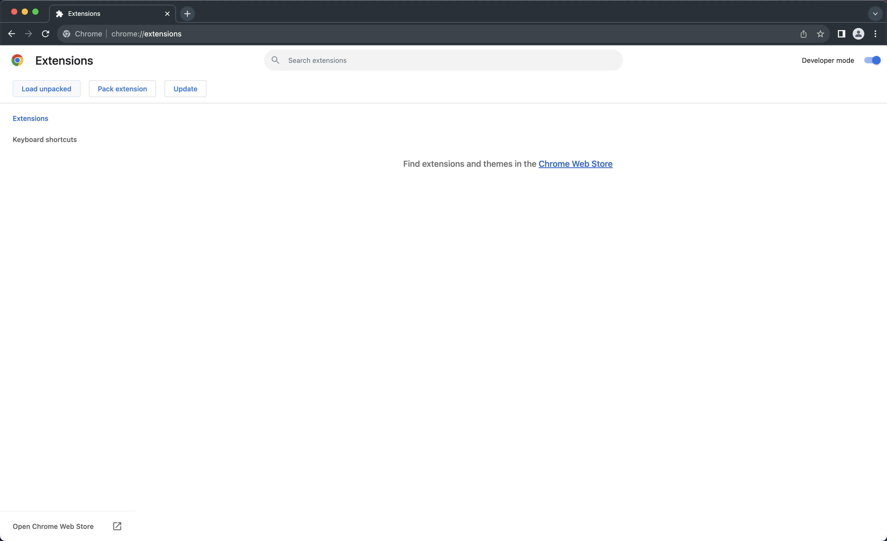
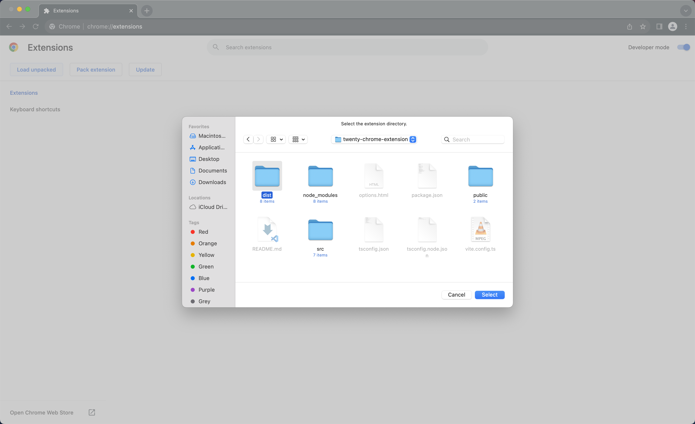
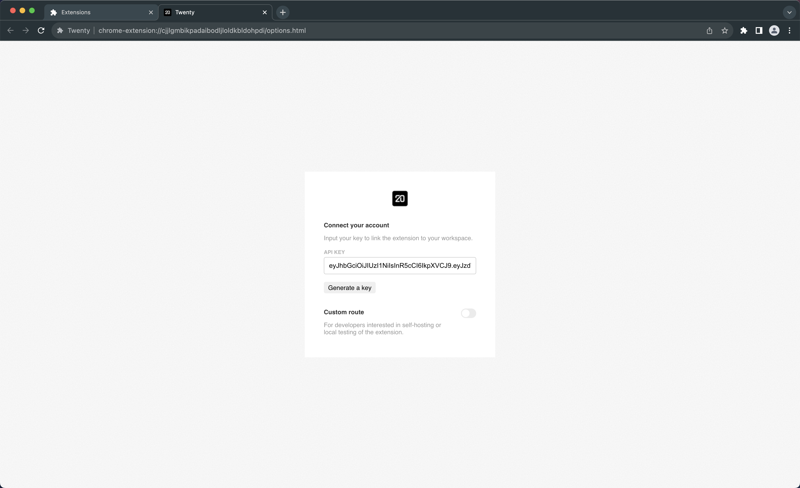
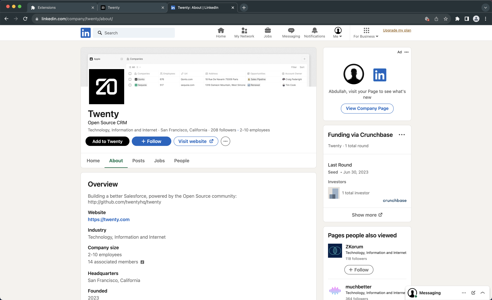

# Twenty Chrome Extension.

This extension allows you to save `company` and `people` information to your twenty workspace directly from LinkedIn.

To install the extension in development mode with hmr (hot module reload), follow these steps.

- STEP 1: Clone the repository and run `yarn install` in the root directory.

- STEP 2: Once the dependencies installation succeeds, create a file with env variables by executing the following command in the root directory.

```
cp ./packages/twenty-chrome-extension/.env.example ./packages/twenty-chrome-extension/.env
```

- STEP 3 (optional): Update values of the environment variables to match those of your instance for `twenty-front` and `twenty-server`. If you want to work on your local machine with the default setup from `Twenty Docs`, replace everything in the .env file with the following.

```
VITE_SERVER_BASE_URL=http://localhost:3000
VITE_FRONT_BASE_URL=http://localhost:3001
```

- STEP 4: Now, execute the following command in the root directory to start up the development server on Port 3002. This will create a `dist` folder in `twenty-chrome-extension`.

```
npx nx start twenty-chrome-extension
```

- STEP 5: Open Google Chrome and head to the extensions page by typing `chrome://extensions` in the address bar.

<p align="center">
   
</p>

- STEP 6: Turn on the `Developer mode` from the top-right corner and click `Load unpacked`.

<p align="center">
   
</p>

- STEP 7: Select the `dist` folder from `twenty-chrome-extension`.

<p align="center">
   
</p>

- STEP 8: This opens up the `options` page, where you must enter your API key.

<p align="center">
   
</p>

- STEP 9: Reload any LinkedIn page that you opened before installing the extension for seamless experience.

- STEP 10: Visit any individual or company profile on LinkedIn and click the `Add to Twenty` button to test.

<p align="center">
   
</p>

To install the extension in production mode without hmr (hot module reload), replace the command in STEP FOUR with `npx nx build twenty-chrome-extension`. You may or may not want to execute STEP THREE based on your requirements.