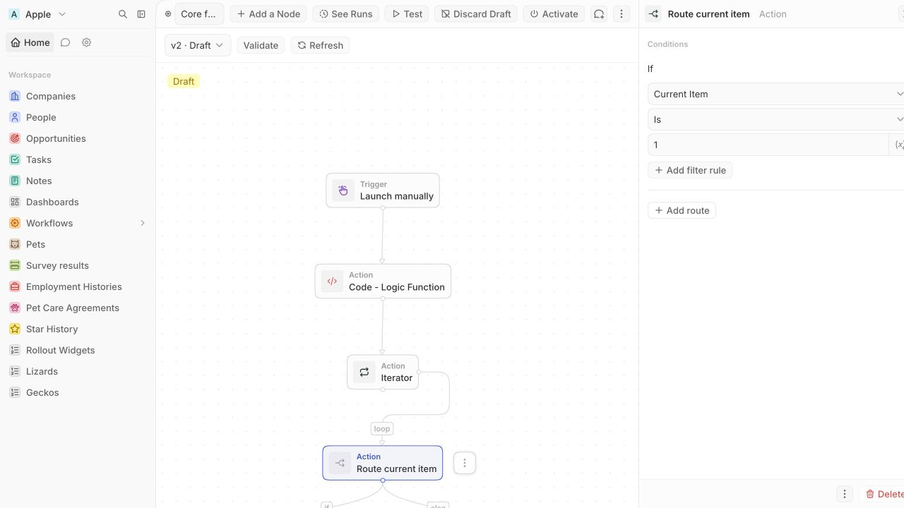
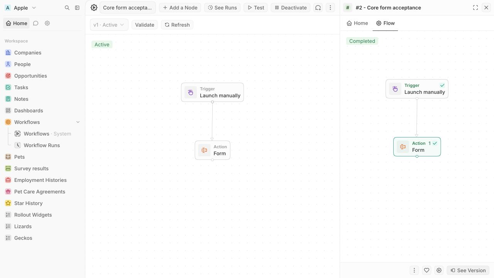
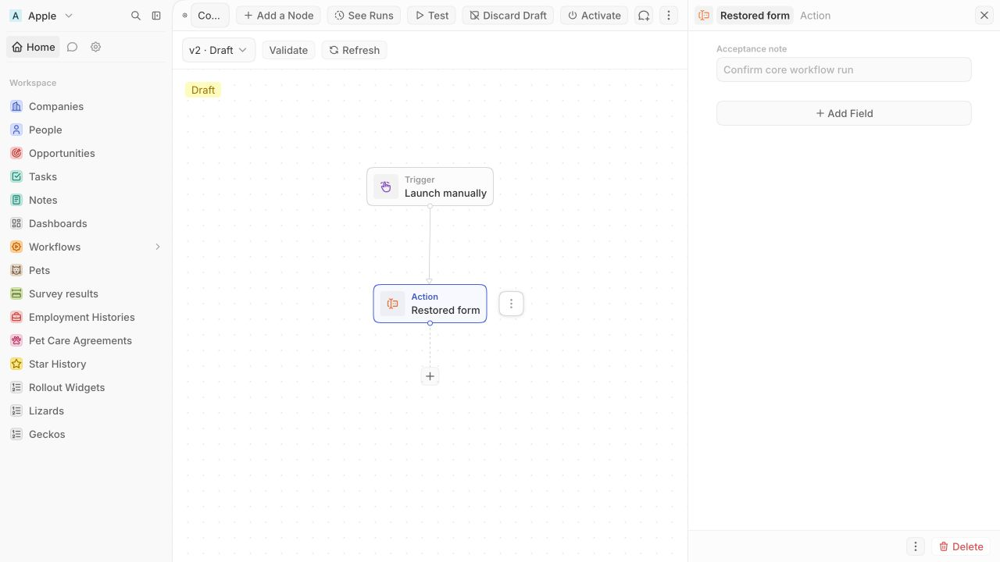

# Core workflow frontend rollout

This frontend uses the core-ID API merged through #26068, and this branch is rebased onto that merge. Keep `IS_WORKFLOW_CORE_INDEX_PAGE_ENABLED` disabled for general rollout until the dependencies below are satisfied. This change does not switch the background execution engine.

## Definition ownership and rollback

With the flag enabled, workflow routes use `/workflow-core/:coreWorkflowId`. Version selectors, diagrams, draft editing, output-schema keys, command-menu actions and definition mutations use core IDs. The existing workspace route resolves its mirror's core ID and redirects. A failed core query shows an error; it never loads a workspace definition as a fallback.

With the flag disabled, the workspace index, show page and mutation paths remain available. A core direct link resolves its workspace mirror and redirects. The backend's core-authoritative writes and rollback mirrors must remain deployed, including the legacy-write-to-core synchronization provided by #26068. Disabling the UI flag does not roll back database migrations.

Workflow runs remain workspace records. Run navigation, subscriptions, retry and stop continue to use the workspace run ID. The core UI uses the run's `coreWorkflowId` and `coreWorkflowVersionId` to inspect definitions. Business record IDs inside trigger payloads and step inputs are not translated.

Existing command-menu items with only `workflowVersionId` resolve the core version before executing with the flag enabled. Items containing both references prefer the core reference when enabled and the workspace reference when disabled. Apply the inherited pointer backfill and this PR's command-menu check-constraint migration before creating core-only items.

## Blocking live-update contract

The available SSE stream has workspace `objectRecordEventsWithQueryIds`, metadata events and queue events. Its record operation signatures accept workspace object metadata and workspace record IDs. There is no core workflow/version subscription contract. Core mirror writes emitting workspace events do not constitute a core event contract.

Before rollout, the SSE dependency must provide:

- Workspace-scoped, permission-checked subscriptions for core workflows and their versions, authorized by the workflow permission.
- Created, updated and deleted events carrying `coreWorkflowId` and, for version events, `coreWorkflowVersionId`.
- An ordering/revision mechanism and reconnect resynchronization, including missed deletions and draft replacement.
- Lifecycle coverage for every writer: core mutations, legacy mirror writes, activation/deactivation, draft creation/discard, duplication and deletion.

Deliver the backend contract and frontend consumer together in a separate follow-up PR, which may be stacked on this frontend PR. The consumer must invalidate `coreWorkflows`, `coreWorkflowById`, `coreWorkflowVersionsByCoreWorkflowId` and `coreWorkflowVersionById`, reconcile removed selections and update open diagrams. It must not subscribe using workspace definition IDs. Local mutation refetches and the explicit Refresh action are implemented; remote live updates are not complete. Keep general rollout blocked until that contract and consumer land and multi-session/reconnect tests pass.

## Execution integration

B-async (#26098) is merged. The shared execution engine, automated triggers and webhook resolution now consume core definitions independently of the UI flag. Core webhook URLs contain a core workflow ID, while existing workspace-ID URLs remain supported.

This frontend PR is rebased and retargeted onto `main` after #26068 and #26098 merged. Their overlapping core-version UI/context, generated GraphQL, workflow lifecycle/list services and instance-command registrations are reconciled on this branch. Before enabling the flag, rerun the complete create → edit → activate → run → inspect flow, command-menu lifecycle after the core-only rename/deletion cleanup, connected If/Else duplication, and ON → OFF → ON rollback behavior against the integrated backend.

## Integrated duplication verification

Browser acceptance exposed a failure in the earlier #26068 implementation: connected If/Else branch destinations were left pointing at the original steps during workflow duplication. The merged API now remaps those destinations through `remapDuplicatedStepDestinations`.

The upstream regression suite covering regular, iterator and If/Else destinations passes on this rebased branch. Browser re-verification of manual trigger → iterator → If/Else → form duplication remains part of final-stack acceptance with the reconciled B-async branch.

MCP rekeying and the A1bis constraints remain separate follow-up work. They are not prerequisites for completing this flag-gated frontend PR, but the full migration must not claim them as covered here.

## Acceptance before enabling

Exercise create, rename, step/trigger/edge/position editing, activation, run inspection, duplication, version switching, draft replacement/discard and deletion with unequal core/workspace IDs. Include manual and webhook triggers, iterator, If/Else, form and code actions, and iterator schema recomputation using `coreWorkflowVersionId`.

Exercise ON → OFF → ON with edits on each UI, direct links and browser history; verify permission denial, missing records and failed queries. Verify multi-session edits, remote deletion, dropped events and SSE reconnect. Search, favorites and workspace-object teardown remain separate migrations.

## Browser acceptance on twenty-2 (2026-09-17)

Tested this branch on `apple.localhost:4001` against its server/worker and local `default_2` database, after applying instance migrations and inherited pointer backfills. Only the local Apple workspace flag was toggled. Core/workspace workflow and version IDs were different throughout.

| Area | Observed result |
| --- | --- |
| Create, rename and navigation | Index creation redirected to the new core workflow; names persisted across refetch. Legacy direct links redirected to core when enabled. |
| Editing | Manual and webhook trigger editing, POST body editing, code source editing, iterator items, If/Else conditions using iterator output, and form fields persisted. Step duplication/deletion, edge deletion/reconnection and node movement persisted. |
| Drafts and versions | First edit of an active version created a core draft. Later edits stayed on that returned draft; the active version was unchanged. Version switching and browser Back restored the selected content. Discard returned to the published version. Restoring a historical version over an existing draft selected the replacement draft; subsequent editing saved to that replacement. |
| Validation and lifecycle | Validate, activate and deactivate succeeded. Manual/form workflow duplication succeeded. Index deletion removed the selected duplicate and cleared selection; its direct link showed Workflow not found. |
| Run and inspection | A manual/form run completed, its submitted value appeared in step output, and See Version opened its core version. Immediate submission no longer races the pending form autosave. |
| Rollback | ON → OFF → ON preserved the complex draft. Flag-off core links redirected to the workspace mirror, the workspace index/show paths worked, and a name edit through the old UI appeared in core after re-enabling. Read-only SQL confirmed matching step, trigger and status content in all four tested core/mirror version pairs. |
| Errors and permissions | A Guest without workflow permission saw explicit denial. A malformed core ID showed an error/retry state. A deleted workflow showed missing-record state. Neither used workspace fallback. Stopping the local server left a failed rename in the input; after restarting, retrying without retyping saved that name. |
| ID boundaries | Completed workspace run `de3f9855-6c0a-4820-bee1-1407afb6b572` retained its ID and referenced core workflow `c3546f66-d16f-465f-93ca-a82f3db536b6` / version `13f37ddc-3620-49a4-b92d-a2e9b4ca6225`. A business-record UUID in the webhook payload was preserved unchanged. |

Incomplete acceptance is explicit: the merged backend If/Else duplication regression passes, while browser verification on the final combined frontend/API/B-async stack remains pending. Code source persisted, but executing its Lambda build failed because the local AWS SSO session had expired. Actual webhook/automated execution remains B-async acceptance. Core definition remote updates, remote deletion and reconnect remain blocked on the missing SSE contract and consumer; workspace run SSE was observed updating the completed run.

### Screenshots

If/Else editing using iterator output:

Completed workspace run inspected beside its core definition:

Editing the replacement draft after restoring a historical version:

