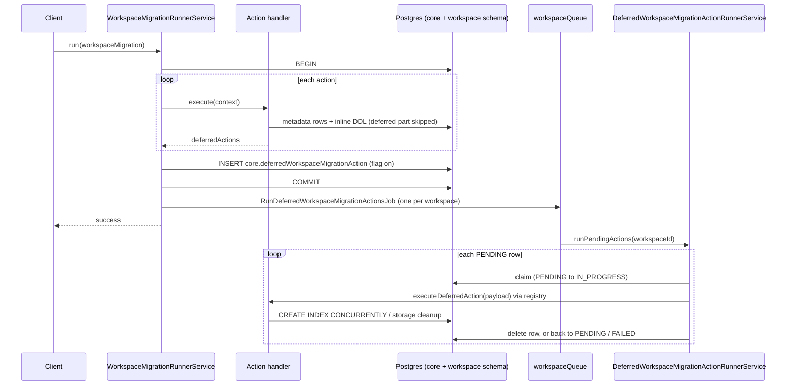

# Deferred workspace migration actions

Implementation: [twentyhq/twenty#26222](https://github.com/twentyhq/twenty/pull/26222) (PR 1 of 6, behind a feature flag). In-repo copy: `packages/twenty-server/docs/DEFERRED_WORKSPACE_MIGRATION_ACTIONS.md`.

## Problem

Data model changes (settings UI, metadata API, application installs) become unusable on workspaces with large tables. A self-hosted customer with 15M `timelineActivity` rows saw each new object cost about 6 minutes; an application install with dozens of objects was estimated at 7 hours, hit the query timeout and rolled back while the application version bump survived. Their workaround is to empty `timelineActivity` before every deployment. Cloud runs the same code path; 23 cloud workspaces had more than 1M `timelineActivity` rows (up to 17.9M) before they were trimmed on 2026-09-19, so they would pay the same cost on a slower disk.

## Context

A workspace migration runs every action in one Postgres transaction: `WorkspaceMigrationRunnerService.executeRun` opens it (`workspace-migration-runner.service.ts:369`), sets `lock_timeout = 8s` (`:385`) and commits once after the whole action loop (`:447`). Each action handler runs two steps inside that transaction, `executeForMetadata` and `executeForWorkspaceSchema` (`workspace-migration-runner-action-handler-service.interface.ts`).

Every new object gets system relations: a `target<Object>Id` join column on `timelineActivity`, `attachment`, `noteTarget` and `taskTarget` (`build-system-relation-flat-field-metadatas-for-object.util.ts`). For each one the runner issues, in the same transaction:

1. `ADD COLUMN`: instant, but takes an `ACCESS EXCLUSIVE` lock held until commit, blocking every read and write on that table for the rest of the migration;
2. `ADD CONSTRAINT ... FOREIGN KEY` (`create-field-action-handler.service.ts:274`), which scans the whole table to validate a column that is `NULL` on every row;
3. a blocking `CREATE INDEX` (`create-index-action-handler.service.ts`), which scans and sorts the whole table again.

The cost is two full table scans per new object, proportional to table size rather than to the size of the change. The runner uses the core datasource, whose client-side `query_timeout` defaults to 10s (`core.datasource.ts:81`); a timed-out query keeps running on the server while holding its locks.

The runner already has one mechanism for work outside the transaction: `afterCommitSideEffects` (introduced in #21845). Its only user is `DeleteLogicFunctionActionHandlerService`, which deletes a logic function's storage files and runtime resource after commit as in-process closures; a failure is logged and forgotten (`workspace-migration-runner.service.ts:545` on main). The #21845 description already anticipated moving this to "jobs and metadata boolean state tracker in db".

## Goals and non-goals

Goals:

- Move the slow, non-correctness-critical part of selected migration actions out of the migration transaction, starting with join column index creation.
- Make that deferred work durable: recorded in the same transaction as the metadata, retried, observable.
- One mechanism for all post-transaction work, replacing `afterCommitSideEffects`.
- Same orchestration as the runner: deferred work is executed by the action handler that produced it, found through the same registry.

Non-goals (this doc and PR 1):

- Unique indexes, enum migrations, index updates (drop and rebuild), search vector rebuilds. Each can become a deferrable action later with the same contract.
- Serializing concurrent metadata migrations, blocking changes while work is pending, and surfacing that state to users (PRs 3 and 4 below).
- Recovery of stranded rows and retry of failed ones (PR 2).

## Design

### Principles

- **Metadata storage is the source of truth.** Decisions come from metadata and from the deferred action table, never from `information_schema`, `pg_index` or `pg_class`.
- **Deferred work is persisted in the migration transaction.** The migration either commits with its deferred work recorded or rolls back without it.
- **Correctness stays inline, cost moves out.** Unique indexes and foreign key enforcement stay in the transaction.
- **Behind `IS_DEFERRED_WORKSPACE_MIGRATION_ACTIONS_ENABLED`**, a workspace feature flag, off by default. With the flag off, behavior is unchanged.

### Deferrable actions

`DEFERRABLE_WORKSPACE_MIGRATION_ACTIONS` lists the action handler keys (`<actionType>_<metadataName>`, the key the runner registry already uses) that may defer work. Each declares its payload type; adding a key without a payload fails to compile.

| Action | Deferred work | Payload |
| --- | --- | --- |
| `create_index` | `CREATE INDEX CONCURRENTLY` for a non-unique, non-partial index covering only `MANY_TO_ONE` join columns | `{ indexMetadataId }`, a reference: the index metadata still exists after commit |
| `delete_logicFunction` | delete the source folder and built handler from storage, delete the runtime resource | `{ flatLogicFunction }`, a snapshot: the metadata is gone after commit |

### Action handler contract

`BaseWorkspaceMigrationRunnerActionHandlerService` gets two methods next to `executeForMetadata` and `executeForWorkspaceSchema`:

- `getDeferredAction(context)` returns the deferred action of this action instance, typed so a handler can only return its own key, or `undefined` (default). The handler owns the decision and skips the matching inline work.
- `executeDeferredAction({ workspaceId, applicationUniversalIdentifier, payload, attempt, queryRunner })` performs the deferred work outside any transaction. It must be idempotent and treats metadata that no longer exists as an obsolete action rather than a failure.

`execute()` returns `deferredActions` next to `partialOptimisticCache` and `metadataEvents`. `afterCommitSideEffects` is removed.

### Runner

- **Flag on:** the runner inserts the collected deferred actions inside the migration transaction (`persistDeferredActions`, `workspace-migration-runner.service.ts:596`), commits, then enqueues one job for the workspace (`dispatchDeferredActions`, `:623`).
- **Flag off:** `create_index` never defers, so only the logic function cleanup produces a deferred action, and the runner executes it in process right after commit, which is today's `afterCommitSideEffects` behavior.

### Storage: `core.deferredWorkspaceMigrationAction`

| Column | Purpose |
| --- | --- |
| `workspaceId` | owning workspace, `ON DELETE CASCADE` |
| `applicationUniversalIdentifier` | application of the migration, passed back to the handler |
| `actionHandlerKey` | one of the deferrable actions, used to find the handler |
| `payload` | `jsonb`, the handler payload |
| `status` | `PENDING`, `IN_PROGRESS` or `FAILED` |
| `attempts`, `lastError`, `startedAt` | retry bookkeeping |

Index on `(workspaceId, status)`. A row is deleted once its action succeeds. The table is not part of the flat entity maps or the migration builder.

### Execution

`RunDeferredWorkspaceMigrationActionsJob` runs on `workspaceQueue`, deduplicated per workspace, 3 attempts with exponential backoff. `DeferredWorkspaceMigrationActionRunnerService.runPendingActions`:

1. loads the workspace's `PENDING` rows once (actions created later come with their own job);
2. claims each row with a conditional update (`PENDING` to `IN_PROGRESS`, `attempts + 1`);
3. resolves the handler with `actionHandlerKey` (`executeDeferredActionHandler`, registry `:106`) and calls `executeDeferredAction` on a dedicated connection without the client `query_timeout` and with a server-side `statement_timeout` of one hour, so Postgres cancels a stuck statement itself;
4. deletes the row on success, or sets it back to `PENDING` (`FAILED` after the last attempt) with `lastError`, then moves on to the next row;
5. fails the job at the end if any action failed, so the queue retries it.

`create_index` resolves the index from the workspace cache, recomputes the cache once on a miss, and completes as obsolete if the index is still absent. On a retry it runs `DROP INDEX CONCURRENTLY IF EXISTS` first, since a failed concurrent build leaves an invalid index behind.

## Alternatives considered

- **Keep deferred work on `afterCommitSideEffects`.** It is in-process and fire-and-forget: a crash after commit loses the work and leaves metadata describing an index that does not exist. Lost because the work must be durable.
- **Per-type state columns on `indexMetadata` / `fieldMetadata`.** Adding a column to a syncable entity touches the flat entity plumbing, cache codec and builder comparison in about 25 files, and changing `fieldMetadata` bumps the metadata version for every client. Lost to a dedicated table that also serves as the job's queue.
- **An index-specific `deferredSchemaOperation` table** (first iteration of the PR). It did not cover the logic function cleanup and required a separate orchestration next to the runner. Lost to one generic table keyed by action.
- **A size threshold (defer only above N rows via `pg_class.reltuples`).** Lost because it reads Postgres catalogs instead of metadata. Every eligible index is deferred instead, including indexes on tables created by the same migration, which the worker builds in milliseconds since those tables are empty.
- **Skip the index and keep only a partial `WHERE col IS NOT NULL` index inline.** A partial index still reads the whole table to build. Lost because it does not remove the scan.

## Rollout and testing

Delivery, each PR merged on its own behind the flag:

| PR | Scope |
| --- | --- |
| 1 | Table, `DEFERRABLE_WORKSPACE_MIGRATION_ACTIONS`, handler contract, runner persistence, deferred action runner and job with retries and timeout; `create_index` and `delete_logicFunction`; `afterCommitSideEffects` removed. |
| 2 | Recovery: sweeper cron resetting `IN_PROGRESS` rows past the timeout and re-enqueueing workspaces with `PENDING` rows; retry of `FAILED` rows (admin mutation, CLI); metrics on pending, failed and duration. |
| 3 | Workspace migration lock: `schemaMigrationStatus` (`IDLE`, `MIGRATING`) and `schemaMigrationStartedAt` on `core.workspace`, taken with a conditional update before migrations touching objects, fields or indexes, released in `finally` with a takeover timeout. While taken, or while schema-affecting deferred actions are pending (`create_index`, not `delete_logicFunction`), such migrations fail with `SCHEMA_MIGRATION_IN_PROGRESS` or `DEFERRED_WORKSPACE_MIGRATION_ACTIONS_IN_PROGRESS`. `FAILED` rows do not block. |
| 4 | Error surfacing: runner codes sent as `subCode` (today `extensions.code` is overwritten by the GraphQL error code), object and field exception handlers map the new codes to `ConflictError`, dedicated front message with the pending count, SDK CLI reads `subCode` and `userFriendlyMessage`. |
| 5 | Foreign keys: `ADD CONSTRAINT ... NOT VALID` for join columns created in the same action, plus a deferrable `create_fieldMetadata` action running `VALIDATE CONSTRAINT` with the constraint name in its payload. |
| 6 | Enable the flag for the affected self-hosted workspace, then cloud, then default on and remove the flag. |

Migration: one fast instance command in 2.42 creating the table. No backfill.

Tested in PR 1:

- unit: the deferral decision (unique, partial, non-relation, one-to-many side, mixed columns, unresolved field);
- integration, through the public APIs only: with the flag on, creating an object adds one join column index to each system relation object, records of the new object get timeline activities, and deleting a logic function succeeds; existing object, field, index and logic function suites pass;
- manual, 3M `timelineActivity` rows: flag off logic function deletion removes files right after commit; flag on persists actions with the worker stopped and processes them once started (`timelineActivity` index built in 2.4s outside the transaction); an object deleted before the worker ran completes its actions as obsolete; a broken column fails three times with backoff then `FAILED` while the other indexes build immediately; restoring it before a retry drops and rebuilds the index.

Known limitations until PRs 2 and 3: a worker crash leaves a row `IN_PROGRESS`; `FAILED` rows need a manual reset; metadata changes are not blocked while actions are pending, so a deletion racing an in-flight build can leave a physical index without metadata.

## Open questions

1. **Should deferral be decided by the runner at step level instead of by each handler?** Today `create_index` defers its `executeForWorkspaceSchema` step while `delete_logicFunction` defers work that was never a runner step, each handler builds its own payload, and the handler has to remember to skip its own inline work. A more consistent shape: the runner skips the step for deferrable actions and persists the flat action itself (plus the pre-delete flat entity for deletes), and the worker replays the same step with a rebuilt context. Logic function cleanup would then need a real step, either (a) its currently empty `executeForWorkspaceSchema`, or (b) a new `executeForExternalResources` step that always runs after commit. Recommendation: runner-owned deferral with option (b), done in PR 1 before merge.
2. **Should logic function cleanup be durable for everyone now, not only behind the flag?** It is low risk and fixes silent orphans in storage. Recommendation: keep it behind the flag until PR 2 (recovery) lands.
3. **Should the one-hour statement timeout be a config variable?** Recommendation: constant for now, config variable if a self-hosted instance needs more.
