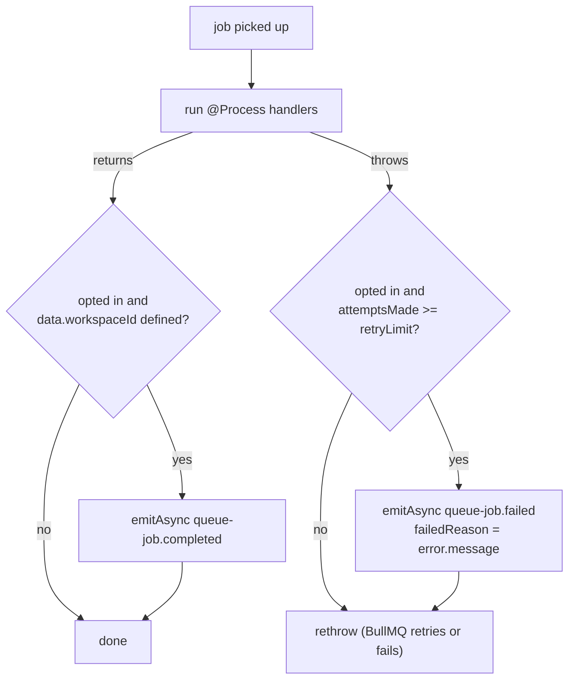
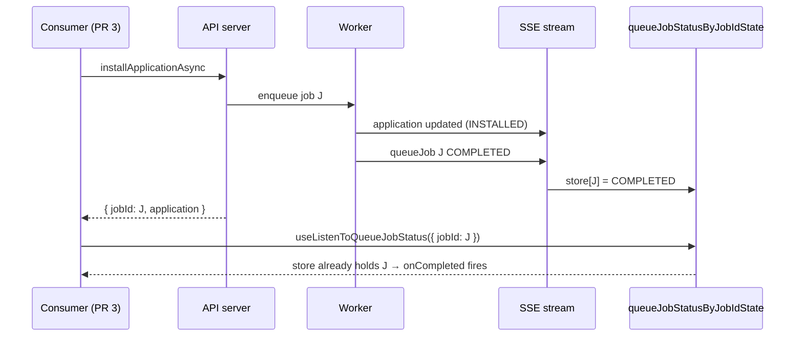

# Queue job status broadcast (PR 2-bis) — design

## Problem

PR 3 of the [async application operations design](https://github.com/twentyhq/twenty/pull/25157) moves install / upgrade / uninstall into worker jobs. Once the mutation only enqueues, the requester loses the one thing the synchronous mutation gave it: the outcome of its own request.

The `application` row events from PR 2 do not cover that. They tell every client what state the app is in, not what happened to a given request:

- a failed fresh install rolls back and deletes the row. On the wire that is the same `deleted` event as an uninstall;
- the failure reason never leaves the worker logs and the failed BullMQ job;
- an `INSTALLED` row event can come from another user's install of the same app.

The requester needs an outcome and a reason, keyed by something only it holds. That key is the job id.

Goal: a generic, opt-in mechanism. A job declares that its terminal status should be broadcast; the worker broadcasts `COMPLETED` / `FAILED` for it over the existing SSE event stream; the front stores statuses by job id and exposes a hook. PR 3's async mutations return the job id and listen.

## Not a new endpoint

"An endpoint to listen to job status" is the existing event stream. A dedicated SSE endpoint per job would need its own auth, Redis subscription, reconnect, keepalive and liveness logic. The event stream already has all of that, every client already holds exactly one, and `WorkspaceEventBroadcaster` already fans arbitrary entity events into it (`agentChatThread`, `application`, `applicationRegistration`). This PR adds one more entity name, `queueJob`, and nothing to the transport.

```mermaid
flowchart LR
  subgraph worker["Worker process"]
    P["@Process handler"] --> X["MessageQueueExplorer wrapper<br/>(completed / terminal failure)"]
    X -- "EventEmitter2<br/>queue-job.*" --> L["QueueJobStatusListener"]
    L --> B["WorkspaceEventBroadcaster"]
  end
  B -- "Redis pub/sub<br/>(per event stream)" --> S["API server<br/>graphql-sse"]
  subgraph browser["Browser"]
    S --> D["dispatchMetadataEventsFromSseToBrowserEvents"]
    D -- "CustomEvent<br/>metadataName: queueJob" --> E["QueueJobStatusSSEEffect"]
    E --> ST[("queueJobStatusByJobIdState")]
    ST --> H["useListenToQueueJobStatus({ jobId })"]
    H --> C["consumer (PR 3):<br/>navigate / snackbar"]
  end
```



## Why the `state` column stays

The job broadcast does not replace the `application.state` column from PR 1. They answer different questions:

| | `application.state` (row events) | `queueJob` event |
|---|---|---|
| Question | What state is this app in? | What happened to *my* request? |
| Audience | Every client of the workspace, the CLI, admin tooling, a client that reconnects or reloads | The client holding the job id |
| Lifetime | Persisted with the row, reloaded with the store | Ephemeral, one event per terminal outcome |
| Carries | Lifecycle state | Outcome and failure reason |

Three things only the column gives:

1. **Cross-client visibility.** "Installing..." in another tab, for another user, or after a reload, without a job id.
2. **The concurrency gate.** PR 3's `transitionState` conditional update is the arbiter between a sync CLI install and an async UI install. BullMQ de-duplication only covers *waiting* jobs, so it cannot play that role.
3. **Reconnect and reload.** The store reloads applications on SSE reconnect. Queue state is per-queue Redis state with retention (completed jobs are evicted after 4 hours or 1000 entries); making it the source of truth would turn `QUEUE_RETENTION` into a correctness setting.

So: keep both. The column is the shared truth, the job event is the requester's receipt. The one thing this PR moves out of the design doc's non-goals is *failure-reason surfacing*: the reason now reaches the requester.

## Server

### Opt-in at the processor

Broadcasting every job's outcome to every stream would be noise (messaging and calendar sync jobs run constantly). A job opts in where it is declared:

```ts
@Process(InstallApplicationJob.name, { shouldBroadcastStatus: true })
```

`Process(jobName, options?)` stores `{ jobName, shouldBroadcastStatus }` in `PROCESS_METADATA`. Existing `@Process(jobName)` call sites are unchanged.

Opting in means the job's thrown error message becomes user-facing. Jobs that throw internal errors should not opt in, or should throw a curated message.

### Emission point: the explorer wrapper

`MessageQueueExplorer.handleProcessorGroupCollection` already wraps every job execution for a queue (stall monitor, per-processor dispatch). It knows the queue name, `job.id`, `job.name`, `job.data.workspaceId`, and whether the handler threw. That makes it driver-agnostic and independent of the job's own code: a job cannot forget to report its failure.



- **Terminal only.** A failed attempt that BullMQ will retry is not an outcome. `MessageQueueJob` gains `attemptsMade` (from `job.attemptsMade` in the BullMQ driver, `0` in the sync driver); the wrapper broadcasts `FAILED` only when `attemptsMade >= retryLimit`. PR 3's jobs use `retryLimit: 0`, so for them every failure is terminal.
- **No `workspaceId`, no event.** The broadcaster fans out per workspace; a job without one has nowhere to go.
- **`emitAsync`, awaited.** The broadcast completes before the job is marked completed or failed. That keeps the ordering deterministic for tests and means a `COMPLETED` event never races the job's own last row write (the job's `application` `INSTALLED` event is emitted from inside the handler, so it is always on the wire before the `queueJob` event).
- **Decoupled through `EventEmitter2`**, the `MetadataEventEmitter` → `MetadataEventsToDbListener` pattern. The message-queue module stays below the subscriptions module; the listener lives next to the broadcaster.

### Listener and payload

`QueueJobStatusListener` (`src/engine/subscriptions/queue-job-status/`), `@OnEvent('queue-job.*')`, calls `WorkspaceEventBroadcaster.broadcast` with one `updated` event:

```ts
{
  type: 'updated',
  entityName: 'queueJob',
  recordId: jobId,
  properties: {
    after: {
      id: jobId,
      queueName,
      jobName,
      state: JobStateEnum.COMPLETED | JobStateEnum.FAILED,
      failedReason: string | null,
      workspaceId,
    },
  },
}
```

- `updated` with a full `after`, because `turnSseMetadataEventsToMetadataOperationBrowserEvents` drops create/update events without one.
- `JobStateEnum` already exists (`message-queue/enums/job-state.enum.ts`, used by the SDK `getJobs` query). No new enum.
- `failedReason` is `error.message` only, never a stack.
- Best effort: try/catch + `logger.warn`, as the `application` broadcasts. A broadcast failure never changes the job's outcome.
- **Workspace-wide**, no `recipientUserWorkspaceIds`. Job data does not consistently carry a `userWorkspaceId`, and the requester may hold several tabs. Only a client that knows the job id reacts, and the payload holds nothing beyond the outcome and a curated error message.

## Frontend

### Store first, hook second

The event can arrive before the client knows the job id: a fast job (a fail-fast install, a worker on the same host) can finish before the mutation response reaches the browser. A listener that only subscribes after the mutation resolves would miss it. So the front keeps every received `queueJob` status in a map, and consumers read from the map.



Read it with the last two arrows swapped for the common case (response first, event later): the hook is already mounted with `jobId`, and the store write fires the callback. Both orders end in one callback.

- `queueJob` joins `ALL_NON_SYNCABLE_BROADCAST_ENTITY_NAME`.
- `queueJobStatusByJobIdState` (`createAtomState<Record<string, QueueJobStatus>>`), written by `QueueJobStatusSSEEffect`, mounted once in `SSEProvider` next to `MetadataStoreSSEEffect`. It listens to `queueJob` browser events with `useListenToMetadataOperationBrowserEvent` and upserts `updatedRecord` by id.
- Not a metadata-store entity: there is nothing to load, nothing to reconcile, and no collection hash. A plain atom is the whole store.
- Not cleared on reconnect: entries are a few hundred bytes each, one per opted-in job outcome seen in this session, and clearing would throw away outcomes the client already knows.

### Hook

```ts
useListenToQueueJobStatus({
  jobId,       // undefined until the mutation resolves
  onCompleted,
  onFailed,    // ({ failedReason }) => void
});
```

It selects `store[jobId]` and fires the matching callback once per job id (a ref of already-reported ids). This is an effect on `[jobId, status]`: it reacts to server-pushed state, there is no user event to attach a handler to.

## Missed events (accepted)

A client that reconnects or reloads between enqueue and the terminal event never gets it. Accepted for this PR:

- the UI still settles correctly, because the `application` store reloads on reconnect and the row is `INSTALLED` or gone;
- only the failure *reason* is lost, and only in that window.

If that window matters later, the catch-up is a `queueJobStatus(queueName, jobId)` query on `MessageQueueService.getJobs` (the SDK `getJobs` query already does this, scoped by workspace id prefix), called by the hook on `SSE_CLIENT_RECONNECTED_EVENT_NAME`. Not in this PR.

## Handoff to PR 3

What PR 3 does with this, so the contract is fixed here:

- `installApplicationAsync` / `upgradeApplicationAsync` / `uninstallApplicationAsync` return `{ jobId, application }`. The design doc kept the job id out of the response; this PR is the reason to put it back. `jobId` is the value `MessageQueueService.add` returns: with `options.id` the BullMQ driver appends `-<uuid>`, so the mutation must return the driver's id, not the prefix it passed.
- The three job processors opt in with `shouldBroadcastStatus: true`.
- The marketplace install flow calls `useListenToQueueJobStatus` with the returned `jobId`: `onCompleted` navigates, `onFailed` shows the snackbar with `failedReason`. Following the row by id stays as the fallback for the missed-event window.

## Tests

- Server unit: the explorer wrapper emits `completed` for an opted-in job, `failed` only on the terminal attempt, nothing for a job that did not opt in or has no `workspaceId`. The listener serializer: full payload, `failedReason` null on success.
- Front unit: the hook fires `onCompleted` once when the status is already in the store at mount, and once when it arrives after mount; never twice.
- No integration test here: no job opts in before PR 3, whose install integration test asserts the `queueJob` event on the broadcaster spy alongside the `application` events.

**Estimated size:** ~13 files, no schema or migration change.

## Files

| Concern | File |
|---|---|
| Opt-in option | `packages/twenty-server/src/engine/core-modules/message-queue/decorators/process.decorator.ts` |
| Emission point | `packages/twenty-server/src/engine/core-modules/message-queue/message-queue.explorer.ts` |
| `attemptsMade` on the job | `.../message-queue/interfaces/message-queue-job.interface.ts`, `drivers/bullmq.driver.ts`, `drivers/sync.driver.ts` |
| Listener, event type, serializer | `packages/twenty-server/src/engine/subscriptions/queue-job-status/` (new), registered in `subscriptions.module.ts` |
| Existing job state enum | `packages/twenty-server/src/engine/core-modules/message-queue/enums/job-state.enum.ts` |
| Emitter/listener precedent | `.../subscriptions/metadata-event/metadata-event-emitter.ts`, `metadata-events-to-db.listener.ts` |
| Front entity name | `packages/twenty-front/src/modules/browser-event/types/BroadcastEntityName.ts` |
| Front store, effect, hook, type | `packages/twenty-front/src/modules/queue-job-status/` (new), effect mounted in `src/modules/sse-db-event/components/SSEProvider.tsx` |
| Front listener precedent | `packages/twenty-front/src/modules/applications/hooks/useRefetchOnApplicationLifecycleSettled.ts` |
