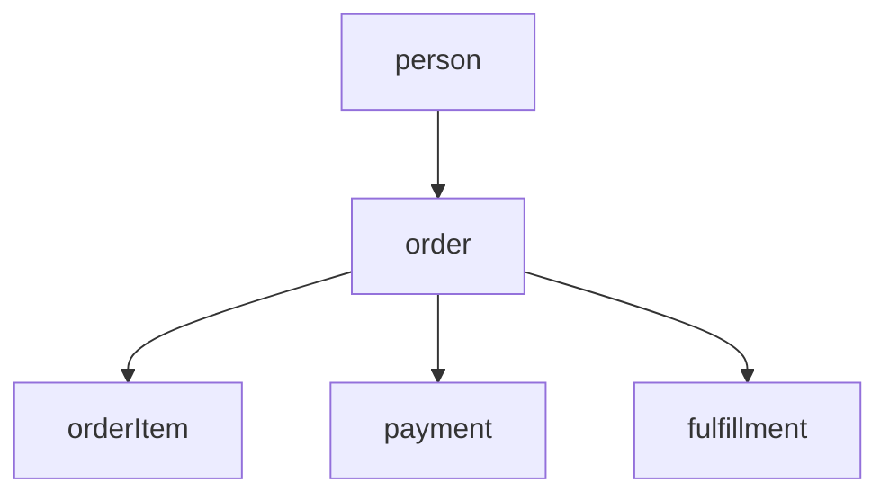
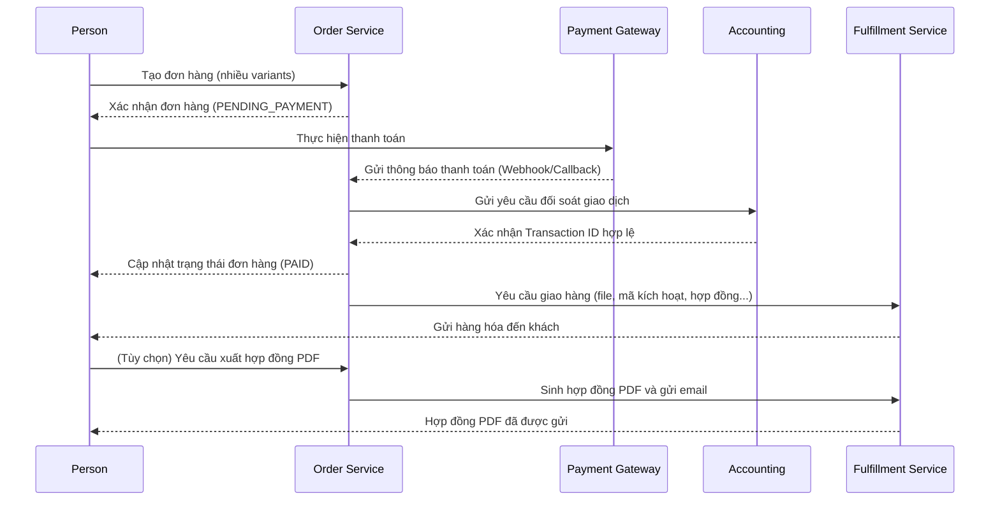

# MKT Order

```mermaid
graph TD
    person[person]
    order[order]
    orderItem[orderItem]
    payment[payment]
    fulfillment[fulfillment]

    person --> order
    order --> orderItem
    order --> payment
    order --> fulfillment

```

══════════════════════════════════════════════
# 📦 MKT Order Payment

```mermaid
sequenceDiagram
    participant U as Person
    participant S as Order Service
    participant PG as Payment Gateway
    participant A as Accounting
    participant F as Fulfillment Service

    U->>S: Tạo đơn hàng (nhiều variants)
    S-->>U: Xác nhận đơn hàng (PENDING_PAYMENT)

    U->>PG: Thực hiện thanh toán
    PG-->>S: Gửi thông báo thanh toán (Webhook/Callback)

    S->>A: Gửi yêu cầu đối soát giao dịch
    A-->>S: Xác nhận Transaction ID hợp lệ

    S-->>U: Cập nhật trạng thái đơn hàng (PAID)

    S->>F: Yêu cầu giao hàng (file, mã kích hoạt, hợp đồng...)
    F-->>U: Gửi hàng hóa đến khách

    U->>S: (Tùy chọn) Yêu cầu xuất hợp đồng PDF
    S->>F: Sinh hợp đồng PDF và gửi email
    F-->>U: Hợp đồng PDF đã được gửi


```
