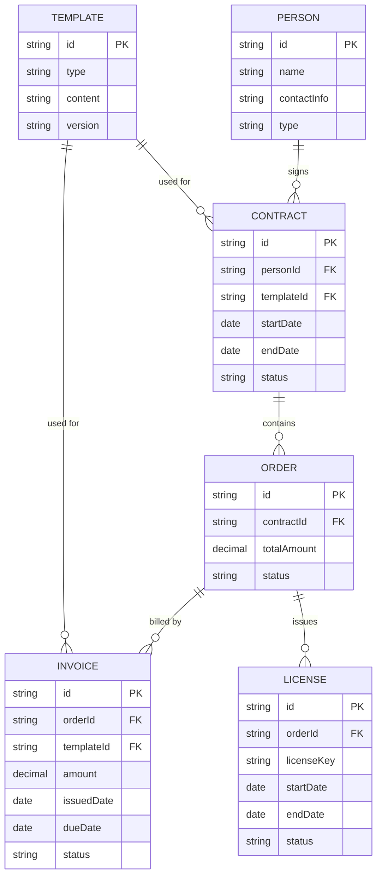
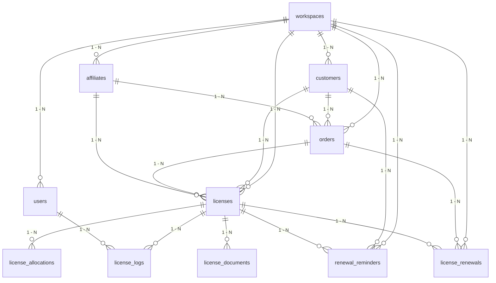
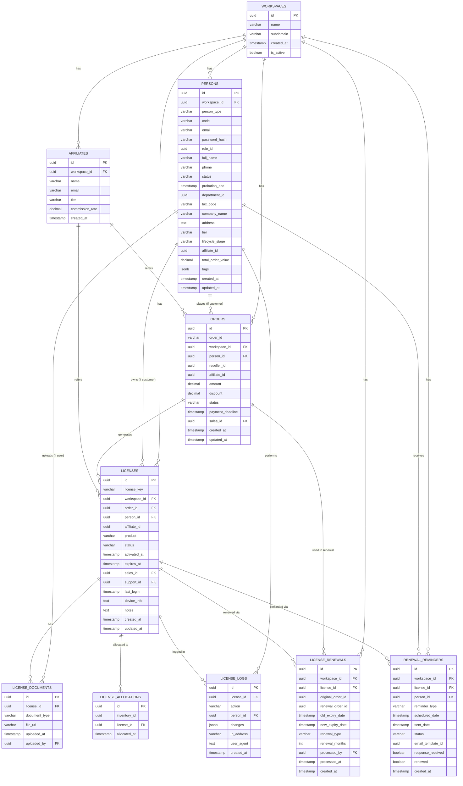

# 📦 MKT License Contract

```mermaid
erDiagram
    PERSON ||--o{ CONTRACT : "signs"
    CONTRACT ||--o{ ORDER : "contains"
    ORDER ||--o{ INVOICE : "billed by"
    ORDER ||--o{ LICENSE : "issues"

    TEMPLATE ||--o{ CONTRACT : "used for"
    TEMPLATE ||--o{ INVOICE : "used for"

    PERSON {
        string id PK
        string name
        string contactInfo
        string type
    }

    CONTRACT {
        string id PK
        string personId FK
        string templateId FK
        date startDate
        date endDate
        string status
    }

    ORDER {
        string id PK
        string contractId FK
        decimal totalAmount
        string status
    }

    INVOICE {
        string id PK
        string orderId FK
        string templateId FK
        decimal amount
        date issuedDate
        date dueDate
        string status
    }

    TEMPLATE {
        string id PK
        string type
        string content
        string version
    }

    LICENSE {
        string id PK
        string orderId FK
        string licenseKey
        date startDate
        date endDate
        string status
    }
```

# 📦 MKT License ERD

```mermaid
erDiagram
    workspaces ||--o{ users : "1 - N"
    workspaces ||--o{ customers : "1 - N"
    workspaces ||--o{ orders : "1 - N"
    workspaces ||--o{ licenses : "1 - N"
    workspaces ||--o{ affiliates : "1 - N"
    workspaces ||--o{ renewal_reminders : "1 - N"
    workspaces ||--o{ license_renewals : "1 - N"

    customers ||--o{ orders : "1 - N"
    customers ||--o{ licenses : "1 - N"
    customers ||--o{ renewal_reminders : "1 - N"

    orders ||--o{ licenses : "1 - N"
    orders ||--o{ license_renewals : "1 - N"

    affiliates ||--o{ orders : "1 - N"
    affiliates ||--o{ licenses : "1 - N"

    licenses ||--o{ license_allocations : "1 - N"
    licenses ||--o{ license_documents : "1 - N"
    licenses ||--o{ license_logs : "1 - N"
    licenses ||--o{ license_renewals : "1 - N"
    licenses ||--o{ renewal_reminders : "1 - N"

    users ||--o{ license_logs : "1 - N"
```

# 📦 MKT License Flow

```mermaid
erDiagram
    WORKSPACES {
        uuid id PK
        varchar name
        varchar subdomain
        timestamp created_at
        boolean is_active
    }

    PERSONS {
        uuid id PK
        uuid workspace_id FK
        varchar person_type
        varchar code
        varchar email
        varchar password_hash
        uuid role_id
        varchar full_name
        varchar phone
        varchar status
        timestamp probation_end
        uuid department_id
        varchar tax_code
        varchar company_name
        text address
        varchar tier
        varchar lifecycle_stage
        uuid affiliate_id
        decimal total_order_value
        jsonb tags
        timestamp created_at
        timestamp updated_at
    }

    ORDERS {
        uuid id PK
        varchar order_id
        uuid workspace_id FK
        uuid person_id FK
        uuid reseller_id
        uuid affiliate_id
        decimal amount
        decimal discount
        varchar status
        timestamp payment_deadline
        uuid sales_id FK
        timestamp created_at
        timestamp updated_at
    }

    LICENSES {
        uuid id PK
        varchar license_key
        uuid workspace_id FK
        uuid order_id FK
        uuid person_id FK
        uuid affiliate_id
        varchar product
        varchar status
        timestamp activated_at
        timestamp expires_at
        uuid sales_id FK
        uuid support_id FK
        timestamp last_login
        text device_info
        text notes
        timestamp created_at
        timestamp updated_at
    }

    LICENSE_ALLOCATIONS {
        uuid id PK
        uuid inventory_id
        uuid license_id FK
        timestamp allocated_at
    }

    LICENSE_DOCUMENTS {
        uuid id PK
        uuid license_id FK
        varchar document_type
        varchar file_url
        timestamp uploaded_at
        uuid uploaded_by FK
    }

    LICENSE_LOGS {
        uuid id PK
        uuid license_id FK
        varchar action
        uuid person_id FK
        jsonb changes
        varchar ip_address
        text user_agent
        timestamp created_at
    }

    LICENSE_RENEWALS {
        uuid id PK
        uuid workspace_id FK
        uuid license_id FK
        uuid original_order_id
        uuid renewal_order_id
        timestamp old_expiry_date
        timestamp new_expiry_date
        varchar renewal_type
        int renewal_months
        uuid processed_by FK
        timestamp processed_at
        timestamp created_at
    }

    AFFILIATES {
        uuid id PK
        uuid workspace_id FK
        varchar name
        varchar email
        varchar tier
        decimal commission_rate
        timestamp created_at
    }

    RENEWAL_REMINDERS {
        uuid id PK
        uuid workspace_id FK
        uuid license_id FK
        uuid person_id FK
        varchar reminder_type
        timestamp scheduled_date
        timestamp sent_date
        varchar status
        uuid email_template_id
        boolean response_received
        boolean renewed
        timestamp created_at
    }

    %% Relationships
    WORKSPACES ||--o{ PERSONS : "has"
    WORKSPACES ||--o{ ORDERS : "has"
    WORKSPACES ||--o{ LICENSES : "has"
    WORKSPACES ||--o{ AFFILIATES : "has"
    WORKSPACES ||--o{ LICENSE_RENEWALS : "has"
    WORKSPACES ||--o{ RENEWAL_REMINDERS : "has"

    PERSONS ||--o{ ORDERS : "places (if customer)"
    PERSONS ||--o{ LICENSES : "owns (if customer)"
    PERSONS ||--o{ LICENSE_DOCUMENTS : "uploads (if user)"
    PERSONS ||--o{ LICENSE_LOGS : "performs"
    PERSONS ||--o{ RENEWAL_REMINDERS : "receives"

    ORDERS ||--o{ LICENSES : "generates"
    ORDERS ||--o{ LICENSE_RENEWALS : "used in renewal"

    AFFILIATES ||--o{ ORDERS : "refers"
    AFFILIATES ||--o{ LICENSES : "refers"

    LICENSES ||--o{ LICENSE_ALLOCATIONS : "allocated to"
    LICENSES ||--o{ LICENSE_DOCUMENTS : "has"
    LICENSES ||--o{ LICENSE_LOGS : "logged in"
    LICENSES ||--o{ LICENSE_RENEWALS : "renewed via"
    LICENSES ||--o{ RENEWAL_REMINDERS : "reminded via"
```

