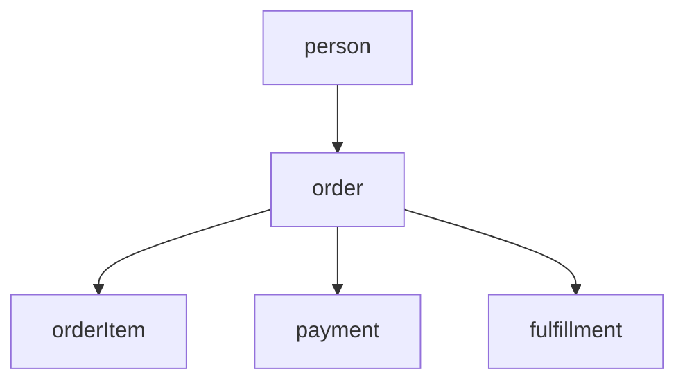
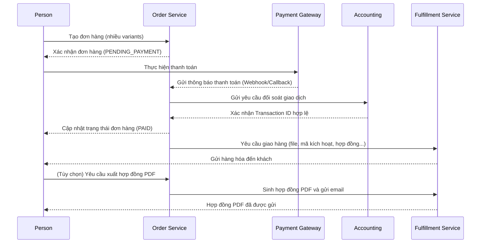
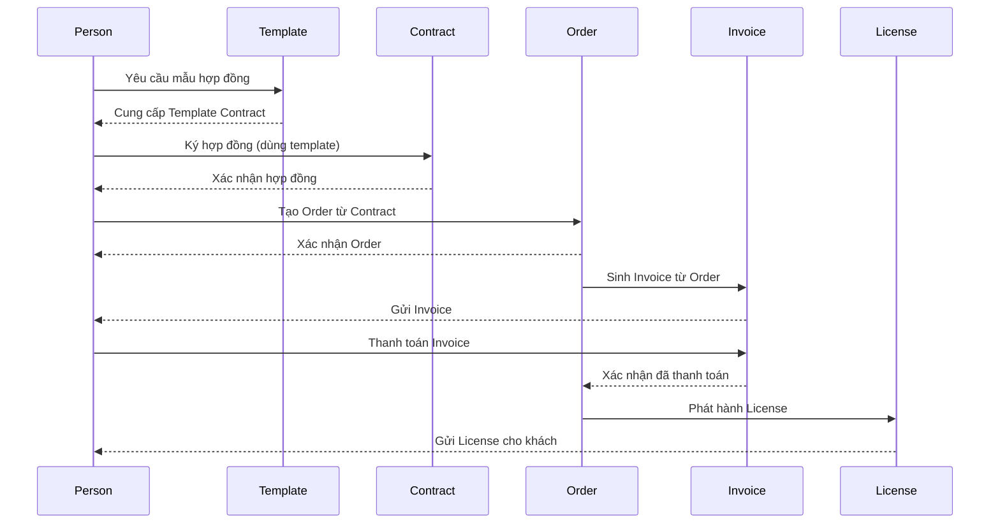
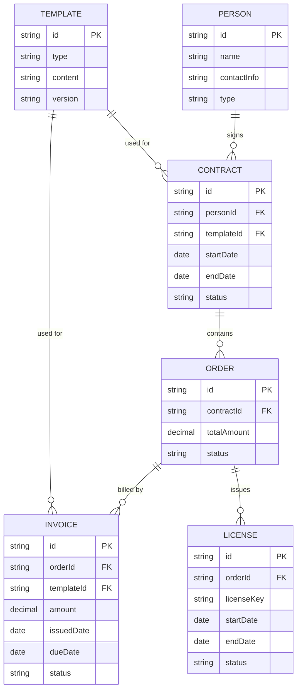

# MKT Order

```mermaid
graph TD
    person[person]
    order[order]
    orderItem[orderItem]
    payment[payment]
    fulfillment[fulfillment]

    person --> order
    order --> orderItem
    order --> payment
    order --> fulfillment

```

══════════════════════════════════════════════
# 📦 MKT Order Payment

```mermaid
sequenceDiagram
    participant U as Person
    participant S as Order Service
    participant PG as Payment Gateway
    participant A as Accounting
    participant F as Fulfillment Service

    U->>S: Tạo đơn hàng (nhiều variants)
    S-->>U: Xác nhận đơn hàng (PENDING_PAYMENT)

    U->>PG: Thực hiện thanh toán
    PG-->>S: Gửi thông báo thanh toán (Webhook/Callback)

    S->>A: Gửi yêu cầu đối soát giao dịch
    A-->>S: Xác nhận Transaction ID hợp lệ

    S-->>U: Cập nhật trạng thái đơn hàng (PAID)

    S->>F: Yêu cầu giao hàng (file, mã kích hoạt, hợp đồng...)
    F-->>U: Gửi hàng hóa đến khách

    U->>S: (Tùy chọn) Yêu cầu xuất hợp đồng PDF
    S->>F: Sinh hợp đồng PDF và gửi email
    F-->>U: Hợp đồng PDF đã được gửi


```

# 📦 MKT Order Contract Flow

```mermaid
sequenceDiagram
    participant P as Person
    participant T as Template
    participant C as Contract
    participant O as Order
    participant I as Invoice
    participant L as License

    P->>T: Yêu cầu mẫu hợp đồng
    T-->>P: Cung cấp Template Contract
    P->>C: Ký hợp đồng (dùng template)
    C-->>P: Xác nhận hợp đồng

    P->>O: Tạo Order từ Contract
    O-->>P: Xác nhận Order

    O->>I: Sinh Invoice từ Order
    I-->>P: Gửi Invoice

    P->>I: Thanh toán Invoice
    I-->>O: Xác nhận đã thanh toán

    O->>L: Phát hành License
    L-->>P: Gửi License cho khách

```

# 📦 MKT Order Contract ERD

```mermaid
erDiagram
    PERSON ||--o{ CONTRACT : "signs"
    CONTRACT ||--o{ ORDER : "contains"
    ORDER ||--o{ INVOICE : "billed by"
    ORDER ||--o{ LICENSE : "issues"

    TEMPLATE ||--o{ CONTRACT : "used for"
    TEMPLATE ||--o{ INVOICE : "used for"

    PERSON {
        string id PK
        string name
        string contactInfo
        string type
    }

    CONTRACT {
        string id PK
        string personId FK
        string templateId FK
        date startDate
        date endDate
        string status
    }

    ORDER {
        string id PK
        string contractId FK
        decimal totalAmount
        string status
    }

    INVOICE {
        string id PK
        string orderId FK
        string templateId FK
        decimal amount
        date issuedDate
        date dueDate
        string status
    }

    TEMPLATE {
        string id PK
        string type
        string content
        string version
    }

    LICENSE {
        string id PK
        string orderId FK
        string licenseKey
        date startDate
        date endDate
        string status
    }
```