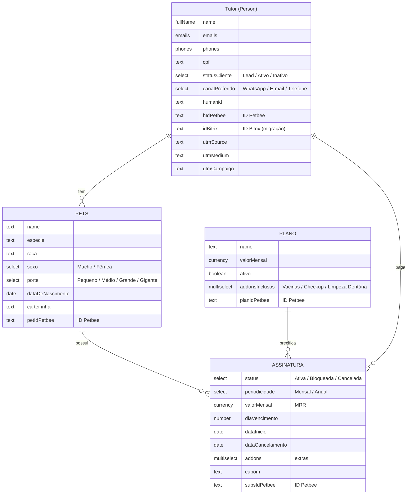

# CRM Petbee sobre o Twenty

Esta pasta contém as ferramentas da Petbee para o Twenty. Ela fica fora de
`packages/` de propósito: o código do Twenty segue intocado, então sincronizar
este fork com o repositório oficial (`twentyhq/twenty`) nunca gera conflito.

A instância atual roda em **https://crm.petbeetools.com.br** (Railway). O
modelo abaixo é o retrato do que existe lá (snapshot de 2026-08-11) — e o
script desta pasta reproduz esse modelo em qualquer instância nova (ex.: a
futura produção).

## O modelo de dados (como construído)



- **Tutor** é o objeto padrão **Person** do Twenty (com e-mails, telefones,
  timeline, notas, tarefas e integração Gmail/Calendar), estendido com os
  campos da Petbee.
- **Pets** guarda os animais, ligados ao tutor.
- **Plano** é o catálogo de planos (nome, valor, addons inclusos).
- **Assinatura** é o coração comercial: liga tutor + pet + plano, com status,
  periodicidade, MRR, vencimento e cupom. Histórico preservado — upgrades e
  cancelamentos viram registros, não sobrescrevem nada.
- Os campos **ID Petbee** (tutor/pet/plano/assinatura) ancoram sincronização
  com o sistema da Petbee; **ID Bitrix** ancora a migração do Bitrix24 (cada
  contato importado guarda o ID de origem — dá para reimportar sem duplicar).

> Detalhe técnico importante para scripts de migração: o objeto Pets tem
> `nameSingular: pets` e `namePlural: petss` (sic). Na API de registros as
> queries usam o plural — ou seja, `petss`. O provisionador reproduz isso
> igual para manter compatibilidade entre ambientes.

## Como reprovisionar em outra instância

1. Na instância de destino, gere uma API key: **Settings → APIs & Webhooks**.
2. Rode (Node 18+, sem dependências):

```bash
# Simular primeiro (recomendado)
TWENTY_API_URL=https://<instancia> TWENTY_API_KEY=<key> node petbee/provision-petbee-crm.mjs --dry-run

# Aplicar
TWENTY_API_URL=https://<instancia> TWENTY_API_KEY=<key> node petbee/provision-petbee-crm.mjs
```

O script é **idempotente**: objetos e campos que já existem (pelo nome) são
pulados, nunca duplicados nem sobrescritos. Rodar duas vezes não faz mal.

## Melhorias sugeridas (backlog)

- **Espécie como seleção**: hoje `especie` é texto livre em Pets — como
  seleção (Cachorro/Gato/…) os filtros e a segmentação ficam mais confiáveis.
  Requer migrar os valores já digitados; fazer quando a base ainda é pequena.
- **Views salvas**: "Clientes ativos" (statusCliente = Ativo), "Assinaturas
  bloqueadas", kanban de Assinaturas por status, "Leads sem pet cadastrado".
- **Workflows**: ex. quando Assinatura muda para Bloqueada → criar tarefa de
  cobrança para o time.
- **Migração Bitrix**: exportar contatos/negócios do Bitrix24 e importar
  preenchendo `idBitrix` — em lotes pequenos, validando a cada lote.
