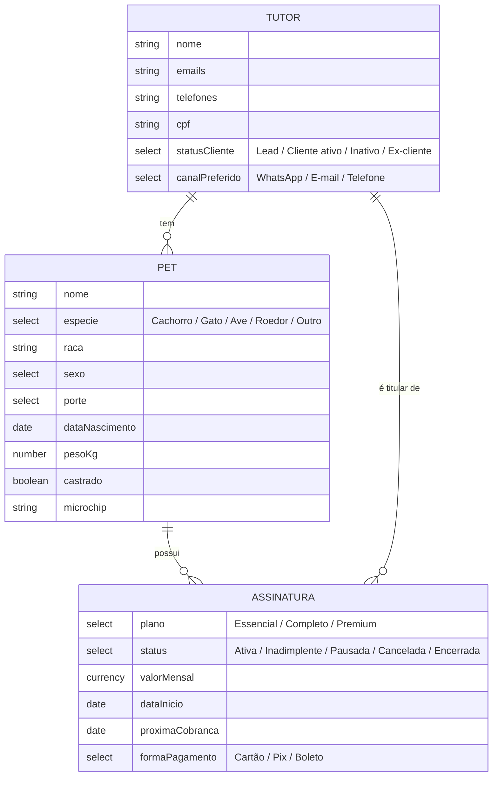

# CRM Petbee sobre o Twenty

Esta pasta contém as customizações da Petbee para o Twenty. Ela fica fora de
`packages/` de propósito: o código do Twenty segue intocado, então sincronizar
este fork com o repositório oficial (`twentyhq/twenty`) nunca gera conflito.

## O modelo de dados



- **Tutor** — por padrão é o objeto **Person** do Twenty (recomendado: ele já
  tem e-mails, telefones, timeline, notas, tarefas e integração com
  Gmail/Calendar). Se você já criou um objeto customizado chamado `tutor` pela
  interface, o script detecta e usa ele automaticamente.
- **Pet** — objeto customizado, com relação *muitos pets → um tutor*.
- **Assinatura** — objeto customizado ligado ao **pet** (qual pet o plano
  cobre) e ao **titular** (quem paga). Manter as assinaturas como objeto
  separado (em vez de um campo "plano ativo" no pet) preserva o histórico:
  cancelamentos, upgrades e reativações viram registros.

Com isso dá para segmentar comunicação com precisão, por exemplo: *tutores
com assinatura Ativa e pet da espécie Cachorro*, ou *leads com pet idoso sem
plano* — tudo com filtros e views salvas, sem código.

## Como rodar o provisionador

1. Na sua instância do Twenty, gere uma API key: **Settings → APIs & Webhooks**.
2. Rode (Node 18+, sem dependências):

```bash
# Contra a instância local
TWENTY_API_KEY=<sua-api-key> node petbee/provision-petbee-crm.mjs

# Contra produção
TWENTY_API_URL=https://crm.suaempresa.com.br TWENTY_API_KEY=<key> node petbee/provision-petbee-crm.mjs

# Só simular, sem alterar nada
TWENTY_API_KEY=<key> node petbee/provision-petbee-crm.mjs --dry-run
```

O script é **idempotente**: objetos e campos que já existem (pelo nome) são
pulados, nunca duplicados nem sobrescritos. Pode rodar na instância onde você
já criou `pet`/`tutor` à mão — ele só completa o que falta.

Variáveis:

| Variável | Padrão | Para quê |
|---|---|---|
| `TWENTY_API_URL` | `http://localhost:3000` | URL da instância |
| `TWENTY_API_KEY` | — (obrigatória) | API key do workspace |
| `PETBEE_TUTOR_OBJECT` | auto (`tutor` se existir, senão `person`) | Forçar qual objeto é o tutor |

## Ajustes depois de rodar

- **Nomes dos planos**: Essencial/Completo/Premium são exemplos — edite as
  opções do campo *Plano* em **Settings → Data model → Assinatura**.
- **Renomear "Person" para "Tutor"**: se quiser que a interface mostre
  "Tutores" no menu, edite os rótulos do objeto People em
  **Settings → Data model** (só muda o rótulo, sem afetar integrações).
- **Views sugeridas**: crie views filtradas como "Clientes ativos"
  (statusCliente = Cliente ativo), "Inadimplentes" (Assinaturas com status
  Inadimplente) e um kanban de Assinaturas agrupado por status.

## Por que via API e não no código?

Objetos criados pela interface ou pela API de metadados ficam no banco do
workspace — sobrevivem a upgrades do Twenty e não exigem manter um fork
divergente. Código só será necessário para funcionalidades que a plataforma
não oferece (ex.: integração própria de WhatsApp); nesse caso, o plano é
manter essas adições isoladas para facilitar o sync com o upstream.
